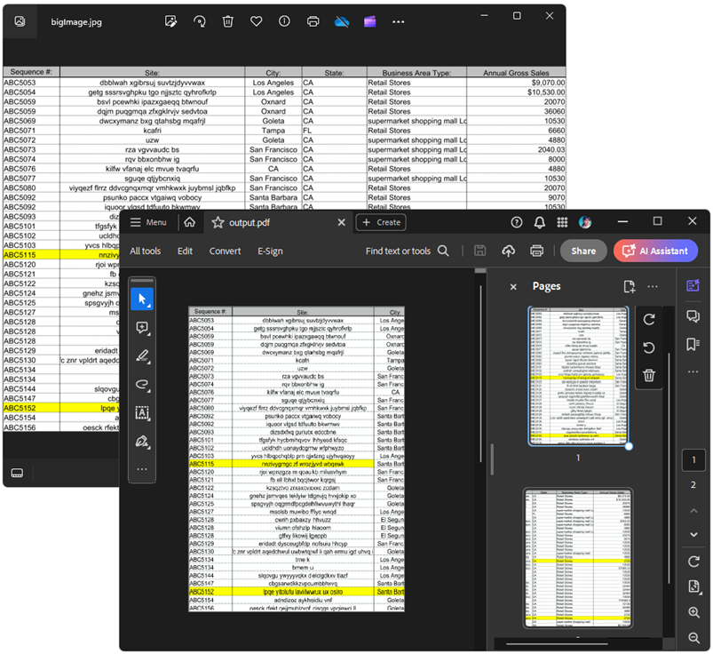

## Environment

| Version | Product | Author | 
| --- | --- | ---- | 
| 2024.2.426| RadPdfProcessing |[Desislava Yordanova](https://www.telerik.com/blogs/author/desislava-yordanova)| 

## Description

`RadPdfProcessing` does not have a built-in mechanism to split a large image across pages when it does not fit within a single page boundary. This article shows a sample approach for achieving this.

## Solution

To export a large image across multiple PDF pages without headers or blank spaces, split the image manually (horizontally or vertically depending on its dimensions) and add each part to a separate page. The following implementation uses [RadPdfProcessing]() to split an image into two parts and export it to a PDF file:

```csharp
         static void Main(string[] args)
        {
            RadFixedDocument document = new RadFixedDocument();
            RadFixedPage page = document.Pages.AddPage();
            System.Windows.Size pageSize = new System.Windows.Size(Unit.MmToDip(210),Unit.MmToDip(297));
            page.Size = pageSize;
            Bitmap bmp = new Bitmap(@"bigImage.jpg");

            if (bmp.Width > pageSize.Width && bmp.Height <= pageSize.Height)
            {
                SplitImages(true, bmp, document, page);
            }
            else
            {
                SplitImages(false, bmp, document, page);
            }
           
            PdfFormatProvider provider = new PdfFormatProvider();
            string outputFilePath = "output.pdf";
            File.Delete(outputFilePath);
            using (Stream output = File.OpenWrite(outputFilePath))
            {
                provider.Export(document, output);
            }
            Process.Start(new ProcessStartInfo() { FileName = outputFilePath, UseShellExecute = true });

        }

        private static void SplitImages(bool isVerticalSplit, Bitmap bmp, RadFixedDocument document, RadFixedPage page)
        {
            Bitmap firstHalf = bmp.Clone(new Rectangle(0, 0, bmp.Width, bmp.Height / 2), System.Drawing.Imaging.PixelFormat.DontCare);
            Bitmap secondHalf = bmp.Clone(new Rectangle(0, bmp.Height / 2, bmp.Width, bmp.Height / 2), System.Drawing.Imaging.PixelFormat.DontCare);
            if (isVerticalSplit)
            {
                firstHalf = bmp.Clone(new Rectangle(0, 0, bmp.Width / 2, bmp.Height), System.Drawing.Imaging.PixelFormat.DontCare);
                secondHalf = bmp.Clone(new Rectangle(bmp.Width / 2, 0, bmp.Width / 2, bmp.Height), System.Drawing.Imaging.PixelFormat.DontCare);
            }

            FixedContentEditor editor = new FixedContentEditor(page);
            var ms = new MemoryStream();
            firstHalf.Save(ms, System.Drawing.Imaging.ImageFormat.Png);
            ms.Seek(0, SeekOrigin.Begin);
            editor.DrawImage(ms, new System.Windows.Size((int)page.Size.Width, (int)page.Size.Height));

            RadFixedPage page1 = document.Pages.AddPage();
            FixedContentEditor editor1 = new FixedContentEditor(page1);
            var ms1 = new MemoryStream();
            secondHalf.Save(ms1, System.Drawing.Imaging.ImageFormat.Png);
            ms1.Seek(0, SeekOrigin.Begin);
            editor1.DrawImage(ms1, new System.Windows.Size((int)page1.Size.Width, (int)page1.Size.Height));
        }
```

This example splits the image into two parts. You can adjust the logic to split the image into as many parts as necessary, depending on the image size and the desired size of each part on the PDF pages.

  
 
## See Also

* [RadPdfProcessing]() 
* [How to Generate a PDF Document from Images with FixedContentEditor]()

