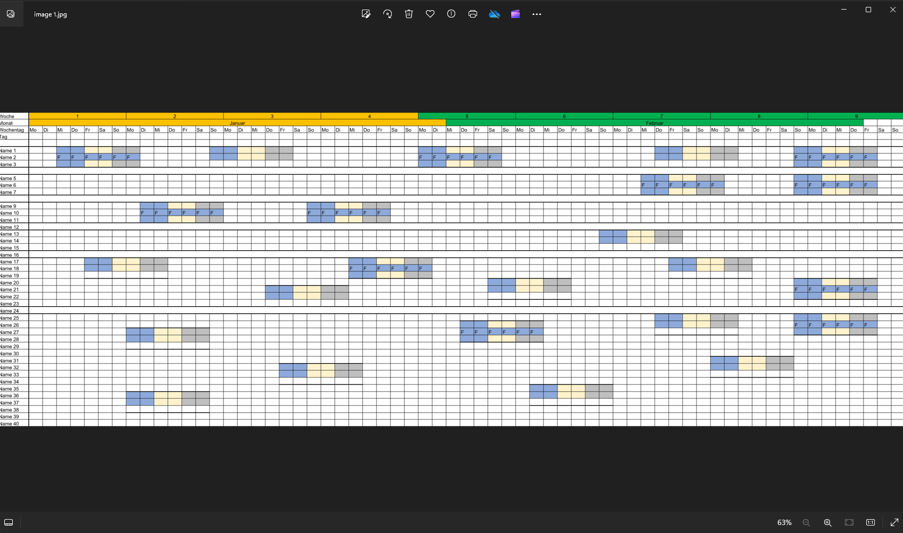

## Environment
| Version | Product | Author | 
| --- | --- | ---- | 
| 2024.1.305 | RadSpreadProcessing |[Yoan Karamanov](https://www.telerik.com/blogs/author/yoan-karamanov)| 
---
## Description
This article shows how to export a [Worksheet]() to image in .NET Standard using the [RadSpreadProcessing]() library. Currently the [Document Processing libraries]() provide image export only for PDF files. This is why the document must first be converted to PDF.

## Solution

1. [Import the file as __Workbook__](https://docs.telerik.com/devtools/document-processing/libraries/radspreadprocessing/formats-and-conversion/import-and-export-to-excel-file-formats/xlsx/xlsxformatprovider#import).
2. Set the desired [Worksheet Page Setup]() and [PDF Export Settings]().
3. [Export the __Workbook__ to __PDF__](https://docs.telerik.com/devtools/document-processing/libraries/radspreadprocessing/formats-and-conversion/pdf/pdfformatprovider#export).
4. [Import the __PDF__ file](https://docs.telerik.com/devtools/document-processing/libraries/radpdfprocessing/formats-and-conversion/pdf/pdfformatprovider/pdfformatprovider#import).
5. Calculate the size of the used range in the __Worksheet__.
6. Make the PDF page the same size.
7. Export the __PDF__ file to image using the [SkiaImageFormatProvider]().

## Additional Requirements

### .NET Standard requirements
* [SpreadFixedTextMeasurer]()
### General requirements
* [SkiaSharp Nuget package](https://www.nuget.org/packages/SkiaSharp/)

```csharp
    using Telerik.Windows.Documents.Spreadsheet.FormatProviders.OpenXml.Xlsx;
    using Telerik.Windows.Documents.Spreadsheet.FormatProviders;
    using Telerik.Windows.Documents.Spreadsheet.Model;
    using Telerik.Windows.Documents.Fixed.Model;
    using Telerik.Documents.Fixed.FormatProviders.Image.Skia;
    using Telerik.Windows.Documents.Extensibility;
    using Telerik.Windows.Documents.Spreadsheet.Extensibility;
    using Telerik.Windows.Documents.Model;
    using Telerik.Windows.Documents.Spreadsheet.Model.Printing;
    using Telerik.Documents.Primitives;

    //.NET Standard Requirements
    SpreadTextMeasurerBase fixedTextMeasurer = new SpreadFixedTextMeasurer();
    SpreadExtensibilityManager.TextMeasurer = fixedTextMeasurer;

    //Import Workbook
    Workbook workbook;
    IWorkbookFormatProvider xlsxFormatProvider = new XlsxFormatProvider();

    using (Stream input = new FileStream("input.xlsx", FileMode.Open))
    {
        workbook = xlsxFormatProvider.Import(input);
    }

    //Set PDF export settings to your preference
    WorksheetPageSetup pageSetup = workbook.ActiveWorksheet.WorksheetPageSetup;
    pageSetup.PageOrientation = PageOrientation.Landscape;
    pageSetup.Margins = new PageMargins(0,0,0,0);
    pageSetup.PaperType = PaperTypes.A1; /*make sure the size of the PaperType is bigger than the dimentions of worksheetTableSizetableSize*/

    Telerik.Windows.Documents.Spreadsheet.FormatProviders.Pdf.PdfFormatProvider spreadPdfFormatProvider = new Telerik.Windows.Documents.Spreadsheet.FormatProviders.Pdf.PdfFormatProvider();
    spreadPdfFormatProvider.ExportSettings = new Telerik.Windows.Documents.Spreadsheet.FormatProviders.Pdf.Export.PdfExportSettings(ExportWhat.ActiveSheet, true);

    //Export as PDF
    using (Stream output = File.OpenWrite("output.pdf"))
    {
        spreadPdfFormatProvider.Export(workbook, output);
    }

    //Import PDF 
    RadFixedDocument pdfDocument;
    Telerik.Windows.Documents.Fixed.FormatProviders.Pdf.PdfFormatProvider fixedPdfFormatProvider = new Telerik.Windows.Documents.Fixed.FormatProviders.Pdf.PdfFormatProvider();

    using (Stream input = File.OpenRead("output.pdf"))
    {
        pdfDocument = fixedPdfFormatProvider.Import(input);
    }

    //Set new PDF page size
    var worksheetTableSize = CalculateRangeSize(workbook.ActiveWorksheet, workbook.ActiveWorksheet.UsedCellRange);
    pdfDocument.Pages.FirstOrDefault().Size = new Size(worksheetTableSize.Width, worksheetTableSize.Height);

    //Export to image
    SkiaImageFormatProvider imageProvider = new SkiaImageFormatProvider();

    int count = 1;
    foreach (RadFixedPage page in pdfDocument.Pages)
    {
        byte[] resultImage = imageProvider.Export(page);
        File.WriteAllBytes("image " + count++ + ".jpg", resultImage);
    }

    Size CalculateRangeSize(Worksheet worksheet, CellRange range)
    {
        double totalHeight = 0;
        double totalWidth = 0;

        for (int row = range.FromIndex.RowIndex; row <= range.ToIndex.RowIndex; row++)
        {
            double rowHeight = worksheet.Rows[row].GetHeight().Value.Value;
            totalHeight += rowHeight;
        }

        for (int column = range.FromIndex.ColumnIndex; column <= range.ToIndex.ColumnIndex; column++)
        {
            double columnWidth = worksheet.Columns[column].GetWidth().Value.Value;
            totalWidth += columnWidth;
        }

        return new Size(totalWidth, totalHeight);
    }

```
__Before:__

  

__After:__

  

# See Also
* [SpreadProcessing .NET Standard limitations]() 
* [PdfProcessing .NET Standard limitations]() 