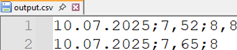

## Environment

| Version | Product | Author | 
| --- | --- | ---- | 
| 2025.3.806 | RadSpreadProcessing |[Yoan Karamanov](https://www.telerik.com/blogs/author/yoan-karamanov)| 

## Description

This article shows how to import a CSV file and export it with different formatting (delimiters, decimal separators, and date formats) back to CSV. You need to account for culture settings and delimiters during both import and export operations to ensure the desired formatting results.

This knowledge base article also answers the following questions:
- How to change culture settings during CSV import/export in SpreadProcessing?
- How to use different delimiters and formats for CSV operations?
- How to format date and numeric values during CSV export?

## Solution

Example input data (*a comma (",") as the delimiter and a dot (".") as the decimal separator*):

 

Example result data (*a semicolon (";") as the delimiter, a comma (",") as the decimal separator, and a formatted date*):

 

To import and process the input file correctly you must:
* Set the **Delimiter** property of the [CsvFormatProvider Settings]() to a comma (",")
* Set the [culture]() to English ("en-EN"), since its default decimal separator is a dot (".") and must match the file decimal separator

Once the document is imported and parsed, you can:
* Switch to a culture that has a comma (",") as its default decimal separator (e.g German - "de-DE")
* Set a new [Number Format]() with a comma ("#,##") to the number values
* Set the **Delimiter** property of the [CsvFormatProvider Settings]() to a semicolon (";")

### Full Code Example

```csharp
using System.Globalization;
using System.IO;
using Telerik.Windows.Documents.Spreadsheet.Formatting;
using Telerik.Windows.Documents.Spreadsheet.Model;
using Telerik.Windows.Documents.Spreadsheet.FormatProviders.Csv;

Telerik.Windows.Documents.Spreadsheet.Formatting.FormatHelper.CultureHelper = new SpreadsheetCultureHelper(new CultureInfo("en-EN"));

Workbook workbook;
CsvFormatProvider formatProvider = new CsvFormatProvider();
formatProvider.Settings.Delimiter = ',';

using (Stream input = new FileStream("input.csv", FileMode.Open))
{
    workbook = formatProvider.Import(input, TimeSpan.FromSeconds(10));
}

Telerik.Windows.Documents.Spreadsheet.Formatting.FormatHelper.CultureHelper = new SpreadsheetCultureHelper(new CultureInfo("de-DE"));

var worksheet = workbook.Worksheets[0];

var currencyFormat = new CellValueFormat("#,##");
ColumnSelection surchargePercent = worksheet.Columns[1];
surchargePercent.SetFormat(currencyFormat);

ColumnSelection surchargePercentNew = worksheet.Columns[2];
surchargePercentNew.SetFormat(currencyFormat);

var dateFormat = new CellValueFormat("dd.mm.yyyy");
ColumnSelection date = worksheet.Columns[0];
date.SetFormat(dateFormat);

formatProvider.Settings.Delimiter = ';';

string fileName = "output.csv";
File.Delete(fileName);
using (Stream output = new FileStream(fileName, FileMode.Create))
{
    formatProvider.Export(workbook, output, TimeSpan.FromSeconds(10));
}
```

## See Also

* [SpreadProcessing]()
* [CsvFormatProvider]()
