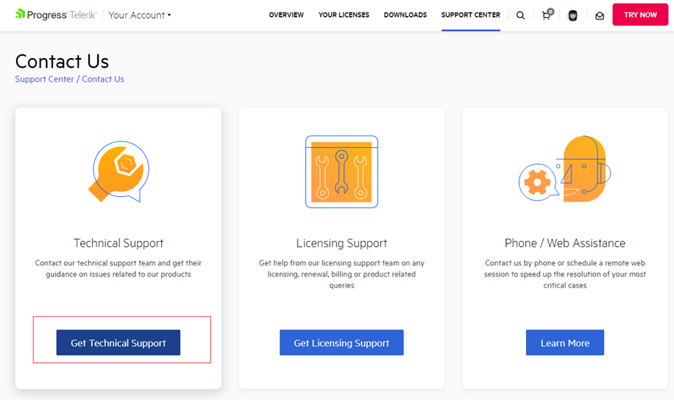
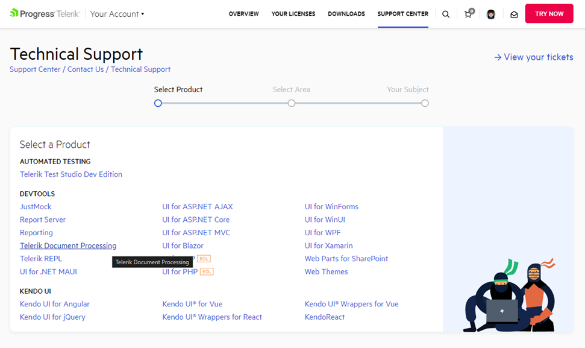
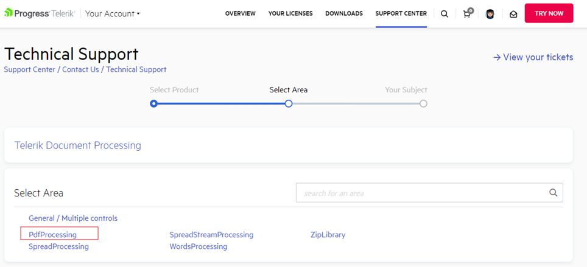
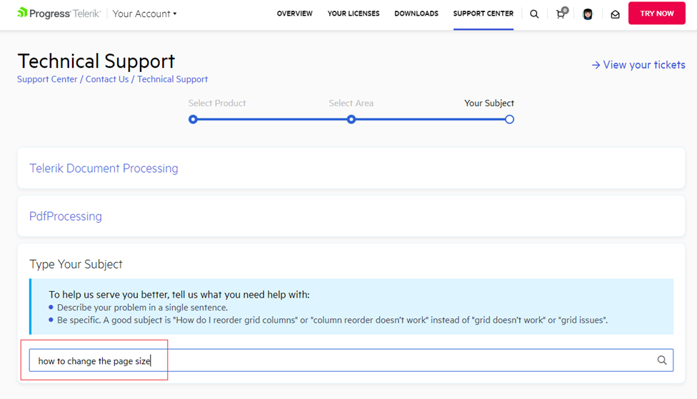
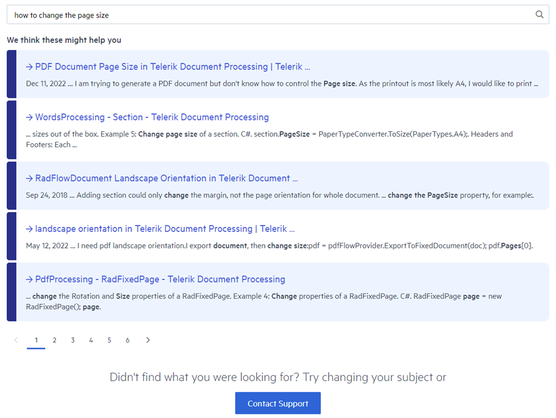
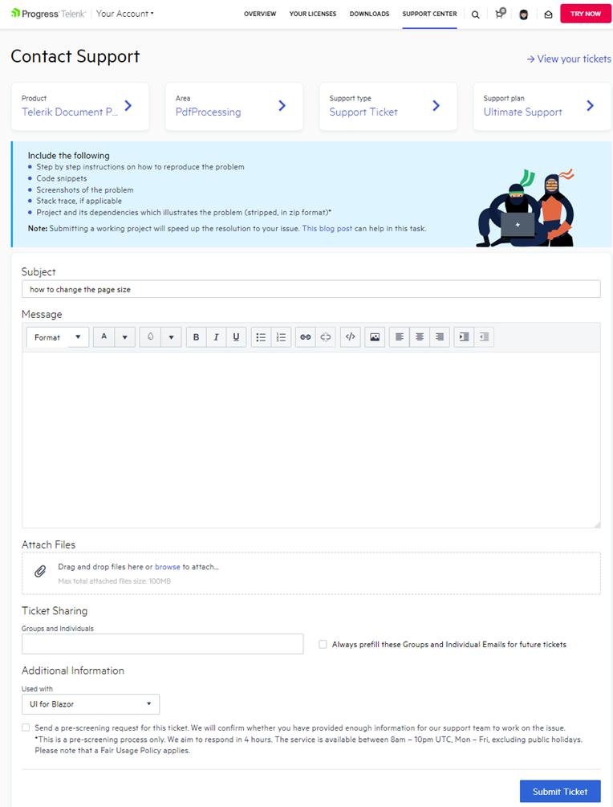

## Environment

| Version | Product | Author | 
| --- | --- | ---- | 
| N/A | Document Processing Libraries |[Desislava Yordanova](https://www.telerik.com/blogs/author/desislava-yordanova)| 

## Description

This article guides you through the process of contacting the Support team of the Telerik Document Processing Libraries. Keep the following general tips in mind when submitting a ticket to start a productive discussion. The information you provide is essential for understanding your specific case. It can significantly help the investigation process or troubleshooting. Always pay attention to the details you give to the support engineers because the resolution often depends on the information provided.

Before submitting a ticket, check the following resources to verify that an answer does not already exist.

## Solution

The following resources help you find answers quickly:

* [Online Documentation](): The documentation provides detailed descriptions, code samples, and improved discoverability for all features.

* [Knowledge Base](https://docs.telerik.com/devtools/document-processing/knowledge-base): The Knowledge Base contains implementations and solutions for common problems and questions.

* [Forums](https://www.telerik.com/forums/telerik-document-processing): The forum is reviewed by both the community and the support engineers.

* [SDK](https://github.com/telerik/document-processing-sdk): The Document Processing SDK contains developer-focused examples for the libraries included in Telerik Document Processing.

Many issues can be resolved by reading through these resources.

Telerik has an exceptional history of support. You typically have a 24-hour guaranteed response time on your ticket ([depending on product and package](https://www.telerik.com/purchase/support-plans)). Every back-and-forth exchange with the support team takes valuable time. Make the most of your ticket the first time. Aim for the first response to contain your answer, not a request for more information.

If none of the listed resources helped, follow these steps to contact the Telerik Document Processing Technical Support:

1. Log into your Telerik.com account and navigate to the [Support Center - Contact Us](https://www.telerik.com/account/support-center/contact-us) page.
2. Select the [Get Technical Support](https://www.telerik.com/account/support-center/contact-us/technical-support) option for technical help (use the [Get Licensing Support](https://www.telerik.com/account/support-center/contact-us/licensing-support) option for product license questions).

    

3. Next, select the product **Telerik Document Processing**: 

	

4. Pick the **Document Processing Library** for which you need assistance, for example, **PdfProcessing**:

	

5. Try to search for a possible solution for your inquiry, for example, *"how to change the page size"*

	

6. Have a look at the found results. You may find a suitable solution for your question:

	

7. If you do not find what you are looking for, click the **Contact Support** button at the bottom to contact the Support engineers. The important part is what to include in the support ticket so that the assigned agent understands what you are trying to achieve.

	

## General Tips when Submitting a Support Ticket

The key to achieving a "one response resolution" is to provide as much information as you can about your issue when you initially submit the ticket. If you do this, you significantly increase the chances of getting your questions answered in the first one to two exchanges. The following tips describe how to accomplish this:

* Give a suitable **Subject** for the ticket - it should summarize what you are trying to accomplish or what error message you get. 

* Keep in mind that the support agent is not familiar with your project and its specific implementation. Information that may seem obvious to you can be unknown to the support engineer. Strive to provide as many details as possible to describe the precise case.

* Specify clearly ordered steps to follow.

* Provide screen shots and explanations of the expected and actual state of the application. An alternative option is to provide a screen recording of the issue. Download [TechSmith Capture](https://www.techsmith.com/jing-tool.html) for free, upload the recording to their server, and provide the link.

* In case of obtaining an error message, copy/paste the entire message and/or provide a screen shot of it.
	
* A sample project that demonstrates the exact undesired behavior can save a lot of time and effort on both sides. Simulate the problematic behavior in a runnable project. This allows the support team to make an adequate analysis of the precise case and identify a suitable solution. Replicating your issue is the most time-consuming part, but it plays the biggest role in demonstrating the issue clearly the first time. Copying and pasting relevant portions of code into the ticket may seem easier, but the pieces have to be reviewed by somebody who does not know what the entire project is supposed to look like or accomplish.

>note Max total attached files size: 100MB.
	
>important If you decide to provide your original project, it will be used only for investigation purposes and your privacy will be respected. Telerik Document Processing is licensed under the conditions of the product with which you obtained the libraries. Confidentiality is also described in the product EULA - See Section 11 of the [EULA](https://docs.telerik.com/devtools/document-processing/distribution-and-licensing/license-agreement) and Article V Section 11 of the DevCraft Complete and DevCraft Ultimate EULAs.

* Investigating issues without the problematic document is difficult. Try to prepare a sample file without sensitive information. If you decide to send the original file, it will be used only for investigation purposes and your privacy will be respected.

* Specify the **Product Version** you are using because it helps reproduce the issue. A fix may be available in a later version.

* The **.NET Framework** version is also important because there can be differences between the full framework and .NET Standard.

>important If you have multiple, unrelated questions, open a separate thread for each question with the appropriate Product (PdfProcessing / Telerik Document Processing) and avoid mixing different subjects in the same thread. This also gives you the opportunity to track the different cases in your account.

The [Telerik support team](https://www.telerik.com/best-tech-support) is always available to help. The team will work with you as long as it takes to get your ticket resolved and help you be as productive as possible.
