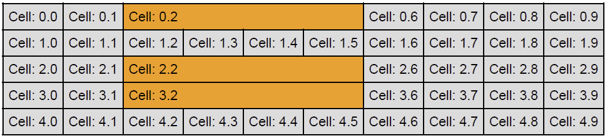

## Environment

| Version | Product | Author | 
| --- | --- | ---- | 
| 2024.3.806| RadPdfProcessing |[Desislava Yordanova](https://www.telerik.com/blogs/author/desislava-yordanova)| 

## Description

Creating [tables]() with varying column counts and sizes in a PDF can be challenging, especially when trying to merge cells across columns to achieve a specific layout. This article demonstrates how to use the `ColumnSpan` property in the RadPdfProcessing library to merge cells across columns and adjust the layout of tables as required. This KB article also answers the following questions:
- How do I merge cells across columns in a PDF table using RadPdfProcessing?
- How can I adjust the column count dynamically in a table created with RadPdfProcessing?
- What is the correct way to apply `ColumnSpan` in RadPdfProcessing tables for custom layouts? 

## Solution

To correctly implement column spanning in tables using RadPdfProcessing, follow these steps:

1. Create a new [Table]() and configure its properties, such as `LayoutType` and `DefaultCellProperties`.

2. When adding cells to a row that includes a column span, adjust the number of added cells accordingly. For a row with cells that should span across multiple columns, reduce the number of total cells in that row by the span amount minus one.

3. Apply the `ColumnSpan` property to the cell that should extend over multiple columns. Set this property before adding the cell to the table.

4. Optionally, for visual distinction, change the background color of the spanning cell.

Here is a simplified example demonstrating these steps:

```csharp
            RadFixedDocument fixedDocument = new RadFixedDocument();
            RadFixedPage page = new RadFixedPage();
            page.Size = new Size(1200, 800);
            fixedDocument.Pages.Add(page);
            Border blackBorder = new Border(1, new RgbColor(0, 0, 0));
            FixedContentEditor editor = new FixedContentEditor(page);
            editor.Position.Translate(Unit.CmToDip(2), Unit.CmToDip(2));
            Table table = new Table
            {
                LayoutType = TableLayoutType.AutoFit,
                DefaultCellProperties =
                {
            Padding = new Thickness(5, 5, 5, 5),
            Borders = new TableCellBorders(blackBorder, blackBorder, blackBorder, blackBorder)
                }
            };

            int colSpanValue = 4;
            int columnSpanStartIndex = 2;
            List<int> rowIndexWithMergedColumnsCollection = new List<int> { 0, 2, 3 };
            int tableRowsCount = 5;
            int tableColumnsCount = 10;
            table.DefaultCellProperties.Background = new RgbColor(220, 220, 220);
            for (var rowIndex = 0; rowIndex < tableRowsCount; rowIndex++)
            {
                Telerik.Windows.Documents.Fixed.Model.Editing.Tables.TableRow row = table.Rows.AddTableRow();
                int colLimit = tableColumnsCount;
                if (rowIndexWithMergedColumnsCollection.Contains(rowIndex))
                {
                    //insert less text blocks when you have cells spanning among several columns
                    colLimit = tableColumnsCount - colSpanValue + 1;
                }
                for (var columnIndex = 0; columnIndex < colLimit; columnIndex++)
                {
                    Telerik.Windows.Documents.Fixed.Model.Editing.Tables.TableCell cell = row.Cells.AddTableCell();
                    Block b = cell.Blocks.AddBlock();
                    string cellText = "Cell: " + rowIndex + "." + columnIndex;
                    if (columnSpanStartIndex<columnIndex && rowIndexWithMergedColumnsCollection.Contains(rowIndex))
                    {
                        cellText= "Cell: " + rowIndex + "." + (columnIndex+ colSpanValue-1);
                    }
                    b.InsertText(new FontFamily("Helvetica"), FontStyles.Normal, FontWeights.Normal, cellText);

                    if (rowIndexWithMergedColumnsCollection.Contains(rowIndex) && columnIndex == columnSpanStartIndex)
                    {
                        cell.RowSpan = 1;
                        cell.ColumnSpan = colSpanValue;
                        cell.Background = new RgbColor(255, 153, 0);
                    }
                }

            }

            editor.DrawTable(table); 

            string outputFilePath = "sample.pdf";
            File.Delete(outputFilePath);
            PdfFormatProvider provider = new PdfFormatProvider();
            using (Stream output = File.OpenWrite(outputFilePath))
            {
                provider.Export(fixedDocument, output);
            }
            Process.Start(new ProcessStartInfo() { FileName = outputFilePath, UseShellExecute = true });
```

This example demonstrates how to create a table with cells that span multiple columns, providing a flexible way to design complex table layouts in PDF documents using RadPdfProcessing.

The achieved result is illustrated below:

   

## Notes

- The `ColumnSpan` property allows a cell to cover multiple columns, effectively merging them for that row. Adjust subsequent cells in the row to reflect the merged space.
- The example illustrates a simplified scenario. Depending on the specific requirements, adjust the logic to dynamically set the `ColumnSpan` and modify the cell addition logic accordingly.

## See Also

- [Tables in RadPdfProcessing]()
- [TableCell]()
