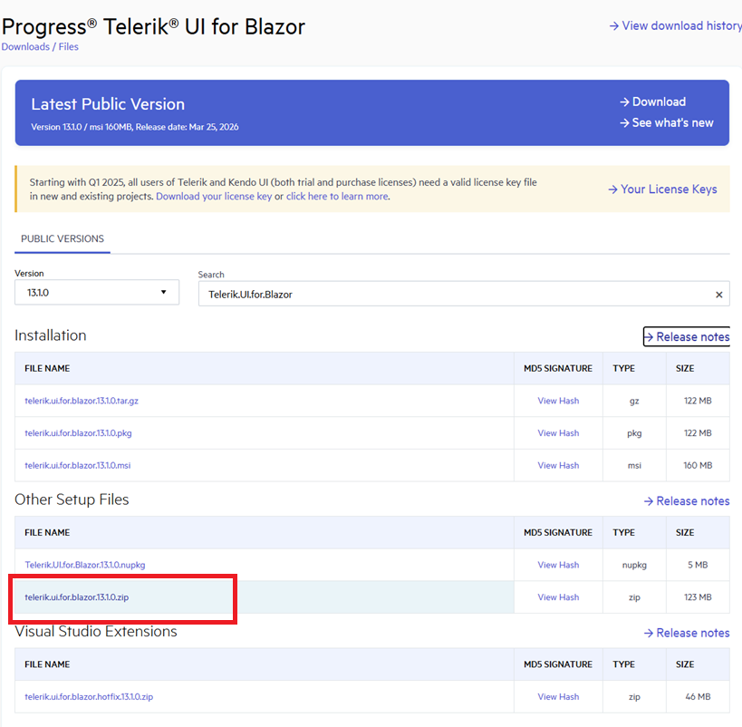
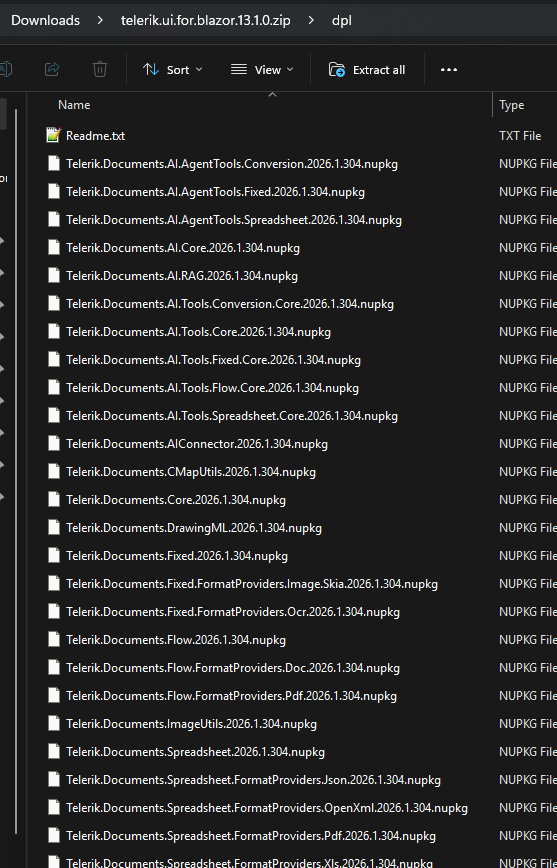
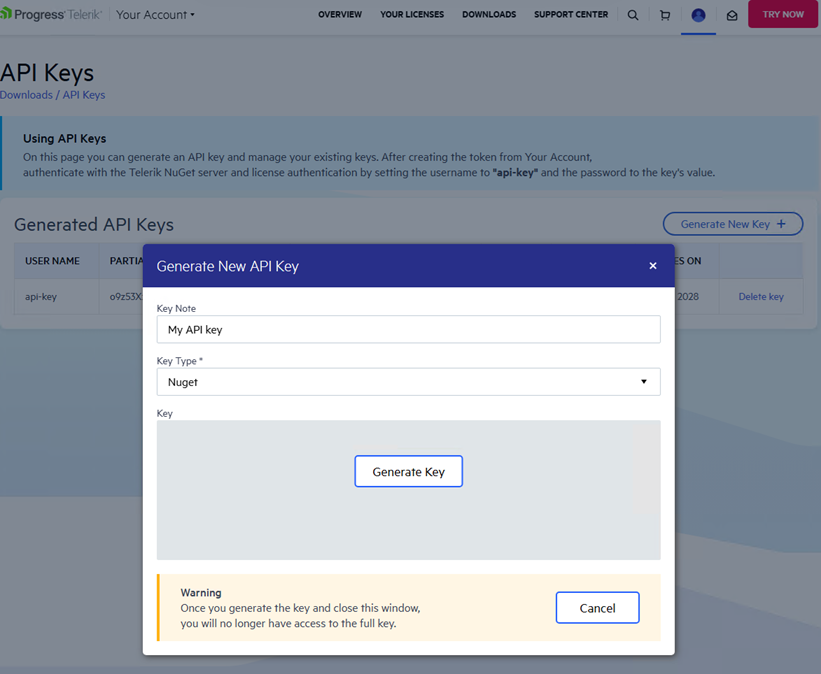
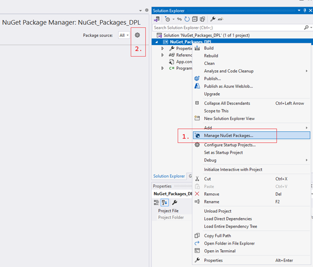
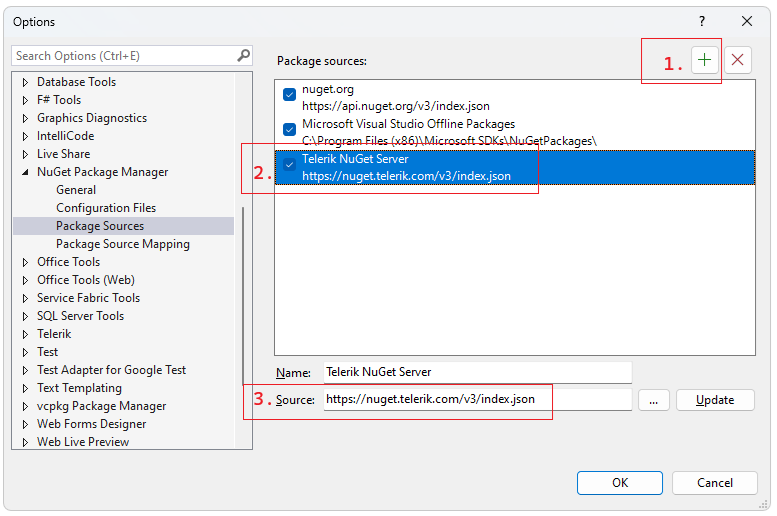

## Environment

| Version | Product | Author | 
| ---- | ---- | ---- | 
| 2026.1.210| Telerik Document Processing|[Desislava Yordanova](https://www.telerik.com/blogs/author/desislava-yordanova)| 
|13.1.0|Telerik.UI.for.Blazor|Trial|

## Description

When a client with an active Blazor **trial** license is attempting to restore Telerik.UI.for.Blazor package, the process may fail due to missing dependencies in Telerik Document Processing libraries, such as `Telerik.Documents.Spreadsheet`, `Telerik.Documents.SpreadsheetStreaming`, and `Telerik.Zip`. 

## Solution

It is recommended to activate a [trial for DevCraft](https://www.telerik.com/download), which is expected to enable the Document Processing's Downloads section in your Telerik account.

Alternatively, instead of using the NuGet packages, you can try downloading the zip (e.g. telerik.ui.for.blazor.13.1.0.zip) from your Telerik account. 

 

It contains all necessary DPL assemblies:

  

To ensure that everything with the Telerik NuGet server is properly setup on your side, follow the steps:

1. Generate a new NuGet API Key from your Telerik account. This will be used for authenticating with the trial account you have. Using an API key instead of a password is a more secure approach:

        

2. Configure the Telerik NuGet server as a package source in Visual Studio:

      

3. Delete any existing package sources that possibly contain any Telerik NuGet packages and add a new package source and enter https://nuget.telerik.com/v3/index.json in the Source field:

       

4. Specify the credentials using the generated API key in the NuGet Config File: 
   ```xml
   <?xml version="1.0" encoding="utf-8"?>
   <configuration>
       <packageSources>
           <clear />
           <add key="nuget.org" value="https://api.nuget.org/v3/index.json" />
           <add key="TelerikNuGetServer" value="https://nuget.telerik.com/v3/index.json" />
       </packageSources>
       <packageSourceCredentials>
           <TelerikNuGetServer>
               <add key="Username" value="api-key" />
               <add key="ClearTextPassword" value="Your API KEY" />
           </TelerikNuGetServer>
       </packageSourceCredentials>
   </configuration>
   ```

This will ensure that you have successfully added the Telerik NuGet feed as a Package source associated with your trial license. Note that if you previously stored credentials for the Telerik NuGet server, you need to reset them to be able to authenticate with your new API key. Remove the saved credentials in the [Windows Credential Manager](https://support.microsoft.com/en-us/windows/credential-manager-in-windows-1b5c916a-6a16-889f-8581-fc16e8165ac0). These credentials will appear as nuget.telerik.com or VSCredentials_nuget.telerik.com entries.


## See Also

- [Troubleshooting Telerik NuGet Feed](https://www.telerik.com/blazor-ui/documentation/troubleshooting/nuget-feed#unable-to-find-package)
