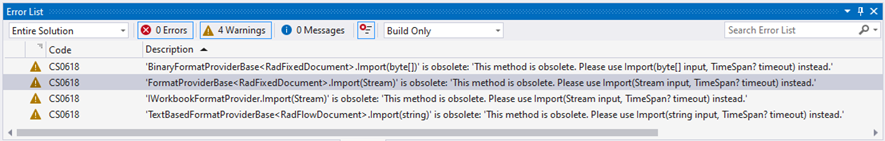
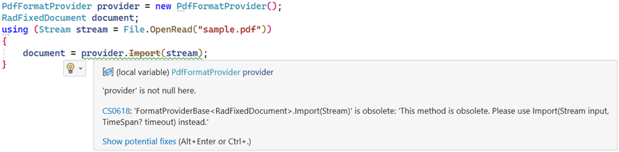
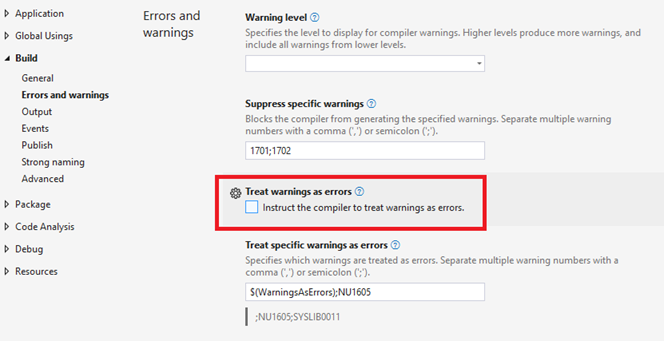

## Environment

| Version | Product | Author | 
| --- | --- | ---- | 
| Q4 2024 | Document Processing Libraries |[Desislava Yordanova](https://www.telerik.com/blogs/author/desislava-yordanova)| 

## Description

After upgrading to **Q4 2024** (or a newer version) of Telerik Document Processing Libraries and you have any logic for importing or exporting documents in your application, one of the following warning messages may occur if you try building the project:

  

The [Compiler Warning (level 2) CS0618](https://learn.microsoft.com/en-us/dotnet/csharp/language-reference/compiler-messages/cs0618?f1url=%3FappId%3Droslyn%26k%3Dk(CS0618)) indicates that an obsolete **Import** or **Export** method is used:

   

## Solution

In Q4 2024 Telerik Document Processing Libraries introduced a new **timeout mechanism** for importing and exporting documents. The Import and Export methods of the FormatProviders have a mandatory **TimeSpan?** timeout parameter after which the operation will be canceled:

>note This is valid for WordsProcessing, PdfProcessing and SpreadProcessing.

#### Import XLSX (Excel Workbook) file

   ```csharp
    using (Stream input = new FileStream("input-file.xlsx", FileMode.Open))
    {
        XlsxFormatProvider formatProvider = new XlsxFormatProvider();
        TimeSpan timeoutInterval = TimeSpan.FromSeconds(10);
        Workbook workbook = formatProvider.Import(input, timeoutInterval);
    }
   ```

>note The [TimeSpan](https://learn.microsoft.com/en-us/dotnet/fundamentals/runtime-libraries/system-timespan) interval is up to the developer and should be considered with the environment-specific configurations. In case of developing a web application for example, set such a timeout interval value that would be safe enough to protect the application from potential [DDoS attacks](https://www.microsoft.com/en-us/security/business/security-101/what-is-a-ddos-attack). If the application is expected to be delivered directly to the end-users, it is possible to use TimeSpan=null as well. 
  
Note that there is a Visual Studio setting that controls whether the [warnings will be treated as errors](https://learn.microsoft.com/en-us/dotnet/csharp/language-reference/compiler-options/errors-warnings):

    

Make sure that it is not toggled. Otherwise, the application wouldn't be compiled due to the obsolete API.

## See Also

- [Using PdfFormatProvider in RadPdfProcessing]()
- [Using DocxFormatProvider in RadWordsProcessing]()
