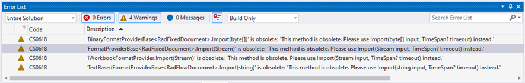
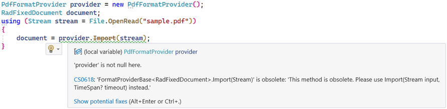
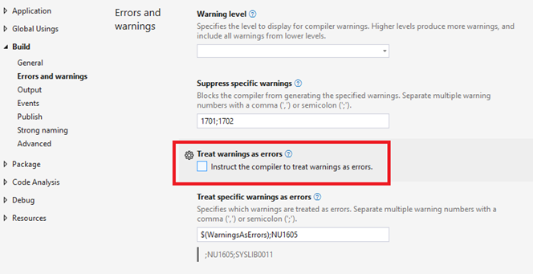

## Environment

| Version | Product | Author | 
| --- | --- | ---- | 
| Q4 2024 | Document Processing Libraries |[Desislava Yordanova](https://www.telerik.com/blogs/author/desislava-yordanova)| 

## Description

After upgrading to **Q4 2024** (or a later version) of Telerik Document Processing Libraries, one of the following warning messages may occur when you build a project that contains any logic for importing or exporting documents:

  

The [Compiler Warning (level 2) CS0618](https://learn.microsoft.com/en-us/dotnet/csharp/language-reference/compiler-messages/cs0618?f1url=%3FappId%3Droslyn%26k%3Dk(CS0618)) indicates that an obsolete **Import** or **Export** method is used:

   

## Solution

Starting with Q4 2024, Telerik Document Processing Libraries introduce a new **timeout mechanism** for importing and exporting documents. The `Import` and `Export` methods of the format providers have a mandatory `TimeSpan?` timeout parameter. After the specified interval elapses, the operation is canceled and an `OperationCanceledException` is thrown:

>note This is valid for WordsProcessing, PdfProcessing and SpreadProcessing.

### Import XLSX (Excel Workbook) File

   ```csharp
    using (Stream input = new FileStream("input-file.xlsx", FileMode.Open))
    {
        XlsxFormatProvider formatProvider = new XlsxFormatProvider();
        TimeSpan timeoutInterval = TimeSpan.FromSeconds(10);
        Workbook workbook = formatProvider.Import(input, timeoutInterval);
    }
   ```

>note The [TimeSpan](https://learn.microsoft.com/en-us/dotnet/fundamentals/runtime-libraries/system-timespan) interval depends on the developer and must account for environment-specific configurations. When developing a web application, set a timeout interval value that is safe enough to protect the application from potential [DDoS attacks](https://www.microsoft.com/en-us/security/business/security-101/what-is-a-ddos-attack). If the application is delivered directly to end-users, you can use `TimeSpan` = `null` as well. 
  
There is a Visual Studio setting that controls whether the [warnings are treated as errors](https://learn.microsoft.com/en-us/dotnet/csharp/language-reference/compiler-options/errors-warnings):

    

Make sure that this setting is not toggled. Otherwise, the application does not compile due to the obsolete API.

### Handling the OperationCanceledException

   ```csharp
           static void Main(string[] args)
           {
            string outputFilePath = "output.xlsx";
            File.Delete(outputFilePath);
            IWorkbookFormatProvider formatProvider = new Telerik.Windows.Documents.Spreadsheet.FormatProviders.OpenXml.Xlsx.XlsxFormatProvider();

            bool exceptionThrown = false;
            string exceptionStack = string.Empty;
            try
            { 
                using (Stream output = new FileStream(outputFilePath, FileMode.Create))
                {
                    formatProvider.Export(workbook, output, TimeSpan.FromMilliseconds(1));
                }
                Process.Start(new ProcessStartInfo() { FileName = outputFilePath, UseShellExecute = true });
            }
            catch (OperationCanceledException ex)
            {
                exceptionThrown = true;
                exceptionStack = ex.StackTrace;
            }
            catch (Exception ex)
            {
                Exception inner = FindInnermostException(ex);
                if (!(inner is OperationCanceledException))
                {
                    throw;
                }
                else
                {
                    exceptionThrown = true;
                    exceptionStack = inner.StackTrace;
                }
            }
           }

        private static Exception FindInnermostException(Exception ex)
        {
            while (ex.InnerException != null)
            {
                ex = ex.InnerException;
            }

            return ex;
        }
   ```

## See Also

* [Using PdfFormatProvider in RadPdfProcessing]()
* [Using DocxFormatProvider in RadWordsProcessing]()
