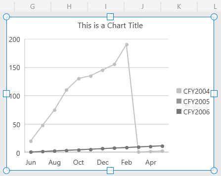
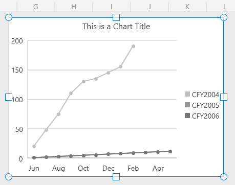

# Environment
| Version | Product | Author | 
| --- | --- | ---- | 
| 2024.1.124 | RadSpreadProcessing |[Desislava Yordanova](https://www.telerik.com/blogs/author/desislava-yordanova)| 
---
# Description
 When the CellRange used for generating the [chart object]() in a worksheet contains blank/empty values, they are converted to zero values which may change the chart line in an unexpected way. This article demonstrates how to update the chart's CellRange and update the range's end when such empty values are found. Thus, the range with null values is cut.

  

# Solution

After importing the XLSX document into a Workbook, iterate the chart shapes and limit the CellRange to the first found blank/empty value:


   ```
    Worksheet worksheet = this.Workbook.ActiveSheet as Worksheet;
            foreach (FloatingChartShape chartShape in worksheet.Charts)
            {
                DocumentChart chart = chartShape.Chart;
                LineSeriesGroup group = chart.SeriesGroups.First() as LineSeriesGroup;
                if (group==null)
                {
                    continue;
                }
                CategorySeriesBase firstSeries = group.Series.Where(s => s is CategorySeriesBase).First() as CategorySeriesBase;
                CellIndex start ;
                CellIndex end;
                CellRange usedChartRange;
                WorkbookFormulaChartData formulaChartData = firstSeries.Values as WorkbookFormulaChartData;
                if (NameConverter.TryConvertCellRangeNameToCellRange(formulaChartData.Formula , out usedChartRange))
                {
                    start = usedChartRange.FromIndex;
                    end = start;
                    for (int rowIndex = usedChartRange.FromIndex.RowIndex; rowIndex <= usedChartRange.ToIndex.RowIndex; rowIndex++)
                    {
                        for (int columnIndex = usedChartRange.FromIndex.ColumnIndex; columnIndex <= usedChartRange.ToIndex.ColumnIndex; columnIndex++)
                        {
                            CellSelection cell = worksheet.Cells[rowIndex, columnIndex];
                            string value = cell.GetValue().Value.RawValue;
                            FormulaCellValue  formulaValue = cell.GetValue().Value as FormulaCellValue;
                            if (formulaValue!=null)
                            {
                                value = formulaValue.GetResultValueAsString(cell.GetFormat().Value);
                            }
                            if (value=="" || value=="0" ||value=="#N/A")
                            {
                                break;
                            }

                            end = new CellIndex(rowIndex, columnIndex);
                        }
                    }
                    usedChartRange = new CellRange(start, end);
                    firstSeries.Values= new  WorkbookFormulaChartData(worksheet, usedChartRange); 
                } 
            }
   ```
 
  

# See Also
- [Using Charts]() 
