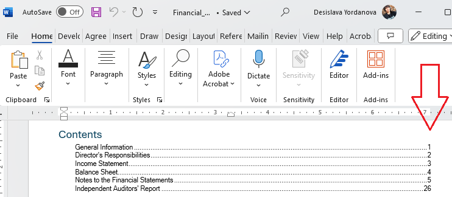
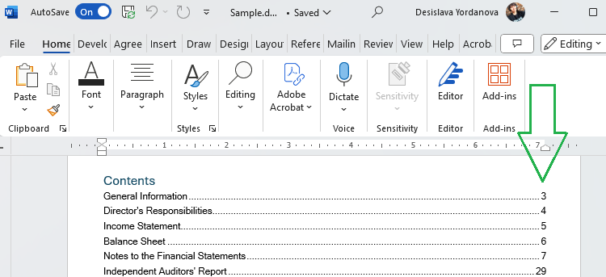

## Environment

| Version | Product | Author | 
| --- | --- | ---- | 
| 2024.2.426| RadWordsProcessing |[Desislava Yordanova](https://www.telerik.com/blogs/author/desislava-yordanova)| 

## Description

When working with Word documents that contain a [Table of Contents (TOC)](), it is often necessary to update the TOC to reflect the correct page numbers before exporting the document to DOCX format. This KB article shows what steps are needed to refresh the page numbers in a document's TOC before exporting the flow document content to DOCX format.

|Before|After|
|----|----|
| | |   

## Solution

To update the TOC in a [RadFlowDocument]() before exporting it to DOCX format, follow these steps:

1. Ensure that your document contains a [TOC field](). RadWordsProcessing supports the TOC field and allows for its update before exporting the document.

2. Before exporting the document to PDF, use the `UpdateFields()` method to update all fields, including the TOC, in the `RadFlowDocument`. This ensures that the TOC reflects the correct page numbers.

3. To accurately update the TOC, including the correct page numbering, it's necessary to calculate the layout of the document. RadWordsProcessing provides the [NumberingFieldsProvider]() for this purpose.

```csharp
FlowExtensibilityManager.NumberingFieldsProvider = new NumberingFieldsProvider();
document.UpdateFields();
```

By setting the `NumberingFieldsProvider` and then calling `RadFlowDocument.UpdateFields()`, the document will update the TOC to reflect the correct page numbering.

4. With the TOC updated, you can now proceed to export the document to DOCX format, confident that the TOC displays the correct page references.

## Notes

- The `UpdateFields()` method updates all fields in the document, not just the TOC. Ensure that this behavior is acceptable for your document's needs before proceeding.
- The `NumberingFieldsProvider` plays a crucial role in ensuring that page numbers are correctly calculated and reflected in the TOC. Make sure to set it before updating the fields.

## See Also

- [RadFlowDocument]()
- [Table of Contents Field]()
- [NumberingFieldsProvider]()
