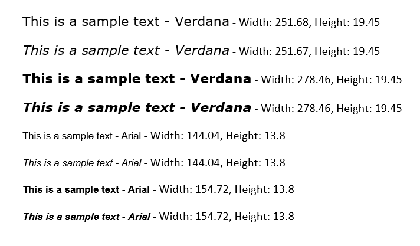

## Environment

| Version | Product | Author | 
| --- | --- | ---- | 
| 2024.1.305 | RadWordsProcessing |[Yoan Karamanov](https://www.telerik.com/blogs/author/yoan-karamanov)| 

## Description

This article shows how to measure text in [WordsProcessing]() in the .NET Framework environment. 

## Solution

You can create a __Telerik.Windows.Documents.Fixed.Model.Editing.[Block]()__ instance with the same content and font properties as the [Run]() you want to insert. Then you can call the __Measure__ method of the block in order to obtain its measurements:

```csharp
using System;
using System.Diagnostics;
using System.IO;
using System.Windows;
using System.Windows.Media;
using Telerik.Windows.Documents.Fixed.Model.Editing;
using Telerik.Windows.Documents.Flow.FormatProviders.Docx;
using Telerik.Windows.Documents.Flow.Model;
using Telerik.Windows.Documents.Flow.Model.Editing;
using Telerik.Windows.Documents.Spreadsheet.Model;

namespace ConsoleNetFramework
{
    internal class Program
    {
        static void Main(string[] args)
        {
            RadFlowDocument flowDocument = new RadFlowDocument();
            RadFlowDocumentEditor editor = new RadFlowDocumentEditor(flowDocument);
            Section section = editor.InsertSection();

            #region Verdana, font size 16
            //Verdana, font size 16
            FontFamily fontFamily = new FontFamily("Verdana");
            string text = "This is a sample text - Verdana";
            int fontSize = 16;

            //FontStyles.Normal, FontWeights.Normal
            Paragraph paragraph = section.Blocks.AddParagraph();
            Size measurementInfo = MeasureText(text, fontFamily, fontSize, FontStyles.Normal, FontWeights.Normal);
            Run run = paragraph.Inlines.AddRun(text);
            run.Properties.FontFamily.LocalValue = new ThemableFontFamily(fontFamily);
            run.FontStyle = FontStyles.Normal;
            run.FontWeight = FontWeights.Normal;
            run.FontSize = fontSize;
            paragraph.Inlines.AddRun($" Width: {Math.Round(measurementInfo.Width, 2)}, Height: {Math.Round(measurementInfo.Height, 2)}");

            //FontStyles.Italic, FontWeights.Normal
            paragraph = section.Blocks.AddParagraph();
            measurementInfo = MeasureText(text, fontFamily, fontSize, FontStyles.Italic, FontWeights.Normal);
            run = paragraph.Inlines.AddRun(text);
            run.Properties.FontFamily.LocalValue = new ThemableFontFamily(fontFamily);
            run.FontStyle = FontStyles.Italic;
            run.FontWeight = FontWeights.Normal;
            run.FontSize = fontSize;
            paragraph.Inlines.AddRun($" - Width: {Math.Round(measurementInfo.Width, 2)}, Height: {Math.Round(measurementInfo.Height, 2)}");

            //FontStyles.Normal, FontWeights.Bold
            paragraph = section.Blocks.AddParagraph();
            measurementInfo = MeasureText(text, fontFamily, fontSize, FontStyles.Normal, FontWeights.Bold);
            run = paragraph.Inlines.AddRun(text);
            run.Properties.FontFamily.LocalValue = new ThemableFontFamily(fontFamily);
            run.FontStyle = FontStyles.Normal;
            run.FontWeight = FontWeights.Bold;
            run.FontSize = fontSize;
            paragraph.Inlines.AddRun($" - Width: {Math.Round(measurementInfo.Width, 2)}, Height: {Math.Round(measurementInfo.Height, 2)}");

            //FontStyles.Italic, FontWeights.Bold
            paragraph = section.Blocks.AddParagraph();
            measurementInfo = MeasureText(text, fontFamily, fontSize, FontStyles.Italic, FontWeights.Bold);
            run = paragraph.Inlines.AddRun(text);
            run.Properties.FontFamily.LocalValue = new ThemableFontFamily(fontFamily);
            run.FontStyle = FontStyles.Italic;
            run.FontWeight = FontWeights.Bold;
            run.FontSize = fontSize;
            paragraph.Inlines.AddRun($" - Width: {Math.Round(measurementInfo.Width, 2)}, Height: {Math.Round(measurementInfo.Height, 2)}");
            #endregion

            #region Arial, font size 12
            //Arial, font size 12
            fontFamily = new FontFamily("Arial");
            fontSize = 12;
            text = "This is a sample text - Arial";

            //FontStyles.Normal, FontWeights.Normal
            paragraph = section.Blocks.AddParagraph();
            measurementInfo = MeasureText(text, fontFamily, fontSize, FontStyles.Normal, FontWeights.Normal);
            run = paragraph.Inlines.AddRun(text);
            run.Properties.FontFamily.LocalValue = new ThemableFontFamily(fontFamily);
            run.FontStyle = FontStyles.Normal;
            run.FontWeight = FontWeights.Normal;
            run.FontSize = fontSize;
            paragraph.Inlines.AddRun($" - Width: {Math.Round(measurementInfo.Width, 2)}, Height: {Math.Round(measurementInfo.Height, 2)}");

            //FontStyles.Italic, FontWeights.Normal
            paragraph = section.Blocks.AddParagraph();
            measurementInfo = MeasureText(text, fontFamily, fontSize, FontStyles.Italic, FontWeights.Normal);
            run = paragraph.Inlines.AddRun(text);
            run.Properties.FontFamily.LocalValue = new ThemableFontFamily(fontFamily);
            run.FontStyle = FontStyles.Italic;
            run.FontWeight = FontWeights.Normal;
            run.FontSize = fontSize;
            paragraph.Inlines.AddRun($" - Width: {Math.Round(measurementInfo.Width, 2)}, Height: {Math.Round(measurementInfo.Height, 2)}");

            //FontStyles.Normal, FontWeights.Bold
            paragraph = section.Blocks.AddParagraph();
            measurementInfo = MeasureText(text, fontFamily, fontSize, FontStyles.Normal, FontWeights.Bold);
            run = paragraph.Inlines.AddRun(text);
            run.Properties.FontFamily.LocalValue = new ThemableFontFamily(fontFamily);
            run.FontStyle = FontStyles.Normal;
            run.FontWeight = FontWeights.Bold;
            run.FontSize = fontSize;
            paragraph.Inlines.AddRun($" - Width: {Math.Round(measurementInfo.Width, 2)}, Height: {Math.Round(measurementInfo.Height, 2)}");

            //FontStyles.Italic, FontWeights.Bold
            paragraph = section.Blocks.AddParagraph();
            measurementInfo = MeasureText(text, fontFamily, fontSize, FontStyles.Italic, FontWeights.Bold);
            run = paragraph.Inlines.AddRun(text);
            run.Properties.FontFamily.LocalValue = new ThemableFontFamily(fontFamily);
            run.FontStyle = FontStyles.Italic;
            run.FontWeight = FontWeights.Bold;
            run.FontSize = fontSize;
            paragraph.Inlines.AddRun($" - Width: {Math.Round(measurementInfo.Width, 2)}, Height: {Math.Round(measurementInfo.Height, 2)}");
            #endregion

            // Save as docx and open
            DocxFormatProvider docxFormatProvider = new DocxFormatProvider();
            string outputPath = "output.docx";
            File.WriteAllBytes(outputPath, docxFormatProvider.Export(flowDocument));

            var psi = new ProcessStartInfo()
            {
                FileName = outputPath,
                UseShellExecute = true
            };
            Process.Start(psi);
        }

        static Size MeasureText(string text, FontFamily fontFamily, double fontSize, FontStyle fontStyle, FontWeight fontWeight)
        {
            Block block = new Telerik.Windows.Documents.Fixed.Model.Editing.Block();
            block.TextProperties.FontSize = fontSize;
            block.InsertText(fontFamily, fontStyle, fontWeight, text);

            return block.Measure();
        }
    }
}

```
#### Result:
 

## See Also

* [PdfProcessing Fonts]()
* [WordsProcessing Measure Text in .NET Standard]()
