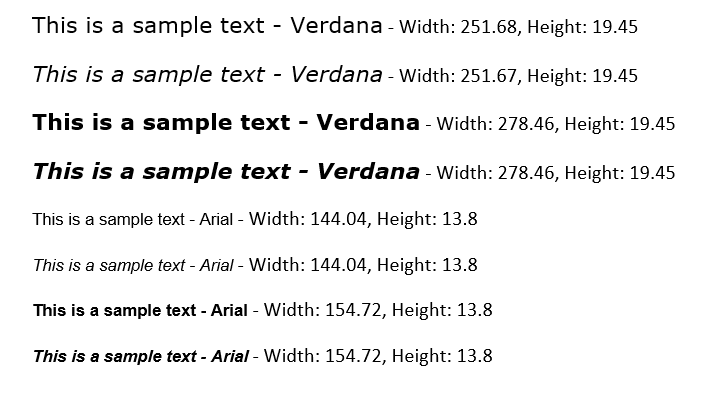

## Environment

| Version | Product | Author | 
| --- | --- | ---- | 
| 2024.1.305 | RadWordsProcessing |[Yoan Karamanov](https://www.telerik.com/blogs/author/yoan-karamanov)| 

## Description

This article shows how to measure text in [WordsProcessing]() in the .NET Standard environment. 

## Solution

You can measure a text by passing the text- and font properties of the [Run]() you want to insert to the __MeasureText__ method of a __Telerik.Windows.Documents.Spreadsheet.Extensibility.[SpreadFixedTextMeasurer](https://docs.telerik.com/devtools/document-processing/libraries/radspreadprocessing/cross-platform-support/text-measure#spreadfixedtextmeasurer)__ instance. Due to [Font Limitations]() of the [PdfProcessing]() library in .NET Standard you would have to provide a [FontsProvider implementation]() as well:

```csharp
using System.Diagnostics;
using Telerik.Documents.Common.Model;
using Telerik.Documents.Core.Fonts;
using Telerik.Windows.Documents.Core.Fonts;
using Telerik.Windows.Documents.Core.TextMeasurer;
using Telerik.Windows.Documents.Extensibility;
using Telerik.Windows.Documents.Flow.FormatProviders.Docx;
using Telerik.Windows.Documents.Flow.Model;
using Telerik.Windows.Documents.Flow.Model.Editing;
using Telerik.Windows.Documents.Spreadsheet.Extensibility;

FontsProviderBase fontsProvider = new FontsProvider();
FixedExtensibilityManager.FontsProvider = fontsProvider;

SpreadTextMeasurerBase textMeasurer = new SpreadFixedTextMeasurer();

RadFlowDocument flowDocument = new RadFlowDocument();
RadFlowDocumentEditor editor = new RadFlowDocumentEditor(flowDocument);
Section section = editor.InsertSection();

#region Verdana, font size 16
//Verdana, font size 16
FontFamily fontFamily = new FontFamily("Verdana");
string text = "This is a sample text - Verdana";
int fontSize = 16;

//FontStyles.Normal, FontWeights.Normal
Paragraph paragraph = section.Blocks.AddParagraph();
TextProperties textProperties = new TextProperties(text, fontSize);
FontProperties fontProperties = new FontProperties(fontFamily, FontStyles.Normal, FontWeights.Normal);
TextMeasurementInfo measurementInfo = textMeasurer.MeasureText(textProperties, fontProperties);
Run run = paragraph.Inlines.AddRun(text);
run.Properties.FontFamily.LocalValue = new ThemableFontFamily(fontFamily);
run.FontStyle = FontStyles.Normal;
run.FontWeight = FontWeights.Normal;
run.FontSize = fontSize;
paragraph.Inlines.AddRun($" - Width: {Math.Round(measurementInfo.Size.Width, 2)}, Height: {Math.Round(measurementInfo.Size.Height, 2)}");

//FontStyles.Italic, FontWeights.Normal
paragraph = section.Blocks.AddParagraph();
fontProperties = new FontProperties(fontFamily, FontStyles.Italic, FontWeights.Normal);
measurementInfo = textMeasurer.MeasureText(textProperties, fontProperties);
run = paragraph.Inlines.AddRun(text);
run.Properties.FontFamily.LocalValue = new ThemableFontFamily(fontFamily);
run.FontStyle = FontStyles.Italic;
run.FontWeight = FontWeights.Normal;
run.FontSize = fontSize;
paragraph.Inlines.AddRun($" - Width: {Math.Round(measurementInfo.Size.Width, 2)}, Height: {Math.Round(measurementInfo.Size.Height, 2)}");

//FontStyles.Normal, FontWeights.Bold
paragraph = section.Blocks.AddParagraph();
fontProperties = new FontProperties(fontFamily, FontStyles.Normal, FontWeights.Bold);
measurementInfo = textMeasurer.MeasureText(textProperties, fontProperties);
run = paragraph.Inlines.AddRun(text);
run.Properties.FontFamily.LocalValue = new ThemableFontFamily(fontFamily);
run.FontStyle = FontStyles.Normal;
run.FontWeight = FontWeights.Bold;
run.FontSize = fontSize;
paragraph.Inlines.AddRun($" - Width: {Math.Round(measurementInfo.Size.Width, 2)}, Height: {Math.Round(measurementInfo.Size.Height, 2)}");

//FontStyles.Italic, FontWeights.Bold
paragraph = section.Blocks.AddParagraph();
fontProperties = new FontProperties(fontFamily, FontStyles.Italic, FontWeights.Bold);
measurementInfo = textMeasurer.MeasureText(textProperties, fontProperties);
run = paragraph.Inlines.AddRun(text);
run.Properties.FontFamily.LocalValue = new ThemableFontFamily(fontFamily);
run.FontStyle = FontStyles.Italic;
run.FontWeight = FontWeights.Bold;
run.FontSize = fontSize;
paragraph.Inlines.AddRun($" - Width: {Math.Round(measurementInfo.Size.Width, 2)}, Height: {Math.Round(measurementInfo.Size.Height, 2)}");
#endregion

#region Arial, font size 12
//Arial, font size 12
fontFamily = new FontFamily("Arial");
fontSize = 12;
text = "This is a sample text - Arial";

//FontStyles.Normal, FontWeights.Normal
paragraph = section.Blocks.AddParagraph();
textProperties = new TextProperties(text, fontSize);
fontProperties = new FontProperties(fontFamily, FontStyles.Normal, FontWeights.Normal);
measurementInfo = textMeasurer.MeasureText(textProperties, fontProperties);
run = paragraph.Inlines.AddRun(text);
run.Properties.FontFamily.LocalValue = new ThemableFontFamily(fontFamily);
run.FontStyle = FontStyles.Normal;
run.FontWeight = FontWeights.Normal;
run.FontSize = fontSize;
paragraph.Inlines.AddRun($" - Width: {Math.Round(measurementInfo.Size.Width, 2)}, Height: {Math.Round(measurementInfo.Size.Height, 2)}");

//FontStyles.Italic, FontWeights.Normal
paragraph = section.Blocks.AddParagraph();
fontProperties = new FontProperties(fontFamily, FontStyles.Italic, FontWeights.Normal);
measurementInfo = textMeasurer.MeasureText(textProperties, fontProperties);
run = paragraph.Inlines.AddRun(text);
run.Properties.FontFamily.LocalValue = new ThemableFontFamily(fontFamily);
run.FontStyle = FontStyles.Italic;
run.FontWeight = FontWeights.Normal;
run.FontSize = fontSize;
paragraph.Inlines.AddRun($" - Width: {Math.Round(measurementInfo.Size.Width, 2)}, Height: {Math.Round(measurementInfo.Size.Height, 2)}");

//FontStyles.Normal, FontWeights.Bold
paragraph = section.Blocks.AddParagraph();
fontProperties = new FontProperties(fontFamily, FontStyles.Normal, FontWeights.Bold);
measurementInfo = textMeasurer.MeasureText(textProperties, fontProperties);
run = paragraph.Inlines.AddRun(text);
run.Properties.FontFamily.LocalValue = new ThemableFontFamily(fontFamily);
run.FontStyle = FontStyles.Normal;
run.FontWeight = FontWeights.Bold;
run.FontSize = fontSize;
paragraph.Inlines.AddRun($" - Width: {Math.Round(measurementInfo.Size.Width, 2)}, Height: {Math.Round(measurementInfo.Size.Height, 2)}");

//FontStyles.Italic, FontWeights.Bold
paragraph = section.Blocks.AddParagraph();
fontProperties = new FontProperties(fontFamily, FontStyles.Italic, FontWeights.Bold);
measurementInfo = textMeasurer.MeasureText(textProperties, fontProperties);
run = paragraph.Inlines.AddRun(text);
run.Properties.FontFamily.LocalValue = new ThemableFontFamily(fontFamily);
run.FontStyle = FontStyles.Italic;
run.FontWeight = FontWeights.Bold;
run.FontSize = fontSize;
paragraph.Inlines.AddRun($" - Width: {Math.Round(measurementInfo.Size.Width, 2)}, Height: {Math.Round(measurementInfo.Size.Height, 2)}");
#endregion

// Save as docx and open
DocxFormatProvider docxFormatProvider = new DocxFormatProvider();
string outputPath = "output.docx";
File.WriteAllBytes(outputPath, docxFormatProvider.Export(flowDocument));

var psi = new ProcessStartInfo()
{
    FileName = outputPath,
    UseShellExecute = true
};
Process.Start(psi);

public class FontsProvider : FontsProviderBase
{
    public override byte[] GetFontData(FontProperties fontProperties)
    {
        string fontFileName = fontProperties.FontFamilyName + ".ttf";
        string fontFolder = Environment.GetFolderPath(Environment.SpecialFolder.Fonts);

        //The fonts can differ depending on the file 
        if (fontProperties.FontFamilyName == "Verdana")
        {
            if (fontProperties.FontStyle == FontStyles.Italic && fontProperties.FontWeight == FontWeights.Bold)
            {
                fontFileName = $"verdanaz.ttf";
            }
            else if (fontProperties.FontStyle == FontStyles.Italic)
            {
                fontFileName = $"verdanai.ttf";
            }
            else if (fontProperties.FontWeight == FontWeights.Normal)
            {
                fontFileName = "verdana.ttf";
            }
            else if (fontProperties.FontWeight == FontWeights.Bold)
            {
                fontFileName = $"verdanab.ttf";
            }
        }

        else if (fontProperties.FontFamilyName == "Arial")
        {
            if (fontProperties.FontStyle == FontStyles.Italic && fontProperties.FontWeight == FontWeights.Bold)
            {
                fontFileName = $"arialbi.ttf";
            }
            else if (fontProperties.FontStyle == FontStyles.Italic)
            {
                fontFileName = $"ariali.ttf";
            }
            else if (fontProperties.FontWeight == FontWeights.Normal)
            {
                fontFileName = "arial.ttf";
            }
            else if (fontProperties.FontWeight == FontWeights.Bold)
            {
                fontFileName = $"arialbd.ttf";
            }
        }

        //...add more fonts if needed... 

        DirectoryInfo directory = new DirectoryInfo(fontFolder);
        FileInfo[] fontFiles = directory.GetFiles();

        var fontFile = fontFiles.FirstOrDefault(f => f.Name.Equals(fontFileName, StringComparison.InvariantCultureIgnoreCase));
        if (fontFile != null)
        {
            string targetPath = fontFile.FullName;
            using (FileStream fileStream = File.OpenRead(targetPath))
            {
                using (MemoryStream memoryStream = new MemoryStream())
                {
                    fileStream.CopyTo(memoryStream);
                    return memoryStream.ToArray();
                }
            }
        }

        return null;
    }
}
```
#### Result:
 

## See Also

* [PdfProcessing Fonts]()
* [FontsProvider Implementation]()
* [PdfProcessing Cross-Platform Fonts]()
* [WordsProcessing Measure Text in .NET Framework]()
* [SpreadProcessing Text Measuring]()
