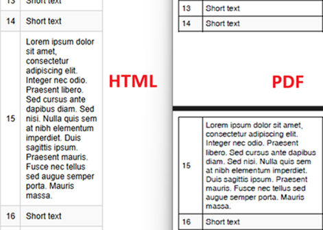

# Environment
| Version | Product | Author | 
| --- | --- | ---- | 
| 2025.3.806 | RadWordsProcessing |[Yoan Karamanov](https://www.telerik.com/blogs/author/yoan-karamanov)| 

## Description

This article shows how to use [WordsProcessing]() and [PdfProcessing]() libraries to convert HTML with tables to a PDF, without splitting rows across pages.

This knowledge base article also answers the following questions:
- How can I prevent table rows from splitting across pages during HTML to PDF conversion?
- How do I handle uneven row heights in tables when exporting to PDF?
- How can I ensure HTML table rows are preserved on a single page during HTML to PDF conversion?

## Solution

To prevent table rows from splitting across pages, manually recreate the PDF table from scratch by copying the HTML table content to a new PDF table. Use the **Measure** method to check whether the table exceeds the page boundary. If it does, create a new page and continue building the table.

### Steps to Implement

1. **Set up the HTML import settings:** Use the [HtmlFormatProvider]() and implement the [LoadImageFromUri](#loadimagefromuri-and-loadstylesheetfromuri-events) event for resolving images in the HTML content.

2. **Load the HTML document:** Import the HTML content into a [RadFlowDocument]() object.

3. **Extract rows from the HTML table:** Enumerate the rows from the HTML table.

4. **Create and format a new PDF table:** For each page, create a new table and add rows while ensuring they fit within the page boundaries, while also setting the desired formatting.

5. **Check row measurements:** After adding each row, use the **Measure** method to verify whether the table exceeds the page height. If it does, move the remaining rows to a new page.

6. **Export the PDF:** Use the [PdfFormatProvider]() to save the final PDF document.

 

```csharp
const string InputHtmlPath = "..\\..\\..\\input.html";
const string OutputPdfPath = "..\\..\\..\\output.pdf";

static void Main(string[] args)
{
    HtmlFormatProvider htmlFormatProvider = new HtmlFormatProvider();
    HtmlImportSettings importSettings = new HtmlImportSettings();

    importSettings.LoadImageFromUri += (s, e) =>
    {
        var data = new System.Net.WebClient().DownloadData(e.Uri);
        e.SetImageInfo(data, Path.GetExtension(e.Uri).Substring(1));
    };

    htmlFormatProvider.ImportSettings = importSettings;

    RadFlowDocument htmlDocument;
    using (var input = File.OpenRead(InputHtmlPath))
        htmlDocument = htmlFormatProvider.Import(input, null);

    var htmlRows = htmlDocument.EnumerateChildrenOfType<Telerik.Windows.Documents.Flow.Model.Table>()
                              .FirstOrDefault().Rows.ToList();

    var mainPdfDocument = new RadFixedDocument();
    int currentRowIndex = 0;

    // Process rows across multiple pages
    while (currentRowIndex < htmlRows.Count)
    {
        var pdfPage = mainPdfDocument.Pages.AddPage();
        var pdfTable = CreateNewTable();
        int rowsAdded = 0;

        while (currentRowIndex < htmlRows.Count)
        {
            var testTable = CreateNewTable();

            // Copy existing rows to test table
            for (int i = currentRowIndex - rowsAdded; i < currentRowIndex; i++)
                if (i >= 0) AddRowToTable(testTable, htmlRows[i], pdfPage);

            AddRowToTable(testTable, htmlRows[currentRowIndex], pdfPage);

            // Check if exceeds page height
            if (testTable.Measure().Height > pdfPage.Size.Height && rowsAdded > 0)
                break;

            AddRowToTable(pdfTable, htmlRows[currentRowIndex], pdfPage);
            rowsAdded++;
            currentRowIndex++;
        }

        new FixedContentEditor(pdfPage).DrawTable(pdfTable);
    }

    File.Delete(OutputPdfPath);
    using (var output = File.OpenWrite(OutputPdfPath))
        new PdfFormatProvider().Export(mainPdfDocument, output, null);

    Process.Start(new ProcessStartInfo(OutputPdfPath) { UseShellExecute = true });
}

private static Telerik.Windows.Documents.Fixed.Model.Editing.Tables.Table CreateNewTable()
{
    var border = new Border(1, new RgbColor(0, 0, 0));
    return new Telerik.Windows.Documents.Fixed.Model.Editing.Tables.Table
    {
        DefaultCellProperties = { Borders = new Telerik.Windows.Documents.Fixed.Model.Editing.Tables.TableCellBorders(border, border, border, border) },
        Margin = new Thickness(10)
    };
}

private static void AddRowToTable(Telerik.Windows.Documents.Fixed.Model.Editing.Tables.Table pdfTable, TableRow htmlRow, RadFixedPage pdfPage)
{
    var pdfRow = pdfTable.Rows.AddTableRow();

    for (int i = 0; i < htmlRow.Cells.Count; i++)
    {
        var pdfCell = pdfRow.Cells.AddTableCell();
        pdfCell.PreferredWidth = pdfPage.Size.Width * (i == 0 ? 0.05 : 0.25);
        pdfCell.Padding = new Thickness(5);
        pdfCell.Background = (pdfTable.Rows.Count % 2 == 0 ? new RgbColor(249, 249, 249) : new RgbColor(255, 255, 255));

        foreach (var htmlBlock in htmlRow.Cells[i].Blocks.OfType<Paragraph>())
        {
            var pdfBlock = pdfCell.Blocks.AddBlock();
            pdfBlock.HorizontalAlignment = Telerik.Windows.Documents.Fixed.Model.Editing.Flow.HorizontalAlignment.Left;
            pdfBlock.VerticalAlignment = Telerik.Windows.Documents.Fixed.Model.Editing.Flow.VerticalAlignment.Center;

            foreach (var htmlInline in htmlBlock.Inlines)
            {
                if (htmlInline is ImageInline htmlImageInline)
                {
                    using (var stream = new MemoryStream(htmlImageInline.Image.ImageSource.Data))
                        pdfBlock.InsertImage(new Telerik.Windows.Documents.Fixed.Model.Resources.ImageSource(stream));
                }
                else if (htmlInline is Run run)
                {                         
                    pdfBlock.InsertText(run.Text);
                }
                else if (htmlInline is Break)
                {
                    pdfBlock.InsertLineBreak();
                }
            }
        }
    }
}
```

## See Also
* [Table]()
* [TableRow]()
* [TableCell]()
