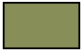
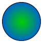
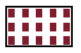

# Colors and Color Spaces

The `ColorBase` abstract class encapsulates colors in different color spaces. The classes that inherit from `ColorBase` are:
      
* [SimpleColor](#simplecolor)

* [PatternColor](#patterncolor)

* [LabColor](#labcolor)

## SimpleColor

Simple colors represent colors defined with color components. The following colors are categorized as simple:

### RgbColor

Represents an ARGB (alpha, red, green, blue) color. The `RgbColor` class exposes the following properties:

| Property | Description |
|---|---|
| `A` | The alpha component value. |
| `R` | The red component value. |
| `G` | The green component value. |
| `B` | The blue component value. |
            
**Example 1** demonstrates how to create an `RgbColor` and assign it as the Fill of a [Path]() element.
        
#### __Example 1: Create RgbColor__

<snippet id='pdf-create-rgb-color'/>

### CmykColor

Represents a CMYK (cyan, magenta, yellow, key) color. The `CmykColor` class was introduced in **Q4 2024** and it exposes the following properties:

| Property | Description |
|---|---|
| `C` | The cyan component of the color, a value between 0.0 and 1.0. |
| `M` | The magenta component of the color, a value between 0.0 and 1.0. |
| `Y` | The yellow component of the color, a value between 0.0 and 1.0. |
| `K` | The key (black) component of the color, a value between 0.0 and 1.0. |

#### Create CmykColor

<snippet id='pdf-create-cmyk-color'/>

 

>note The difference between the RGB and CMYK color spaces is an essential aspect of color management in the design industry. While CMYK is used for traditional print, the RGB color space is used for screen-based media. 

## PatternColor

The abstract `PatternColor` class represents colors defined with the pattern color space. A pattern color paints with a pattern rather than a single color. `PatternColor` is inherited by the `Gradient` and `TilingBase` classes.
        
### Gradient

`Gradient` provides a smooth transition between colors across a painted area. The gradient color is represented by the `Gradient` abstract class which exposes the following properties:

| Property | Description |
|---|---|
| `StartPoint` | A `Point` object representing the starting two-dimensional coordinates of the gradient. |
| `EndPoint` | A `Point` object representing the ending two-dimensional coordinates of the gradient. |
| `ExtendBefore` | Specifies whether to extend the gradient beyond the starting point. |
| `ExtendAfter` | Specifies whether to extend the gradient beyond the ending point. |
| `Background` | A `SimpleColor` object representing the background color. |
| `GradientStops` | A collection of [GradientStop](https://docs.telerik.com/devtools/document-processing/api/Telerik.Windows.Documents.Fixed.Model.ColorSpaces.GradientStop.html) objects representing the gradient stops. |
                
The `Gradient` class is inherited by the following classes:
            
* `LinearGradient`: Defines a color blend along a line between two points, optionally extended beyond the boundary points by continuing the boundary colors.
            
	**Example 2** shows how to create a `LinearGradient` and assign it as the `FillColor` of a [FixedContentEditor]().
            
	#### __Example 2: Create LinearGradient__
	
	<snippet id='pdf-create-linear-gradient'/>
	
The gradient created in **Example 2** is shown in **Figure 1**.
	            
#### Figure 1: LinearGradient	

    
* `RadialGradient`: Defines a blend between two circles, optionally extended beyond the boundary circles by continuing the boundary colors. The `RadialGradient` class exposes the following additional properties:

| Property | Description |
|---|---|
| `StartRadius` | Decimal number determining the radius of the starting circle. |
| `EndRadius` | Decimal number determining the radius of the ending circle. |
              
**Example 3** demonstrates how to create a `RadialGradient` and assign it as the `FillColor` of a [FixedContentEditor]().
	
#### __Example 3: Create RadialGradient__
	
<snippet id='pdf-create-linear-gradient'/>
	
The result from **Example 3** is shown in **Figure 2**.
	
#### Figure 2: RadialGradient
	

### Tiling Pattern

A tiling pattern consists of a small graphical figure called a pattern cell. Painting with the pattern replicates the cell at fixed horizontal and vertical intervals to fill an area. The tiling pattern is represented by the `TilingBase` abstract class, which exposes the following properties:

| Property | Description |
|---|---|
| `BoundingBox` | Of type `Rect`, representing the dimensions of the pattern cell. |
| `VerticalSpacing` | Decimal number determining the vertical spacing between pattern cells. |
| `HorizontalSpacing` | Decimal number determining the horizontal spacing between pattern cells. |
| `Size` | The size of the bounding box. |
| `Content` | The collection of content elements inside a pattern cell. |
| `Position` | The position of the tiling pattern. |
| `TilingType` | Of type [TilingType](https://docs.telerik.com/devtools/document-processing/api/Telerik.Windows.Documents.Fixed.Model.ColorSpaces.TilingType.html), represents the tiling type. Possible values: `AllowSmallDistortion` (cells spaced consistently with slight distortion), `NoDistortion` (cells not distorted but spacing may vary), `FastTiling` (consistent spacing with additional distortion for efficient painting). |
	                    

The `TilingBase` class is inherited by the following classes:

* `Tiling`: Represents a tiling pattern.

* `UncoloredTiling`: Represents an uncolored tiling pattern. You can define this type of tiling pattern with some specific content, and then reuse it with a different color. It exposes two additional properties: `Tiling` which represents the tiling to be used, and `Color` representing the color of the content of the specified tiling.

Because the `TilingBase` class implements the `IContentRootElement` interface like [RadFixedPage](), you can modify the content of the tiling using the `FixedContentEditor` class. **Example 4** shows how to create a tiling pattern.

#### __Example 4: Create Tiling__

<snippet id='pdf-create-tiling'/>

The tiling created in **Example 4** is shown in **Figure 3**.

#### Figure 3: Tiling

## LabColor

 **LAB** is a device-independent color space: **L** represents lightness or brightness, **A** represents the red-green axis, and **B** represents the yellow-blue axis.

#### Create LabColor

<snippet id='pdf-create-lab-color'/>

## See Also

 * [Path]()
 * [FixedContentEditor]()
