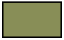

# Colors and Color Spaces

The __ColorBase__ abstract class is used to encapsulate colors in different color spaces. The classes which inherit from __ColorBase__ are:
      
* [SimpleColor](#simplecolor)

* [PatternColor](#patterncolor)

* [LabColor](#labcolor)

## SimpleColor

The simple colors represent colors, which are defined with color components. The following colors are categorized as simple:

### RgbColor

Represents an ARGB (alpha, red, green, blue) color. The RgbColor class exposes the following properties: 

* __A__: The alpha component value.
* __R__: The red component value.
* __G__: The green component value.
* __B__: The blue component value.
            
__Example 1__ demonstrates how you can create an RgbColor and assign it as Fill of a [Path]() element.
        
#### __[C#] Example 1: Create RgbColor__

{{region cs-radpdfprocessing-concepts-colors-and-color-spaces_0}}
	RgbColor magenta = new RgbColor(255, 0, 255);
	Path path = new Path();
	path.Fill = magenta;
{{endregion}}

### CmykColor

Represents a CMYK (cyan, magenta, yellow, key) color. The CmykColor class was introduced in **Q4 2024** and it exposes the following properties:

* **C**: The cyan component of the color, a value between 0.0 and 1.0.
* **M**: The magenta component of the color, a value between 0.0 and 1.0.
* **Y**: The yellow component of the color, a value between 0.0 and 1.0.
* **K**: The key (black) component of the color, a value between 0.0 and 1.0.

#### Create CmykColor

<snippet id='codeblock_11'/>

 

>note The difference between the RGB and CMYK color spaces is an essential aspect of color management in the design industry. While CMYK is used for traditional print, the RGB color space is used for screen-based media. 

## PatternColor

The abstract __PatternColor__ class represents colors, which are defined with the pattern color space. A pattern color paints with a pattern rather than a single color. PatternColor is inherited by the __Gradient__ and __TilingBase__ classes.
        
### Gradient

Gradient provides a smooth transition between colors across an area which is painted. The gradient color is represented by the __Gradient__ abstract class which exposes the following properties:         

* __StartPoint__: A __Point__ object representing the starting two-dimensional coordinates of the gradient.

* __EndPoint__: A __Point__ object representing the ending two-dimensional coordinates of the gradient.

* __ExtendBefore__: Specifies whether to extend the gradient beyond the starting point.

* __ExtendAfter__: Specifies whether to extend the gradient beyond the ending point.

* __Background__: __SimpleColor__ object representing the background color.

* __GradientStops__: A collection of [GradientStop](https://docs.telerik.com/devtools/document-processing/api/Telerik.Windows.Documents.Fixed.Model.ColorSpaces.GradientStop.html) objects representing the gradient stops collection.
                
The __Gradient__ class is inherited by the following classes:
            
* __LinearGradient__: Defines a color blend along a line between two points, optionally extended beyond the boundary points by continuing the boundary colors.
            
	__Example 2__ shows how to create a LinearGradient and assign it as the FillColor of a [FixedContentEditor]().
            
	#### __[C#] Example 2: Create LinearGradient__
	
	{{region cs-radpdfprocessing-concepts-colors-and-color-spaces_1}}
		FixedContentEditor containerEditor = new FixedContentEditor(container);
		
		LinearGradient linearGradient = new LinearGradient(new Point(0, 0), new Point(30, 30));
		linearGradient.GradientStops.Add(new GradientStop(new RgbColor(0, 207, 0), 0));
		linearGradient.GradientStops.Add(new GradientStop(new RgbColor(0, 102, 204), 1));
		
		containerEditor.GraphicProperties.FillColor = linearGradient;
		containerEditor.DrawRectangle(new Rect(10, 10, 48, 29));
	{{endregion}}
	
	The gradient created in __Example 2__ is shown in __Figure 1__.
	            
	#### Figure 1: LinearGradient	
	
    
* __RadialGradient__: Defines a blend between two circles, optionally extended beyond the boundary circles by continuing the boundary colors. The __RadialGradient__ class exposes the following properties:
                

	 * __StartRadius__: Decimal number determining the radius of the starting circle.
	 * __EndRadius__: Decimal number determining the radius of the ending circle.
              
	__Example 3__ demonstrates how to create a RadialGradient and assing it as the FillColor of a [FixedContentEditor]().
	
	#### __[C#] Example 3: Create RadialGradient__
	
	{{region cs-radpdfprocessing-concepts-colors-and-color-spaces_3}}
		FixedContentEditor containerEditor = new FixedContentEditor(container);
		
		RadialGradient radialGradient = new RadialGradient(new Point(40, 40), new Point(40, 40), 0, 30);
		radialGradient.GradientStops.Add(new GradientStop(new RgbColor(0, 207, 0), 0));
		radialGradient.GradientStops.Add(new GradientStop(new RgbColor(0, 102, 204), 1));
		
		containerEditor.GraphicProperties.FillColor = radialGradient;
		containerEditor.DrawEllipse(new Point(40, 40), 30, 30);
	{{endregion}}
	
	The result from __Example 3__ is shown in __Figure 2__.
	
	#### Figure 2: RadialGradient
	
	

### Tiling Pattern

A tiling pattern consists of a small graphical figure called a pattern cell. Painting with the pattern replicates the cell at fixed horizontal and vertical intervals to fill an area. The tiling pattern is represented by the __TilingBase__ abstract class, which exposes the following properties:
            

* __BoundingBox__: Property of type __Rect__ representing the dimensions pattern cell.

* __VerticalSpacing__: Decimal number determining the vertical spacing between pattern cells.               

* __HorizontalSpacing__: Decimal number determining the horizontal spacing between pattern cells.             

* __Size__: The size of the bounding box.             

* __Content__: The collection of content elements inside a pattern cell.                

* __Position__: The position of the tiling pattern.               

* __TilingType__: Property of type [TilingType](https://docs.telerik.com/devtools/document-processing/api/Telerik.Windows.Documents.Fixed.Model.ColorSpaces.TilingType.html) that represents the tiling type.The possible values are:
	 * __AllowSmallDistortion__: Pattern cells are spaces consistently. To achieve this, the pattern cell might be slightly distorted by making small adjustments to the __HorizontalSpacing__ and __VerticalSpacing__.
	 * __NoDistortion__: Pattern cells are not distorted, but the spacing between pattern cells may vary. This achieves the spacing requested by __HorizontalSpacing__ and __VerticalSpacing__ on average, but not necessarily for each individual pattern cell.
	 * __FastTiling__: Pattern cells are spaced consistently as in __AllowSmallDistortion__ type but with additional distortion permitted to enable a more efficient painting.
	                    

The __TilingBase__ class is inherited from the following classes:
            

* __Tiling__: Represents a tiling pattern.

* __UncoloredTiling__: Represents an uncolored tiling pattern. This type of tiling patterns can be defined with some specific content, and then reused with a different color of their content. It exposes two additional properties - __Tiling__ which represents the tiling to be used and __Color__ representing the color of the content of the specified tiling.
                

Since the __TilingBase__ class implements the __IContentRootElement__ interface like [RadFixedPage](), the content of the tiling can be modified using the __FixedContentEditor__ class. __Example 4__ shows how a tiling pattern can be created.
            

#### __[C#] Example 4: Create tiling__

{{region cs-radpdfprocessing-concepts-colors-and-color-spaces_2}}
	FixedContentEditor containerEditor = new FixedContentEditor(container);
	
	Tiling tiling = new Tiling(new Rect(0, 0, 10, 10));
	FixedContentEditor tilingEditor = new FixedContentEditor(tiling);
	tilingEditor.GraphicProperties.IsStroked = false;
	tilingEditor.GraphicProperties.FillColor = new RgbColor(128, 28, 43);
	tilingEditor.DrawRectangle(new Rect(2, 2, 5, 7));
	
	containerEditor.GraphicProperties.FillColor = tiling;
	containerEditor.DrawCircle(new Point(30, 30), 20);
{{endregion}}

The tiling created in __Example 4__ is shown in __Figure 3__.        

#### Figure 3: Tiling

## LabColor

 **LAB** is a device-independent color space: **L** represents lightness or brightness, **A** represents the red-green axis, and **B** represents the yellow-blue axis.

#### Create LabColor

<snippet id='codeblock_12'/>

## See Also

 * [Path]()
 * [FixedContentEditor]()
