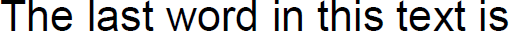
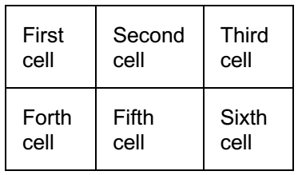

# FixedContentEditor

**FixedContentEditor** is intended to simplify the process of creating and editing the content of a PDF page, also known as **IContentRootElement** or simply [RadFixedPage]().
      
>note Unlike [RadFixedDocumentEditor]() which manages the document's content in a flow-like manner and allows you to insert all desired elements one after another without calculating the elements' position, the **FixedContentEditor** requires managing the Position at which the document elements will be drawn. This will give you the possibility to draw the respective element at a fixed position. However, you should be careful about the available remaining space on the page and the space needed for the element to be drawn. A complete example of how to create a PDF document from scratch is available in the [How to Generate a PDF Document with Logo and Text using FixedContentEditor]() KB article.

## Creating FixedContentEditor with a Specified Position

__FixedContentEditor__ is always associated with a single [RadFixedPage]() (also known as **IContentRootElement**) which it takes as a constructor parameter when it is created. __Example 1__ shows how you can create an editor.

#### __[C#] Example 1: Create FixedContentEditor__

{{region cs-radpdfprocessing-editing-fixedcontenteditor_0}}
	FixedContentEditor editor = new FixedContentEditor(contentRootElement);
{{endregion}}

The editor maintains an internal [Position]() inside the content root element. When a new element is created, its position is being set to the current position of the editor. The initial position of the editor can be specified when it is created.      

__Example 2__ demonstrates how you can create a FixedContentEditor with a specific initial [Position]().
        
#### __[C#] Example 2: Create FixedContentEditor with a specific position__

{{region cs-radpdfprocessing-editing-fixedcontenteditor_1}}
	FixedContentEditor editor = new FixedContentEditor(contentRootElement, initialPosition);
{{endregion}}

## Inserting Elements

Composing a [RadFixedDocument]() normally requires to create all elements and specify exactly how they should look. The **FixedContentEditor** takes care of most things for you. This section explains how you can add different type of elements.
        
### Inserting Text

Inserting a [TextFragment]() can be done with the __public void DrawText(string text)__ method. __Example 3__ inserts a fragment with content "First text fragment.".     

#### __[C#] Example 3: Insert TextFragment__

{{region cs-radpdfprocessing-editing-fixedcontenteditor_2}}
	editor.DrawText("First text fragment.");
{{endregion}}

__Figure 1__ shows the result of __Example 3__.         

#### Figure 1: TextFragment result

>The '\r' and '\n' characters don't have the usual meaning of "go to next line" when they are inserted into a PDF document and you cannot simply insert text containing these characters to produce multiline text. Instead, you should split the text and insert it line by line. 

### Inserting Paragraph

__Example 4__ shows how you can use the __Block__ object to draw a paragraph.         

#### __[C#] Example 4: Insert paragraph__

{{region cs-radpdfprocessing-editing-fixedcontenteditor_3}}
	Block block = new Block();
	block.InsertText("First sentence.");
	block.InsertText("Second sentence.");
	editor.DrawBlock(block);
{{endregion}}

__Figure 2__ shows the result of __Example 4__.        

#### Figure 2: Paragraph

>tip Building a paragraph with the FixedContentEditor is much simpler than creating TextFragments yourself. The [Block]() object would flow the content of a paragraph for you if this is necessary.  

### Inserting Image

__FixedContentEditor__ provides several overloads for inserting an [Image]().       

- public void DrawImage(Stream stream); 
- public void DrawImage(Stream stream, double width, double height);
- public void DrawImage(Stream stream, Size size);
- public void DrawImage(ImageSource source);
- public void DrawImage(ImageSource source, Size size);
- public void DrawImage(ImageSource source, double width, double height);

__Example 5__ shows how you can add an image created from a Stream.
            
#### __[C#] Example 5: Insert image__

{{region cs-radpdfprocessing-editing-fixedcontenteditor_4}}
	using (Stream stream = this.GetResourceStream("Telerik_logo.jpg"))
	{
	    editor.DrawImage(stream, new Size(118, 28));
	}
{{endregion}}

#### Figure 3: Image result

### Inserting Geometries

The following methods can be used to insert different [Geometries]() in the document:          

- public void **DrawLine**(Point point1, Point point2): Inserts a line between the specified points.
- public void **DrawRectangle**(Rect rectangle): Inserts a rectangle.
- public void **DrawEllipse**(Point center, double radiusX, double radiusY): Inserts an ellipse.
- public void **DrawCircle**(Point center, double radius): Inserts a circle.
- public void **DrawPath**(PathGeometry pathGeometry): Inserts a custom path geometry.
          
__Example 6__ shows how you can add an ellipse using one of FixedContentEditor's methods.
            
#### __[C#] Example 6: Insert ellipse__

{{region cs-radpdfprocessing-editing-fixedcontenteditor_5}}
	editor.DrawEllipse(new Point(250, 70), 136, 48);
{{endregion}}

### Inserting Clipping

__FixedContentEditor__ exposes a __Clipping__ property, which defines the [Clipping]() to be used for the inserted content elements. The following methods can be used to push and pop clippings:         

* public IDisposable **PushClipping**(GeometryBase clip): Inserts a new clipping defined from the specified geometry.
* public IDisposable **PushClipping**(Rect clip): Inserts a new clipping defined from the specified rectangle.
* public Clipping **PopClipping**(): Pops the last clipping, which was inserted with the editor.
            
When the returned __IDisposable__ object from the __PushClipping()__ method is disposed, the clipping is popped from the clippings in the editor.          

When a new clipping is pushed, it is set as a clipping to the current clipping in the editor. __Example 7__ shows how a clipping can be pushed.
            
#### __[C#] Example 7: Push clipping__

{{region cs-radpdfprocessing-editing-fixedcontenteditor_6}}
	string visibleText = "The last word in this text is";
	string text = string.Format("{0} clipped.", visibleText); //The last word in this text is clipped.
	Block block = new Block();
	block.InsertText(visibleText);
	Size visisibleTextSize = block.Measure();
	
	using (editor.PushClipping(new Rect(new Point(0, 0), visisibleTextSize)))
	{
	    editor.DrawText(text);
	}
{{endregion}}

__Figure 4__ shows the result of __Example 7__.
            
#### Figure 4: Clipping result

### Inserting Table

__FixedContentEditor__ exposes __DrawTable()__ method, which allows you to easily position and draw tabular data in the PDF document. You can specify the size you need to fit the table in by using the appropriate overload of the __DrawTable()__ method.
            
__Example 8__ generates a table and draws it in some fixed size.          

#### __[C#] Example 8: Insert table__

{{region cs-radpdfprocessing-editing-fixedcontenteditor_8}}
	Table table = new Table();
	Border border = new Border();
	table.DefaultCellProperties.Borders = new TableCellBorders(border, border, border, border);
	table.DefaultCellProperties.Padding = new Thickness(10);
	TableRow firstRow = table.Rows.AddTableRow();
	firstRow.Cells.AddTableCell().Blocks.AddBlock().InsertText("First cell");
	firstRow.Cells.AddTableCell().Blocks.AddBlock().InsertText("Second cell");
	firstRow.Cells.AddTableCell().Blocks.AddBlock().InsertText("Third cell");
	TableRow secondRow = table.Rows.AddTableRow();
	secondRow.Cells.AddTableCell().Blocks.AddBlock().InsertText("Forth cell");
	secondRow.Cells.AddTableCell().Blocks.AddBlock().InsertText("Fifth cell");
	secondRow.Cells.AddTableCell().Blocks.AddBlock().InsertText("Sixth cell");
	
	RadFixedDocument document = new RadFixedDocument();
	RadFixedPage page = document.Pages.AddPage();
	FixedContentEditor editor = new FixedContentEditor(page);
	editor.Position.Translate(10, 10);
	editor.DrawTable(table, new Size(180, double.PositiveInfinity));
{{endregion}}

#### The table created in Example 8

More detailed information about tables is available in the [Table]() documentation article.

### Inserting Forms

With the FixedContentEditor class you can insert a Form (Form-XObject) element. 

#### __[C#] Example 9: Insert a form__
{{region cs-radpdfprocessing-editing-fixedcontenteditor_9}}
	editor.DrawForm(formSource);
{{endregion}}

There are two more overloads of DrawForm() that enable you to pass the size that should be used for the form.

>For more information on how to create a form, check the [Form]() and [FormSource]() articles.

### Inserting Widgets

The Widget annotations allow you visualize the content of a FormField. With the API of FixedContentEditor, you can easily create and insert widgets to the PDF document. The **DrawWidget**() method has two overloads:

* **DrawWidget<T>(FormField<T> parentField, Size annotationSize)**: Creates new [Widget]() representing the [FormField]() instance passed as a parameter and draws the widget with the specified annotation size. This method will add widget only in cases when the root of the FixedContentEditor supports annotations. 

	#### **[C#] Example 10: Insert PushButtonField with PushButtonWidget using DrawWidget**
	
	{{region cs-radpdfprocessing-editing-fixedcontenteditor_10}}
	
		PushButtonField pushButton = new PushButtonField("button");
	
		document.AcroForm.FormFields.Add(pushButton);
	
		editor.Position.Translate(20, 450);
		editor.DrawWidget(pushButton, new Size(100, 20));
	{{endregion}}

* **DrawWidget(RadioButtonField parentField, RadioOption option, Size annotationSize)**: Creates new [RadioButtonWidget](#radiobuttonwidget-class) and draws the widget with the specified annotation size. This method will add widget only in cases when the root of the FixedContentEditor supports annotations. The second parameter represents the option that should be visualized by the widget.
	
	#### **[C#] Example 11: Insert RadioButtonField with RadioButtonWidget using DrawWidget**
	
	{{region cs-radpdfprocessing-editing-fixedcontenteditor_11}}
	
		RadioButtonField radio = new RadioButtonField("radio");
		radio.Options.Add(new RadioOption("first radio"));
		radio.Options.Add(new RadioOption("second radio"));
		radio.Options.Add(new RadioOption("third radio"));
		radio.Value = radio.Options[1];
	
		document.AcroForm.FormFields.Add(radio);
		
		editor.Position.Translate(20, 410);
		editor.DrawWidget(radio, radio.Options[0], new Size(20, 20));
		editor.Position.Translate(50, 410);
		editor.DrawWidget(radio, radio.Options[1], new Size(20, 20));
		editor.Position.Translate(80, 410);
		editor.DrawWidget(radio, radio.Options[2], new Size(20, 20));
	{{endregion}}

## Positioning

The [Position]() property exposed by __FixedContentEditor__ provides an easy way to manipulate the position of inserted content elements.   

The code in __Example 12__ shows how to manipulate the position of the inserted content elements and __Figure 5__ shows the result of the code.     

#### __[C#] Example 12: Scale and rotate content__

{{region cs-radpdfprocessing-editing-fixedcontenteditor_7}}
	editor.Position.Scale(1.5, 0.5);
	editor.Position.Rotate(10);
	editor.DrawText("Image:");
	editor.Position.Translate(0, 20);
	using (Stream stream = this.GetResourceStream("Telerik_logo.jpg"))
	{
	    editor.DrawImage(stream, new Size(118, 28));
	}
{{endregion}}

#### Figure 5: Positioning result

     

## Changing Current Styles

__FixedContentEditor__ has some properties and methods that affect how it will be rendered:
        

* __TextProperties and GraphicProperties__: Responsible for the properties of text and graphics. For more information see the [Text and Graphic Properties]() article.
            

* __SaveTextProperties()__: Saves the TextProperties. It returns an IDisposable object which calls RestoreTextProperties() when disposed and can be used in a using statement.
            

* __RestoreTextProperties()__: Restores the TextProperties.
            

* __SaveGraphicProperties()__: Saves the GraphicProperties. It returns an IDisposable object which calls RestoreGraphicProperties() when disposed and can be used in a using statement.
            

* __RestoreGraphicProperties()__: Restores the GrahpicProperties.
            

* __SaveProperties()__: Saves both the text and the graphic properties. It returns an IDisposable object which calls RestoreProperties() when disposed and can be used in a using statement.
            

* __RestoreProperties()__: Restores both text and graphic properties.
            

## See Also

 * [RadFixedPage]()
 * [Block]()
 * [Position]()
 * [TextFragment]()
 * [Image]()
 * [Geometry]()
 * [Clipping]()
 * [Table]()
 * [How to Generate a PDF Document from Images with FixedContentEditor]()
 * [Splitting a Large Image Across Multiple PDF Pages]()
 * [Resizing Large Images to Fit in the PDF Page]()
