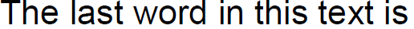
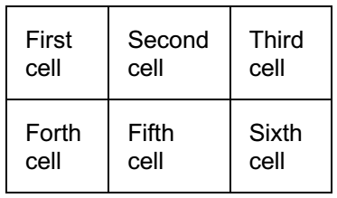

# FixedContentEditor

`FixedContentEditor` is intended to simplify the process of creating and editing the content of a PDF page, also known as `IContentRootElement` or [RadFixedPage]().
      
>note Unlike [RadFixedDocumentEditor]() which manages the document content in a flow-like manner and allows you to insert all desired elements one after another without calculating the element position, `FixedContentEditor` requires managing the Position at which the document elements are drawn. This gives you the possibility to draw the respective element at a fixed position. However, you must be careful about the available remaining space on the page and the space needed for the element to be drawn. A complete example of how to create a PDF document from scratch is available in the [How to Generate a PDF Document with Logo and Text using FixedContentEditor]() KB article.

## Public API

|Method/Property|Description|
|----|----|
|**[Position]()**|Gets or sets the current position of the editor.|
|**[Clipping]()**|Defines the outline of other content elements like [Image]() and [Path]().|
|**PushClipping**|Inserts a new clipping defined from the specified object depending on the overload.|
|**PopClipping**|Pops the last clipping, which was inserted with the editor.|
|**DrawText**|Draws text as a [TextFragment]() at the current position and with size depending on the overload.|
|**DrawImage**|Draws an [Image]() at the current position and with size depending on the overload.|
|**DrawForm**|Draws a [Form]() at the current position and with size depending on the overload.|
|**DrawWidget**|Creates a [Widget]() with different type and size depending on the overload.|
|**DrawStampAnnotation**|Creates a new [StampAnnotation]() and draws it with a specified size and name.|
|**DrawTextAnnotation**|Creates a new [TextAnnotation]() and draws it with a specified size and text.|
|**DrawLineAnnotation**|Creates a new [LineAnnotation]() with starting point the current point of the editor and end point the current point of the editor plus the given distances.|
|**DrawLine**|Draws a line from point A to point B.|
|**DrawRectangle**|Draws a rectangle ([Geometry]()).|
|**DrawEllipse**|Draws an ellipse ([Geometry]()).|
|**DrawCircle**|Draws a circle ([Geometry]()).|
|**DrawPath**|Draws a path ([Geometry]()).|
|**DrawTable**|Draws a [Table]() with size depending on the overload.|
|**DrawBlock**|Draws a [Block]() with size depending on the overload.|
|**Draw**|Draws the specified element.|

## Creating FixedContentEditor with a Specified Position

`FixedContentEditor` is always associated with a single [RadFixedPage]() (also known as `IContentRootElement`) which it takes as a constructor parameter when created. **Example 1** shows how to create an editor.

#### **Example 1: Create FixedContentEditor**

 <snippet id='libraries-pdf-editing-fixedcontenteditor-create-fixedcontenteditor'/>
 
The editor maintains an internal [Position]() inside the content root element. When a new element is created, its position is set to the current position of the editor. You can specify the initial position of the editor when creating it.      

**Example 2** demonstrates how to create a `FixedContentEditor` with a specific initial [Position]().
        
#### **Example 2: Create FixedContentEditor with a specific position**

 <snippet id='libraries-pdf-editing-fixedcontenteditor-set-fixedcontenteditor-position'/>

## Inserting Elements

Composing a [RadFixedDocument]() normally requires creating all elements and specifying exactly how they look. The `FixedContentEditor` takes care of most things for you. This section explains how to add different types of elements.
        
### Inserting Text

Insert a [TextFragment]() with the `public void DrawText(string text)` method. **Example 3** inserts a fragment with content "First text fragment.".     

#### **Example 3: Insert TextFragment**

<snippet id='fixed-content-editor-insert-text-fragment'/>

**Figure 1** shows the result of **Example 3**.         

#### Figure 1: TextFragment result

>The '\r' and '\n' characters do not have the usual meaning of "go to next line" when inserted into a PDF document, and you cannot insert text containing these characters to produce multiline text. Instead, split the text and insert it line by line.

### Inserting Paragraph

**Example 4** shows how to use the `Block` object to draw a paragraph.         

#### **Example 4: Insert paragraph**

<snippet id='fixed-content-editor-insert-paragraph'/>

**Figure 2** shows the result of **Example 4**.        

#### Figure 2: Paragraph

>tip Building a paragraph with the FixedContentEditor is much simpler than creating TextFragments yourself. The [Block]() object flows the content of a paragraph for you if necessary.

### Inserting Image

`FixedContentEditor` provides several overloads for inserting an [Image]():       

* public void DrawImage(Stream stream); 
* public void DrawImage(Stream stream, double width, double height);
* public void DrawImage(Stream stream, Size size);
* public void DrawImage(ImageSource source);
* public void DrawImage(ImageSource source, Size size);
* public void DrawImage(ImageSource source, double width, double height);

**Example 5** shows how to add an image created from a Stream.
            
#### **Example 5: Insert image**

<snippet id='fixed-content-editor-insert-image'/>

#### Figure 3: Image result

### Inserting Geometries

The following methods can be used to insert different [Geometries]() in the document:          

* public void `DrawLine`(Point point1, Point point2): Inserts a line between the specified points.
* public void `DrawRectangle`(Rect rectangle): Inserts a rectangle.
* public void `DrawEllipse`(Point center, double radiusX, double radiusY): Inserts an ellipse.
* public void `DrawCircle`(Point center, double radius): Inserts a circle.
* public void `DrawPath`(PathGeometry pathGeometry): Inserts a custom path geometry.
          
**Example 6** shows how to add an ellipse using one of the `FixedContentEditor` methods.
            
#### **Example 6: Insert ellipse**

<snippet id='fixed-content-editor-insert-ellipse'/>

### Inserting Clipping

`FixedContentEditor` exposes a `Clipping` property, which defines the [Clipping]() to be used for the inserted content elements. The following methods can be used to push and pop clippings:         

* public IDisposable `PushClipping`(GeometryBase clip): Inserts a new clipping defined from the specified geometry.
* public IDisposable `PushClipping`(Rect clip): Inserts a new clipping defined from the specified rectangle.
* public Clipping `PopClipping`(): Pops the last clipping, which was inserted with the editor.
            
When the returned `IDisposable` object from the `PushClipping()` method is disposed, the clipping is popped from the clippings in the editor.          

When a new clipping is pushed, it is set as a clipping to the current clipping in the editor. **Example 7** shows how to push a clipping.
            
#### **Example 7: Push clipping**

 <snippet id='libraries-pdf-editing-fixedcontenteditor-push-clipping'/>

**Figure 4** shows the result of **Example 7**.
            
#### Figure 4: Clipping result

### Inserting Table

`FixedContentEditor` exposes the `DrawTable()` method, which allows you to position and draw tabular data in the PDF document. You can specify the size you need to fit the table in by using the appropriate overload of the `DrawTable()` method.
            
**Example 8** generates a table and draws it in a fixed size.          

#### **Example 8: Insert table**

<snippet id='fixed-content-editor-insert-table'/>

#### The Table Created in Example 8

More detailed information about tables is available in the [Table]() documentation article.

### Inserting Forms

With the `FixedContentEditor` class you can insert a Form (Form-XObject) element. 

#### **Example 9: Insert a form**
<snippet id='fixed-content-editor-insert-form'/>

There are two more overloads of `DrawForm()` that allow you to pass the size that should be used for the form.

>For more information on how to create a form, see the [Form]() and [FormSource]() articles.

### Inserting Widgets

The Widget annotations allow you to visualize the content of a FormField. With the API of `FixedContentEditor`, you can create and insert widgets to the PDF document. The `DrawWidget()` method has two overloads:

* **DrawWidget&lt;T&gt;(FormField&lt;T&gt; parentField, Size annotationSize)**: Creates a new [Widget]() representing the [FormField]() instance passed as a parameter and draws the widget with the specified annotation size. This method adds a widget only in cases when the root of the FixedContentEditor supports annotations. 

	#### **Example 10: Insert PushButtonField with PushButtonWidget using DrawWidget**
	
	<snippet id='fixed-content-editor-insert-pushbuttonfield'/>

* **DrawWidget(RadioButtonField parentField, RadioOption option, Size annotationSize)**: Creates a new [RadioButtonWidget](#radiobuttonwidget-class) and draws the widget with the specified annotation size. This method adds a widget only in cases when the root of the FixedContentEditor supports annotations. The second parameter represents the option that the widget visualizes.
	
	#### **Example 11: Insert RadioButtonField with RadioButtonWidget using DrawWidget**
	
	<snippet id='fixed-content-editor-insert-radiobuttonfield'/>

## Positioning

The [Position]() property exposed by `FixedContentEditor` provides an easy way to manipulate the position of inserted content elements.   

The code in **Example 12** shows how to manipulate the position of the inserted content elements and **Figure 5** shows the result of the code.     

#### **Example 12: Scale and rotate content**

<snippet id='fixed-content-editor-scale-rotate'/>

#### Figure 5: Positioning result

     

## Changing Current Styles

`FixedContentEditor` has properties and methods that affect how it is rendered:
        

* `TextProperties` and `GraphicProperties`: Responsible for the properties of text and graphics. For more information, see the [Text and Graphic Properties]() article.
            

* `SaveTextProperties()`: Saves the TextProperties. It returns an IDisposable object which calls `RestoreTextProperties()` when disposed and can be used in a using statement.
            

* `RestoreTextProperties()`: Restores the TextProperties.
            

* `SaveGraphicProperties()`: Saves the GraphicProperties. It returns an IDisposable object which calls `RestoreGraphicProperties()` when disposed and can be used in a using statement.
            

* `RestoreGraphicProperties()`: Restores the GraphicProperties.
            

* `SaveProperties()`: Saves both the text and the graphic properties. It returns an IDisposable object which calls `RestoreProperties()` when disposed and can be used in a using statement.
            

* `RestoreProperties()`: Restores both text and graphic properties.
            

## See Also
* [How to Generate a PDF Document from Images with FixedContentEditor]()
* [Adding a Watermark to PDF Files Using RadPdfProcessing]()
* [Adding Images with a Shadow in PDF Documents]()
* [Splitting a Large Image Across Multiple PDF Pages]()
* [Resizing Large Images to Fit in the PDF Page]()
* [Inserting HTML Content into PDF TableCell with RadPdfProcessing]()
* [Drawing Rectangles with Text and Image Contant with RadPdfProcessing]()
* [Positioning Centered and Right-Aligned Text on the Same Line in PDF]()
