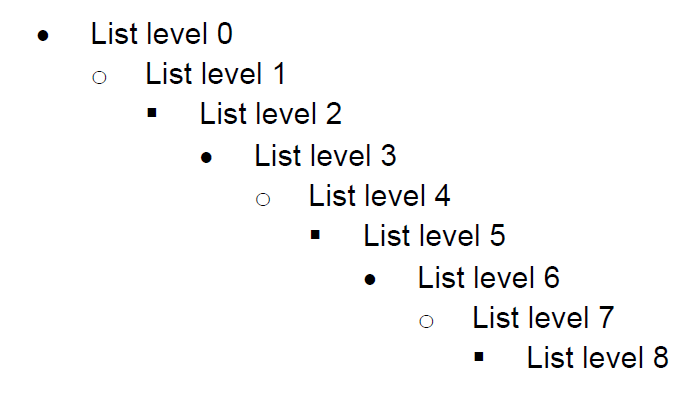
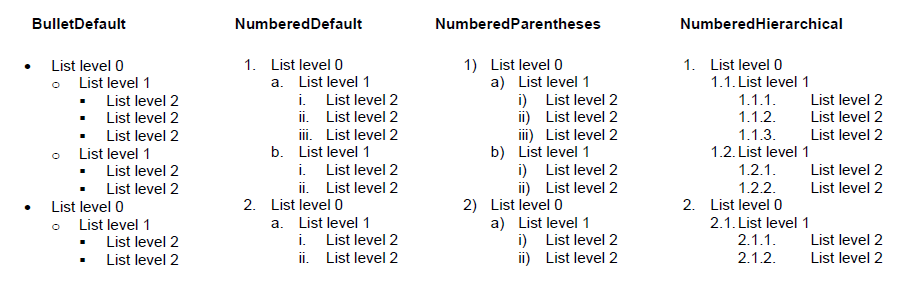
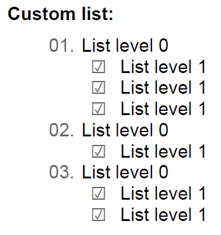
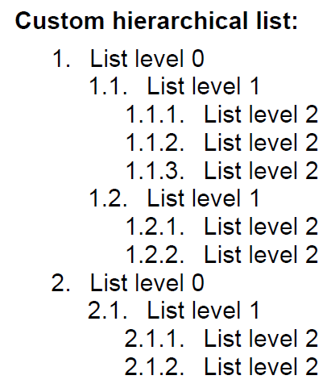
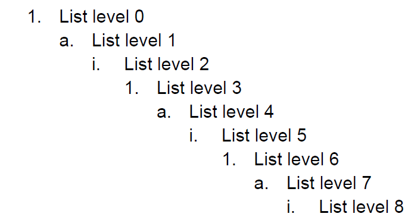

# List

The `List` class helps you create a list of numbered paragraphs. You can use lists by adding them to the [RadFixedDocumentEditor]() `Lists` collection or by creating `List` class instances and setting the list bullets to some [Block]() instances.

#### Figure 1

The following sections present the list-related API in RadPdfProcessing:

* [Creating List from ListTemplateType](#creating-list-from-listtemplatetype)

* [Creating Custom ListLevel](#creating-custom-listlevel)

* [Creating Custom Bullet](#creating-custom-bullet)

* [Using Lists with RadFixedDocumentEditor](#using-lists-with-radfixeddocumenteditor)

* [Using Lists with Block Class](#using-lists-with-block-class)

## Creating List from ListTemplateType

Each `List` contains a `ListLevelCollection` where the presentation of each list level is defined by a `ListLevel` class instance. For the most common cases you do not need to define each separate list level. Instead, you can use the `ListTemplateType` enumeration to create a list with one of the predefined list templates.

The code snippet from **Example 1** shows how to create a list with the NumberedParentheses template.

#### **Example 1: Create numbered parentheses list template type**

<snippet id='libraries-pdf-editing-list-numbered-parentheses'/>

The following image shows the available list template types and their appearance:

#### Figure 2

>In .NET Standard due to font limitations, the **BulletDefault** list requires a Wingdings font be provided so its bullets are rendered properly. You can read how to handle these restrictions in the [Fonts]() and [FontsProvider]() articles.

## Creating Custom ListLevel

When you need to create a custom `List`, define the presentation of each list level. The appearance of the list level is defined with the properties of the `ListLevel` class. The following list level properties are available in RadPdfProcessing:

* `StartIndex`: Specifies the index from which the list items numbering starts. The default value of this property is 1.

* `RestartAfterLevel`: Specifies the index of the level, which restarts the current level numbering. The default value is negative, which means that all previous levels restart the current level numbering. If this property has a non-negative value, all previous levels that have a level index less than or equal to the `RestartAfterLevel` value restart the current level numbering.

* `ParagraphProperties`: Specifies the paragraph properties of the paragraphs from this list level.

* `CharacterProperties`: Specifies the character properties of the bullet element on this list level.

* `BulletNumberingFormat`: Specifies how the bullet element is formatted on this list level.

* `IndentAfterBullet`: Specifies the amount of indent after the bullet element.

**Example 2** shows how to create an empty list and add two custom list levels to its `ListLevelsCollection`. Level 0 has a bullet which displays its current numbering as a two-digit number with a leading zero. Level 1 displays a checkbox as a bullet symbol for all of the corresponding list items. Additionally, each of the levels defines custom values for the `LeftIndent`, `ForegroundColor`, and `IndentAfterBullet` properties. 

#### **Example 2: Create custom list levels**

<snippet id='libraries-pdf-editing-list-custom-levels'/>

The image in **Figure 3** shows how the list created in **Example 2** looks when used.

#### Figure 3

## Creating Custom Bullet

When you create a custom list level, you need to specify how the bullet numbering is formatted. With RadPdfProcessing, by implementing `IBulletNumberingFormat` you can choose what `PositionContentElement` to use for each bullet appearance. This way, knowing the current indexes of all list levels, you can create bullets with text, geometry, or image.

If you need a text bullet, use the `TextBulletNumberingFormat` class. This class implements `IBulletNumberingFormat`. When you initialize an instance of this class, its constructor requires a function that returns the string representation of the bullet.

The following code snippet shows how to create the bullets of a numbered hierarchical list using the `TextBulletNumberingFormat` class:

#### **Example 3: Create custom text numbering bullet**

<snippet id='libraries-pdf-editing-list-custom-numbering-bullet'/>

When using the list created in **Example 3**, its bullets look as shown in **Figure 4**.

#### Figure 4

## Using Lists with RadFixedDocumentEditor

To use lists with `RadFixedDocumentEditor`, first add them to the editor `ListCollection`. Each time you add a list item, set the `ListId` and `ListLevel` values in the editor `Paragraph` properties and call the `InsertParagraph()` method.

**Example 4** shows how to create a list with `RadFixedDocumentEditor` and insert a single item for each of the list levels. The appearance of the list comes from the values in the predefined `ListTemplateType` enumeration.

#### **Example 4: Using lists with RadFixedDocumentEditor**

<snippet id='libraries-pdf-editing-list-using-raddocumentfixededitor'/>

The resulting document looks like the image in **Figure 5**.

#### Figure 5

## Using Lists with Block Class

As the `Block` class has `Bullet` and `IndentAfterBullet` properties, you can set a custom bullet to any `Block` instance. However, if you want to get an automatically formatted bullet corresponding to some `List` class instance, use the `SetBullet(List list, int listLevel)` method. This way you can set the bullet-related properties so that the bullet displays the correct list numbering and formatting.

The following code snippet shows how to create a `List` with `BulletDefault` template and set the bullet of the first list level to a Block:

#### **Example 5: Using lists with Block class**

<snippet id='libraries-pdf-editing-list-using-with-blocks'/>

>The list style is applied for the whole Block element. To generate a list consisting of several paragraphs in different list items, use the same count of Block instances as the number of the different list items.

**Figure 6** demonstrates how the block from **Example 5** looks when exported.

#### Figure 6

## See Also

* [Block]()
* [Table]()
* [TableRow]()
* [TableCell]()
* [FixedContentEditor]()
* [RadFixedDocumentEditor]()
* [Customizing the Font of Numbered Lists with RadPdfProcessing]()
