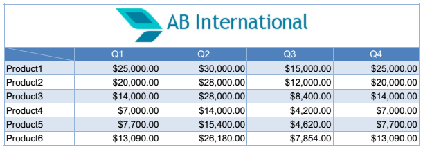
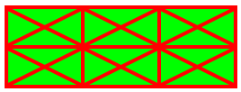
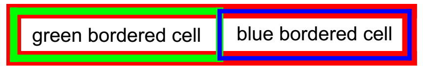
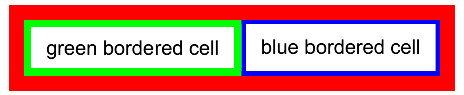
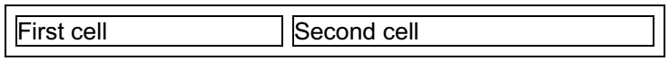

# Table Overview

The **Table** class helps you easily create tabular data content. All you need to do is define the table content and pass a Table instance to a [FixedContentEditor]() or a [RadFixedDocumentEditor](). From then on, these editors are responsible for positioning, measuring, drawing and splitting the table onto pages.

## Defining Table Content

Each table contains a series of [TableRow]() instances each of which contains a series of [TableCell]() instances. To define a simple table, you need to generate the table cells and add some content to them.
        

**Example 1** shows how to generate a simple table with two rows and three columns with some sample text in each table cell.
        

#### **Example 1: Create simple table**

<snippet id='libraries-pdf-editing-table-overview-create-simple-table'/>

The result table is shown in **Figure 1**.
        

#### Figure 1: Table

## Using DefaultCellProperties

If you want to apply default styling to all the cells in a table, you can use the Table `DefaultCellProperties` property. This allows you to modify the default cell presentation.
        

* **Padding**: Specifies the distances between the inner cell border contour and the cell content.
* **Borders**: Property of type `TableCellBorders`, which specifies the borders of a single cell. The available borders are left, right, top, bottom, diagonal up, and diagonal down.
* **Background**: Specifies the background of the cell.
            

**Example 2** shows how to use the **DefaultCellProperties** of a table
        

#### **Example 2: Use DefaultCellProperties of Table**

<snippet id='libraries-pdf-editing-table-overview-use-default-cell-properties-of-table'/>

The result of the snippet in **Example 2** is demonstrated on **Figure 2**.
        

#### Figure 2: Result of DefaultCellProperties modification

## Modifying a Table

There are several factors that affect table measuring calculations. Some of them are listed and explained below:
        

* **Margin**: Specifies the distances between the table borders outline and the rest of the document content.
         
* **Padding**: Set through the TableCell `Padding` property, it specifies the distances between cell borders inner contour and the cell content.
            
* **LayoutType**: Specifies the algorithm which is used to layout table contents. There are two options available in the `TableLayoutType` enumeration:
	
	* **AutoFit** – The table width fits the content unless the needed width is bigger than the available measuring width.
	* **FixedWidth** – The table width always fits the available measuring width.

* **HorizontalAlignment**: Specifies the alignment of the table inside the page.

* **BorderSpacing**: Specifies the distance between all the borders in the table. This distance is measured differently depending on the **BorderCollapse** option.
         
* **BorderCollapse**: Specifies the way the border spacing calculations are done. There are two options:
	* **Collapse**: The distance between borders is measured from the middle lines of the borders.
	* **Separate**: The distance between borders is measured from the outer border contour.
                

**Example 3** demonstrates how border calculations occur with different **BorderCollapse** option. The code in this example creates an empty table and sets default cell padding and red table border with thickness 10 to it.
        

#### **Example 3: Create table with red border**

<snippet id='libraries-pdf-editing-table-overview-create-table-with-red-border'/>

**Example 4** adds a single row with two cells to the table from **Example 3**. The first cell has a green border with thickness 5 while the second cell has a blue border with thickness 3.
        

#### **Example 4: Add green and blue cells**

<snippet id='libraries-pdf-editing-table-overview-add-green-and-blue-cells-to-table'/>

**Figure 3** shows the table from Example 3 and 4 with BorderCollapse property set to Collapse - all borders are drawn so that their middle lines coincide.
        

#### **Example 5: Collapse border**

<snippet id='libraries-pdf-editing-table-overview-collapse-table-border'/>

#### Figure 3: Collapsed border

**Figure 4** shows the same table with BorderCollapse property set to Separate - all borders are drawn so that their outer contour coincide.
        

#### **Example 6: Separate border**

<snippet id='libraries-pdf-editing-table-overview-separate-table-border'/>

#### Figure 4: Separated border

## Drawing Table with RadFixedDocumentEditor

When a table is generated, you can insert it in the PDF document using the `RadFixedDocumentEditor` `InsertTable()` method. This way the table is inserted in the document and split onto pages if necessary.
            

**Example 7** generates a simple table with two cells.
        

#### **Example 7: Create table**

<snippet id='libraries-pdf-editing-table-overview-create-table'/>

**Example 8** inserts the table from **Example 7** in a RadFixedDocumentEditor and specifies the table layout type to AutoFit.
        

#### __Example 8: Insert AutoFit table__

<snippet id='libraries-pdf-editing-table-overview-insert-autofit-table'/>

The result is that the table width is exactly as needed for fitting the cells content as visible in __Figure 5__.
        

#### Figure 5: AutoFit table

Specifying FixedWidth layout option produces different results.
        

#### __Example 9: Insert FixedWidth table__

<snippet id='libraries-pdf-editing-table-overview-insert-fixed-width-table'/>

#### Figure 6: FixedWidth table

## Drawing Table with FixedContentEditor

When you need more customization options, you can use the `DrawTable()` method of `FixedContentEditor` instead of `RadFixedDocumentEditor`.
        

**Example 10** shows how to draw a rotated table with the help of FixedContentEditor.
        

#### **Example 10: Draw rotated table**

<snippet id='libraries-pdf-editing-table-overview-draw-rotated-table'/>

As a result, on **Figure 7** you can see a 45-degree rotated table similar to the one on **Figure 5**.
        

#### Figure 7: FixedWidth table

## Measuring a Table

The `Table` class exposes `Measure` overloads that calculate and return the desired size of the table without drawing it. This is useful when you need to know the table dimensions before inserting it into a document—for example, to decide whether to use a new page or to position other content relative to the table.

- **`Measure(CancellationToken)`** – Measures the table against an infinite available size and returns the resulting `Size`. Pass a `CancellationToken` to allow the operation to be cancelled.
- **`Measure(Size, CancellationToken)`** – Measures the table against a constrained available size. Use this overload when the table must fit within a known width or height.

**Example 11** demonstrates how to measure a table both with infinite available size and with a specific size constraint.

#### __Example 11: Measure a table__

<snippet id='libraries-pdf-editing-table-overview-measure-table'/>

## Supported Border Styles

As of **Q3 2024**, along with the BorderStyle.*Single*, RadPdfProcessing offers *Dotted*, *Dashed*, and *DashSmallGap* border styles. With this update, the Dotted, Dashed, DashSmallGap, and Thick border lines are now exported from [RadFlowDocument]() to [RadFixedDocument]() as well.

|BorderStyle|Border Design|
|----|----|
|Single||  
|Dotted||
|Dashed||   
|DashSmallGap|| 

## See Also

 * [FixedContentEditor]()
 * [RadFixedDocumentEditor]()
 * [TableRow]()
 * [TableCell]()
 * [How to Generate a Table with Images with PdfProcessing]()
 * [Creating Custom Layout Tables with RadPdfProcessing]()
 * [Implementing Column Span in RadPdfProcessing Tables]()
 * [Generating a Table with RadFixedDocumentEditor]()
 * [Avoiding Table Splits Across Pages Using FixedContentEditor in RadPdfProcessing]()
 * [How to Achieve Alternating Row Color for Tables in PdfProcessing]()
