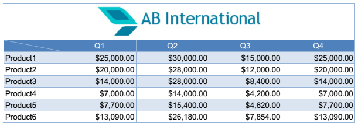
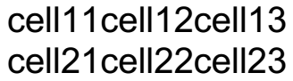
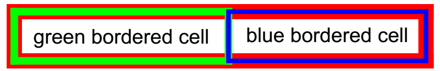
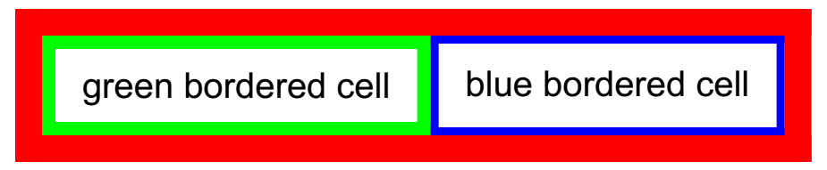
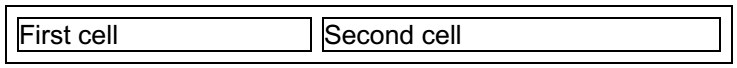

# Table Overview

The **Table** class helps you easily create tabular data content. All you need to do is define the table content and pass a Table instance to a [FixedContentEditor]() or a [RadFixedDocumentEditor](). From then on, these editors are responsible for positioning, measuring, drawing and splitting the table onto pages.

This article aims to present the table-related API in __RadPdfProcessing__. It contains the following sections:     

* [Defining Table Content](#defining-table-content)

* [Using DefaultCellProperties](#using-defaultcellproperties)

* [Modifying a Table](#modifying-a-table)

* [Drawing Table with RadFixedDocumentEditor](#drawing-table-with-radfixeddocumenteditor)

* [Drawing Table with FixedContentEditor](#drawing-table-with-fixedcontenteditor)

## Defining Table Content

Each table contains a series of [TableRow]() instances each of which contains a series of [TableCell]() instances. In order to define a simple table, you need to generate the table cells and add some content to them.
        

__Example 1__ shows how to generate a simple table with two rows and three columns with some sample text in each table cell.
        

#### __Example 1: Create simple table__

<snippet id='libraries-pdf-editing-table-overview-create-simple-table'/>

The result table is shown in __Figure 1__.
        

#### Figure 1: Table

## Using DefaultCellProperties

If you want to apply default styling to all the cells in a table, you can use Table's __DefaultCellProperties__ property. This allows to easily modify the default cell presentation.
        

* __Padding__: Specifies the distances between the inner cell border contour and the cell content.
* __Borders__: Property of type __TableCellBorders__, which specifies the borders of a single cell. The available borders are left, right, top, bottom, diagonal up and diagonal down.
* __Background__: Specifies the background of the cell.
            

__Example 2__ shows how to use the __DefaultCellProperties__ of a table
        

#### __Example 2: Use DefaultCellProperties of Table__

<snippet id='libraries-pdf-editing-table-overview-use-default-cell-properties-of-table'/>

The result of the snippet in __Example 2__ is demonstrated on __Figure 2__.
        

#### Figure 2: Result of DefaultCellProperties modification

## Modifying a Table

There are several factors that affect tables measuring calculations. Some of them are listed and explained bellow:
        

* __Margin__: Specifies the distances between the table borders outline and the rest of the document's content.
         
* __Padding__: Set through the TableCell's Padding property, it specifies the distances between cell borders inner contour and the cell content.
            
* __LayoutType__: Specifies the algorithm, which shall be used to layout table contents. There are two options available in the __TableLayoutType__ enumeration:
	
	* __AutoFit__ – The table width fits the content unless the needed width is bigger than the available measuring width.
	* __FixedWidth__ – The table width always fits the available measuring width.

* __HorizontalAlignment__: Specifies the alignment of the table inside the page. 

* __BorderSpacing__: Specifies the distance between all the borders in the table. This distance is measured differently depending on the __BorderCollapse__ option.
         
* __BorderCollapse__: Specifies the way the border spacing calculations should be done. There are two options:         
	* __Collapse__: The distance between borders is measured from the middle lines of the borders
	* __Separate__: The distance between borders is measured from the outer border contour.
                

__Example 3__ demonstrates how border calculations occur with different __BorderCollapse__ option. The code in this example creates an empty table and sets default cell padding and red table border with thickness 10 to it.
        

#### __Example 3: Create table with red border__

<snippet id='libraries-pdf-editing-table-overview-create-table-with-red-border'/>

__Example 4__ adds a single row with two cells to the table from __Example 3__. The first cell has a green border with thickness 5 while the second cell has a blue border with thickness 3.
        

#### __Example 4: Add green and blue cells__

<snippet id='libraries-pdf-editing-table-overview-add-green-and-blue-cells-to-table'/>

__Figure 3__ shows the table from Example 3 and 4 with BorderCollapse property set to Collapse - all borders are drawn so that their middle lines coincide.
        

#### __Example 5: Collapse border__

<snippet id='libraries-pdf-editing-table-overview-collapse-table-border'/>

#### Figure 3: Collapsed border

__Figure 4__ shows the same table with BorderCollapse property set to Separate - all borders are drawn so that their outer contour coincide.
        

#### __Example 6: Separate border__

<snippet id='libraries-pdf-editing-table-overview-separate-table-border'/>

#### Figure 4: Separated border

## Drawing Table with RadFixedDocumentEditor

When a table is generated, it could be inserted in the PDF document using the __RadFixedDocumentEditor__'s __InsertTable()__ method. This way the table is inserted in the document and split onto pages if necessary.
            

__Example 7__ generates a simple table with two cells.
        

#### __Example 7: Create table__

<snippet id='libraries-pdf-editing-table-overview-create-table'/>

__Example 8__ inserts the table from __Example 7__ in a RadFixedDocumentEditor and specifies the table layout type to AutoFit.
        

#### __Example 8: Insert AutoFit table__

<snippet id='libraries-pdf-editing-table-overview-insert-autofit-table'/>

The result is that the table width is exactly as needed for fitting the cells content as visible in __Figure 5__.
        

#### Figure 5: AutoFit table

Specifying FixedWidth layout option produces different results.
        

#### __Example 9: Insert FixedWidth table__

<snippet id='libraries-pdf-editing-table-overview-insert-fixed-width-table'/>

#### Figure 6: FixedWidth table

## Drawing Table with FixedContentEditor

When in need of more customization options, you can use the __DrawTable()__ method of __FixedContentEditor__ instead of __RadFixedDocumentEditor__.
        

__Example 10__ shows how to draw a rotated table with the help of FixedContentEditor.
        

#### __Example 10: Draw rotated table__

<snippet id='libraries-pdf-editing-table-overview-draw-rotated-table'/>

As a result, on __Figure 7__ you can see a 45-degree rotated table similar to the one on Figure 5.
        

#### Figure 7: FixedWidth table

## Supported Border Styles

As of **Q3 2024**, along with the BorderStyle.*Single*, RadPdfProcessing offers *Dotted*, *Dashed*, and *DashSmallGap* border styles. With this update, the Dotted, Dashed, DashSmallGap, and Thick border lines are now exported from [RadFlowDocument]() to [RadFixedDocument]() as well.

|BorderStyle|Border Design|
|----|----|
|Single||  
|Dotted||
|Dashed||   
|DashSmallGap|| 

## See Also

 * [FixedContentEditor]()
 * [RadFixedDocumentEditor]()
 * [TableRow]()
 * [TableCell]()
 * [How to Generate a Table with Images with PdfProcessing]()
 * [Creating Custom Layout Tables with RadPdfProcessing]()
 * [Implementing Column Span in RadPdfProcessing Tables]()
 * [Generating a Table with RadFixedDocumentEditor]()
 * [Avoiding Table Splits Across Pages Using FixedContentEditor in RadPdfProcessing]()
 * [How to Achieve Alternating Row Color for Tables in PdfProcessing]()

