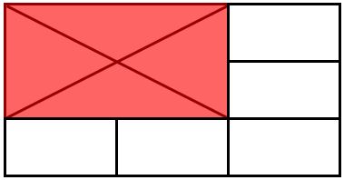

# TableCell

__TableCell__ class represents a single cell in a [Table](). Cells are added to a [TableRow]() instance in the rows collection of a table. The main purpose of the cell is to contain, organize and layout tabular data.
      

* [Inserting a TableCell](#inserting-a-tablecell)

* [Adding Cell Content](#adding-cell-content)

* [Modifying a TableCell](#modifying-a-tablecell)

## Inserting a TableCell

In order to add a cell to a __Table__, you should add it in the __TableCellCollection__ of a __TableRow__.
        

The code snippet in __Example 1__ shows how to create a table with a single row and add a cell in the first row.
        

#### __[C#] Example 1: Create TableCell__

<snippet id='libraries-pdf-editing-table-tablecell-create-tablecell'/>

## Adding Cell Content

Using __TableCell__'s __Blocks__ property you can easily add one or several __IBlockElement__ instances to the cell.
        

__Example 2__ shows how to create a cell with a single [Block]() in it.
        

#### __[C#] Example 2: Add content to TableCell__

<snippet id='libraries-pdf-editing-table-tablecell-add-content-to-tablecell'/>

## Modifying a TableCell

You can easily change the cell's presentation by using the following properties:
        

* __RowSpan__: Defines the number or rows that the TableCell instance should occupy.
            

* __ColumnSpan__: Defines the number of columns that the TableCell instance should occupy.
            

* __Padding__: Specifies the distances between the cells borders inner contour and the cell content. If the value is null, the cell will use the padding from the table's DefaultCellProperties.
            

* __Borders__: Specifies the borders of the cells. If the value is null the cell uses the value from table's DefaultCellProperties.
            

* __Background__: Specifies the background of the cell. If null, the cell uses the background from table's DefaultCellProperties.
            
* __PreferredWidth__: Specifies the preferred width of the cell. The final width of the cell may be bigger of the set value in case when another cell from the same column requires bigger PreferredWidth.
 
* __VerticalAlignment__: Specifies the vertical alignment of the content inside the cell.

__Example 3__ demonstrates how to set locally the cell properties to a specific cell. This helps achieve different appearance for this cell by changing its borders and background. Additionally, the cell will span onto two rows and two columns.
        

#### __[C#] Example 1: Change TableCell appearance__

<snippet id='libraries-pdf-editing-table-tablecell-change-tablecell-appearance'/>

The result from __Example 3__ is illustrated on __Figure 1__.

#### Figure 1: TableCell 

## See Also

 * [Table]()
 * [TableRow]()
 * [Block]()
 * [How to Generate a Table with Images with PdfProcessing]()
 * [Creating Custom Layout Tables with RadPdfProcessing]()
 * [Implementing Column Span in RadPdfProcessing Tables]()
 * [Creating a PDF Table with Form Fields Inside the Cells]()
 * [ Inserting HTML Content into PDF TableCell with RadPdfProcessing]()
