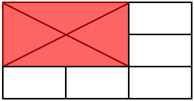

# TableCell

The `TableCell` class represents a single cell in a [Table](). Cells are added to a [TableRow]() instance in the rows collection of a table. The main purpose of the cell is to contain, organize, and layout tabular data.
      

* [Inserting a TableCell](#inserting-a-tablecell)

* [Adding Cell Content](#adding-cell-content)

* [Modifying a TableCell](#modifying-a-tablecell)

## Inserting a TableCell

To add a cell to a `Table`, add it in the `TableCellCollection` of a `TableRow`.
        

The code in **Example 1** shows how to create a table with a single row and add a cell in the first row.
        

**Example 1: Create TableCell**

<snippet id='libraries-pdf-editing-table-tablecell-create-tablecell'/>

## Adding Cell Content

Use the `Blocks` property of `TableCell` to add one or several `IBlockElement` instances to the cell.
        

**Example 2** shows how to create a cell with a single [Block]() in it.
        

**Example 2: Add content to TableCell**

<snippet id='libraries-pdf-editing-table-tablecell-add-content-to-tablecell'/>

## Modifying a TableCell

You can change the cell presentation by using the following properties:
        

* `RowSpan`: Defines the number of rows that the `TableCell` instance occupies.
            

* `ColumnSpan`: Defines the number of columns that the `TableCell` instance occupies.
            

* `Padding`: Specifies the distances between the cell borders inner contour and the cell content. If the value is null, the cell uses the padding from the table `DefaultCellProperties`.
            

* `Borders`: Specifies the borders of the cell. If the value is null, the cell uses the value from the table `DefaultCellProperties`.
            

* `Background`: Specifies the background of the cell. If null, the cell uses the background from the table `DefaultCellProperties`.
            
* `PreferredWidth`: Specifies the preferred width of the cell. The final width of the cell may be bigger than the set value if another cell from the same column requires a bigger `PreferredWidth`.
 
* `VerticalAlignment`: Specifies the vertical alignment of the content inside the cell.

**Example 3** demonstrates how to set the cell properties locally to a specific cell. This helps achieve a different appearance for this cell by changing its borders and background. Additionally, the cell spans two rows and two columns.
        

**Example 3: Change TableCell appearance**

<snippet id='libraries-pdf-editing-table-tablecell-change-tablecell-appearance'/>

The result from **Example 3** is illustrated in the following image.

**TableCell**

## See Also

* [Table]()
* [TableRow]()
* [Block]()
* [How to Generate a Table with Images with PdfProcessing]()
* [Creating Custom Layout Tables with RadPdfProcessing]()
* [Implementing Column Span in RadPdfProcessing Tables]()
* [Creating a PDF Table with Form Fields Inside the Cells]()
* [Inserting HTML Content into PDF TableCell with RadPdfProcessing]()
* [How To Rotate Cell Content]()

