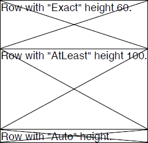

# TableRow

`TableRow` represents a single row in a [Table](). Each row contains a collection of [TableCell]() instances.
      

* [Inserting a Row](#inserting-a-row-)

* [Using TableCellCollection](#using-tablecellcollection)

## Inserting a TableRow 

You can add a `TableRow` instance by using the `AddTableRow()` method of the `Table` class.
        

The code in **Example 1** shows how to create a table and add a single row to it.
        

**Example 1: Create TableRow**

<snippet id='libraries-pdf-editing-table-tablerow-create-tablerow'/>

## Using TableCellCollection

To manipulate the cells in a row, use the `Cells` property of `TableRow`. The property represents the collection of cells added to this row and provides access to each of them.
        

**Example 2** shows how to add two cells in a row and get the cells count.
        

**Example 2: Access cells in a TableRow**

<snippet id='libraries-pdf-editing-table-tablerow-add-cells'/>

## Setting TableRow Height

Starting with **Q1 2025**, you can configure the `TableRow` height through its `Height` property which accepts the following options defined in the `HeightType` enum:     

* `Auto`: Automatically determines the row height.
            
* `Exact`: Sets an exact row height. The value is in [Device Independent Pixels]() (DIPs).      

* `AtLeast`: Sets a minimum row height. The value is in [Device Independent Pixels]() (DIPs).

>note You can convert DIPs to other units using the [Unit](https://docs.telerik.com/devtools/document-processing/api/Telerik.Windows.Documents.Media.Unit.html) class.
            
**Example 3** creates a table with three single-cell rows, each with a different `HeightType`.
        
**Example 3: Set TableRow height**

<snippet id='libraries-pdf-editing-table-tablerow-set-tablerow-height'/>

## See Also

* [Table]()
* [TableCell]()
* [How to Generate a Table with Images with PdfProcessing]()
