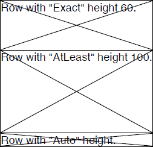

# TableRow

__TableRow__ class represents a single row in a [Table](). Each row contains a collection of [TableCell]() instances.
      

* [Inserting a Row](#inserting-a-row-)

* [Using TableCellCollection](#using-tablecellcollection)

## Inserting a TableRow 

You can easily add a __TableRow__ instance by using the __AddTableRow()__ method of the __Table__ class.
        

The code snippet in __Example 1__ shows how to create a table and add a single row to it.
        

#### __[C#] Example 1: Create TableRow__

{{region cs-radpdfprocessing-editing-tablerow_0}}
	Table table = new Table();
	TableRow tableRow = table.Rows.AddTableRow();
{{endregion}}

## Using TableCellCollection

In order to manipulate the cells in a row you can use TableRow's __Cells__ property. The property represents the collection of cells added to this row and provides easy access to each of them.
        

__Example 2__ shows how to add two cells in a row and get the cells count.
        

#### __[C#] Example 2: Access cells in a TableRow__

{{region cs-radpdfprocessing-editing-tablerow_1}}
	TableCell firstCell = tableRow.Cells.AddTableCell();
	TableCell secondCell = tableRow.Cells.AddTableCell();
	int cellsInRowCount = tableRow.Cells.Count;
{{endregion}}

## Setting TableRow Height

Since **Q1 2025** you can easily configure the TablRow's height through its **Height** property which accepts the following options defined in the **HeightType** enum:     

* __Auto__: Automatically determines the row height.
            
* __Exact__: Sets an exact row height. The value is in [Device Independent Pixels]() (DIPs).      

* __AtLeast__: Sets a minimum row height. The value is in [Device Independent Pixels]() (DIPs).
            
__Example 3__ creates a table with three single-cell rows, each with a different **HeightType**.
        
#### __[C#] Example 3: Set TableRow height__

<snippet id='libraries-pdf-editing-tablerow-set-tablerow-height'/>

## See Also

 * [Table]()
 * [TableCell]()
 * [How to Generate a Table with Images with PdfProcessing]()
