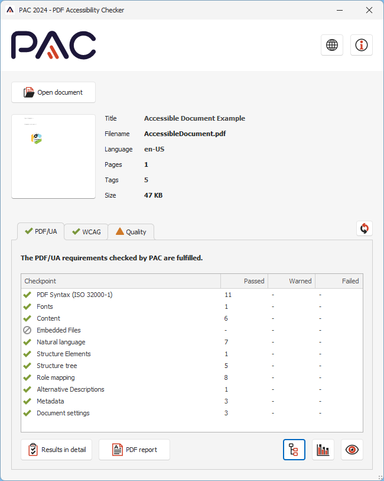
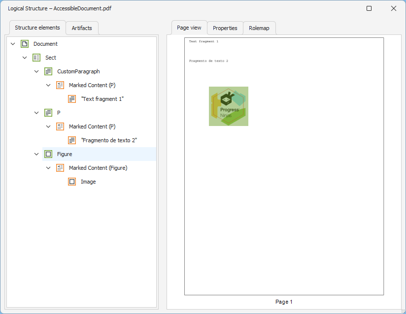
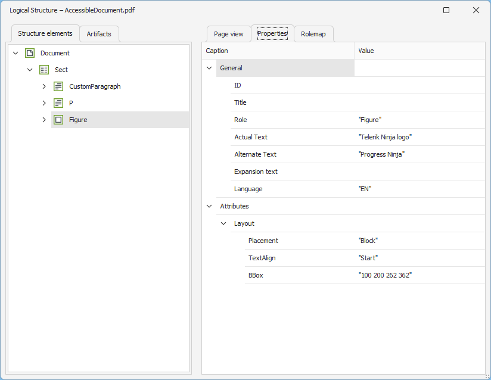

# Creating Accessible PDF Documents 

|Minimum Version|Q3 2025|
|----|----|
|Related Feature:|[Accessibility Support]()|

This article aims to demonstrate how to generate an accessible PDF document using Telerik Document Processing. 

To take advantage of the accessibility feature, the document must be **PDF/A-1a**, **PDF/A-2a**, **PDF/A-3a**, or **PDF/UA-1** compliant. To achieve this, the [PdfComplianceLevel](#accessibility-compliance) and [TaggingStrategy]() properties of the PdfFormatProvider's **PdfExportSettings** must be set accordingly.

RadFixedDocument offers a constructor allowing to specify the **AutoTag** property value which is *false* by default. This gives the developer the opportunity to choose whether to build the [StructureTree]() from scratch or leave the library auto-tag the elements.

>note Please refer to the [PdfProcessing Accessibility Demo](https://demos.telerik.com/document-processing/pdfprocessing/accessibility) which demonstrates how to create accessible PDF documents programmatically, ensuring compliance with standards such as PDF/UA by supporting features like tagged content, document structure, and metadata. Downloaded documents will adhere to the selected compliance level.

>important In **.NET Standard/.NET (Target OS: None)** environments, fonts beyond the [14 standard ones](#standard-fonts) require a [FontsProvider implementation]() to be resolved correctly.

##  Creating Accessible PDF Documents and Building the StructureTree

When exporting the document, specify the [TaggingStrategy](#tagging-strategy) so the document should not be tagged automatically and use the existing StructureTree:

<snippet id='libraries-pdf-features-accessible-pdf'/>

<table style="width:100%;">
<th width=45%>PDF Accessibility Checker tool</th><th>Logical Structure</th>
<tr>
    <td rowspan="2"></td>
    <td></td>
</tr>
<tr><td></td></tr>
</table>

## Creating Accessible PDF Documents with Auto-Tagging

This example shows how to add content to a PDF document and leave the PdfProcessing's engine build the [StructureTree]() automatically:

<snippet id='libraries-pdf-features-accessible-pdf-with-auto-tagging'/>

## See Also

* [RadPdfProcessing]()
* [Tagged PDF]()
* [Marked Content]()
* [StructureTree]()
* [Export Settings](#export-settings)
* [PdfProcessing Accessibility Demo](https://demos.telerik.com/document-processing/pdfprocessing/accessibility)
