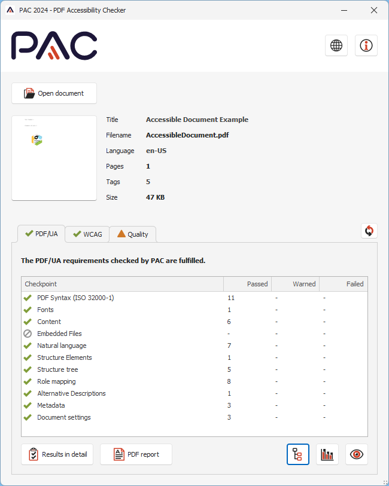
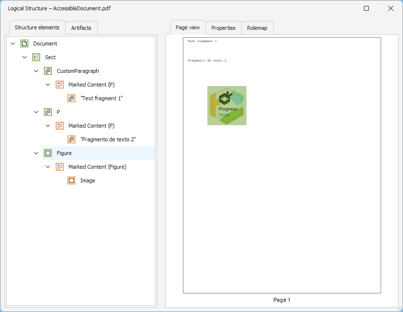
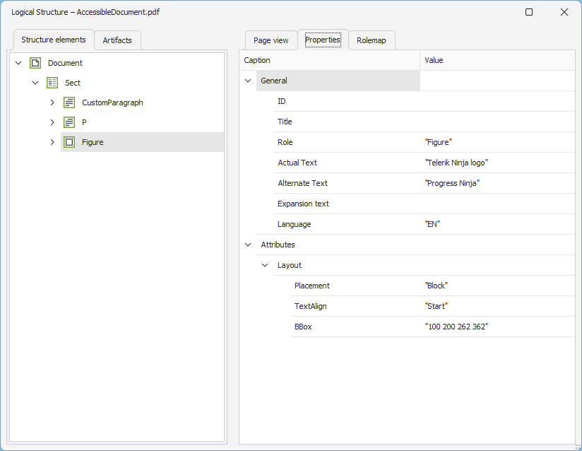

# Creating Accessible PDF Documents 

|Minimum Version|Q3 2025|
|----|----|
|Related Feature:|[Accessibility Support]()|

Use `RadPdfProcessing` of Telerik Document Processing to generate accessible PDF documents. This article shows how to export accessible output by using compliance settings, tagging strategies, and structure trees.

To export accessible output, the document must target **PDF/A-1a**, **PDF/A-2a**, **PDF/A-3a**, or **PDF/UA-1** compliance. To achieve this, configure `PdfFormatProvider.ExportSettings.ComplianceLevel` and `PdfFormatProvider.ExportSettings.TaggingStrategy` as described in [PdfComplianceLevel](#accessibility-compliance) and [Tagged PDF]().

`RadFixedDocument` provides a constructor overload with an `autoTag` parameter. The `AutoTag` property is `false` by default. You can either build the `StructureTree` yourself or let the library tag elements automatically.

>note Refer to the [PdfProcessing Accessibility Demo](https://demos.telerik.com/document-processing/pdfprocessing/accessibility). It shows how to create accessible PDF documents programmatically and export files that match the selected compliance level.

>important In **.NET Standard/.NET (Target OS: None)** environments, fonts beyond the [14 standard ones](#standard-fonts) require a [FontsProvider implementation]() to be resolved correctly.

## Creating Accessible PDF Documents with an Existing Structure Tree

When you already have a `StructureTree`, export the document with [`TaggingStrategyType.UseExisting`](#tagging-strategy) so the existing structure is preserved:

<snippet id='libraries-pdf-features-accessible-pdf'/>

<table style="width:100%;">
<th width=45%>PDF Accessibility Checker tool</th><th>Logical Structure</th>
<tr>
    <td rowspan="2"></td>
    <td></td>
</tr>
<tr><td></td></tr>
</table>

## Creating Accessible PDF Documents with Auto-Tagging

The following example adds content to a PDF document and lets `RadPdfProcessing` build the `StructureTree` automatically by using `TaggingStrategyType.Build`:

<snippet id='libraries-pdf-features-accessible-pdf-with-auto-tagging'/>

## See Also

* [RadPdfProcessing]()
* [Tagged PDF]()
* [Marked Content]()
* [StructureTree]()
* [Export Settings](#export-settings)
* [PdfProcessing Accessibility Demo](https://demos.telerik.com/document-processing/pdfprocessing/accessibility)
