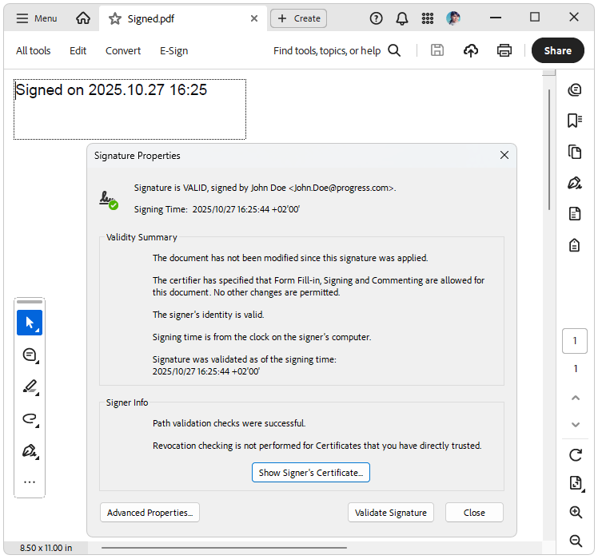

---
title: Getting Started 
description: Learn how to sign and validate PDF documents using digital signatures with RadPdfProcessing, including X509 certificates and signature settings.
page_title: Digital Signature - Getting Started
slug: radpdfprocessing-features-digital-signature-getting-started
tags: digital, signature, pdf, signing, certificates, radpdfprocessing, x509, nuget, started
position: 1
---

# Getting Started with Digital Signature

`RadPdfProcessing` allows adding a digital signature while editing a document created from scratch or importing an existing one.

>To use the signing functionality in PdfProcessing for **.NET Standard/.NET Core**, you must add a reference to the **System.Security.Cryptography.Pkcs** NuGet package, version 6 or later (this functionality is available starting with R1 2022 SP1).

>note [PdfProcessing Digitally Sign Document Demo](https://demos.telerik.com/document-processing/pdfprocessing/digitally_sign_document)

## Signing a Document

To sign a document, follow these steps:

1\. Create a **Signature** object which takes a [X509Certificate2](https://msdn.microsoft.com/en-us/library/system.security.cryptography.x509certificates.x509certificate2(v=vs.110).aspx) object as a parameter. This is the certificate that will be used to sign the PDF document.

2\. When instantiated, add the **Signature** to the document's content using a [SignatureField]().

3\. To create a signature, which has a visual representation, you must create a [SignatureWidget]() and associate the Widget annotation with the signed [SignatureField](). The widget also needs a [FormSource]() object applied to its Content.**NormalContentSource** property. A **FormSource** could be filled with data using the FixedContentEditor.

>caution When exporting a digitally signed document, a stream that allows both, reading and writing, should be passed. Otherwise, an exception is thrown: *NotSupportedException: 'Stream does not support reading.'*.

The following example shows a full code snippet for a simple signing of a newly created document:

#### **Example: Sign a document**

<snippet id='pdf-sign-document'/>

>important In .NET Standard use __Telerik.Documents.Primitives.Rect__ instead of __System.Windows.Rect__.

>important When signing an existing document (after the import) you must verify that the AcroForm `ViewersShouldRecalculateWidgetAppearances` property is set to false. Otherwise, the exported and signed PDF document may not be displayed as signed.

## Signature Settings

The **SignatureSettings** class (*introduced in Q4 2025*) provides configurable options for producing digital signatures in PDF documents. It allows developers to specify the digest (hash) algorithm used during certificate-based signing. `SignatureSettings` are accessed via the `Signature.Settings` property and expose the following settings:

| Property | Description |
|---|---|
| `DigestAlgorithm` | Gets or sets the digest (hash) algorithm used when producing the CMS (PKCS#7) signature. Default is `DigestAlgorithmType.Sha256`. Supported values: `Sha256` (recommended default), `Sha384` (for higher strength or P-384 key policy), `Sha512` (highest SHA-2 strength or long-term archival). |
| `TimeStampServer` | Gets or sets the [timestamp server]() settings used to obtain a trusted timestamp for the signature. |
| `CertificateChainIncludeOption` | Gets or sets the option that determines which certificates are included in the certificate chain. Available values: `None` (no chain info), `ExcludeRoot` (entire chain except root), `EndCertOnly` (only the end certificate), `WholeChain` (entire chain). [*Introduced in Q1 2026*] |

## Signature Encodings

RadPdfProcessing enables you to sign and validate signature fields using standard signature encodings:

* adbe.x509.rsa_sha1 (PKCS #1)

* adbe.pkcs7.sha1 (PKCS #7)

* adbe.pkcs7.detached (PKCS #7 Detached)

## Signature Flags

The signature flags were introduced in R2 2022 SP1. You can set the flags with the following code:

#### **Example: Set signature flags**

<snippet id='pdf-signature-flags'/>

The possible values are:

| Value | Description |
|---|---|
| `None` | Indicates no signature fields exist. |
| `SignaturesExist` | If set, the document contains at least one signature field. This flag allows a viewer to enable signature-related UI (such as menu items or buttons) without scanning the entire document. |
| `AppendOnly` | The document contains signatures that may be invalidated if the file is saved in a way that alters its previous contents. Viewer applications can use this flag to warn users that saving will invalidate signatures. |

## See Also

* [Form]()
* [Form Fields]()
* [AcroForm]()
* [SignatureField]()
* [Signing a document with a digital signature]()
* [Widgets Types]()
* [How to Create Invisible Signatures for PDF Documents]()
* [Signing a PDF Document with a SignatureWidget]()
* [Verifying If Digital Signatures Exist in PDF Documents]()
* [Signing an Unsigned PDF Document that Contains a Digital Signature with RadPdfProcessing]()
* [Digitally Sign Document](https://demos.telerik.com/document-processing/pdfprocessing/digitally_sign_document)
