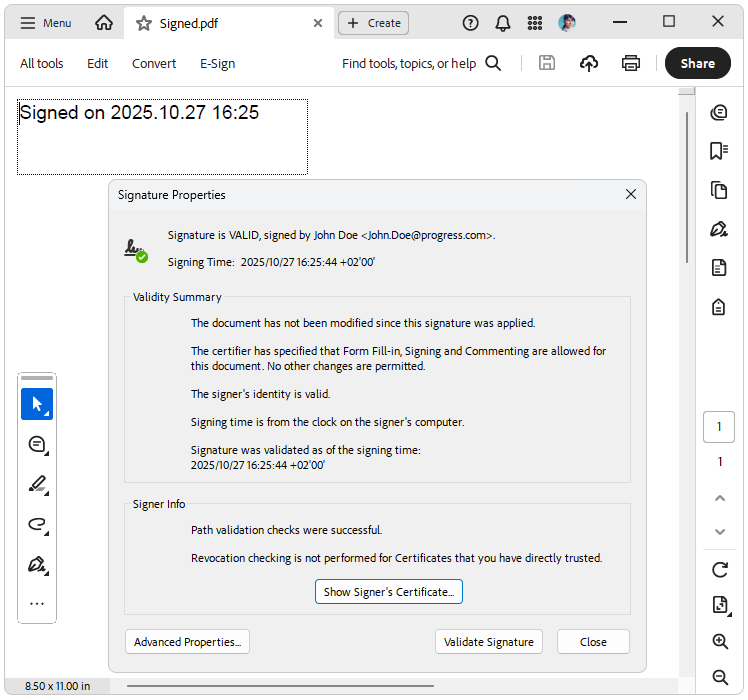

# Getting Started with Digital Signature

RadPdfProcessing allows adding a digital signature while editing a created from scratch document (or importing an existing one).

>To use the signing functionality in PdfProcessing for **.NET Standard/.NET Core**, you must add a reference to the **System.Security.Cryptography.Pkcs** NuGet package, version 6 or newer (This functionality is available since R1 2022 SP1).

>note [PdfProcessing Digitally Sign Document Demo](https://demos.telerik.com/document-processing/pdfprocessing/digitally_sign_document)

## Signing a Document

To sign a document, follow the steps:

1\. Create a **Signature** object which takes a [X509Certificate2](https://msdn.microsoft.com/en-us/library/system.security.cryptography.x509certificates.x509certificate2(v=vs.110).aspx) object as a parameter. This is the certificate that will be used to sign the PDF document.

2\. When instantiated, add the **Signature** to the document's content using a [SignatureField]().

3\. To create a signature, which has a visual representation, you must create a [SignatureWidget]() and associate the Widget annotation with the signed [SignatureField](). The widget also needs a [FormSource]() object applied to its Content.**NormalContentSource** property. A **FormSource** could be filled with data using the FixedContentEditor.

>caution When exporting a digitally signed document, a stream that allows both, reading and writing, should be passed. Otherwise, an exception is thrown: *NotSupportedException: 'Stream does not support reading.'*.

The following example shows a full code snippet for a simple signing of a newly created document:

#### **[C#] Example: Sign a document**

<snippet id='pdf-sign-document'/>

>important In .NET Standard use __Telerik.Documents.Primitives.Rect__ instead of __System.Windows.Rect__.

>important When signing an existing document (after the import) we must be sure the AcroForm's ViewersShouldRecalculateWidgetAppearances property is set to false, otherwise, the exported and signed PDF document could not be shown as a signed. 

## Signature Settings

The **SignatureSettings** class (*introduced in Q4 2025*) provides configurable options for producing digital signatures in PDF documents. It allows developers to specify the digest (hash) algorithm used during certificate-based signing. The SignatureSettings are accessed by the Signature.**Settings** public property and it offers the following settings to be specified:

* **DigestAlgorithm**: Gets or sets the digest (hash) algorithm used when producing the CMS (PKCS#7) signature. The default is *DigestAlgorithmType.Sha256* to provide a modern, interoperable baseline (SHA-256). The supported digest (hash) algorithms for producing CMS (PKCS#7) PDF signature values are: <ul><li>**Sha256**: SHA-256 (256-bit). Recommended default: strong, widely supported, and efficient.</li><li>**Sha384**: SHA-384 (384-bit). Use when organizational policy or key size (e.g. P-384) mandates higher strength.</li><li>**Sha512**: SHA-512 (512-bit). Use for highest SHA-2 family strength or long‑term archival policies; may have slightly higher computational cost.</li></ul>

* **TimeStampServer**: Gets or sets the [timestamp server]() settings used to obtain a trusted timestamp for the signature.

## Signature Encodings

RadPdfProcessing enables you to sign and validate signature fields using standard signature encodings:

* adbe.x509.rsa_sha1 (PKCS #1)

* adbe.pkcs7.sha1 (PKCS #7)

* adbe.pkcs7.detached (PKCS #7 Detached)

## Signature Flags

The signature flags were introduced in R2022 SP1. You can set the flags with the following code:

#### **[C#] Example: Set signature flags**

<snippet id='pdf-signature-flags'/>

The possible values are: 
* __None__: Indicates no signature fields exist.
* __SignaturesExist:__ If set, the document contains at least one signature field. This flag allows a viewer application to enable user interface items (such as menu items or pushbuttons) related to signature processing without having to scan the entire document for the presence of signature fields. 
* __AppendOnly:__ The document contains signatures that may be invalidated if the file is saved in a way that alters its previous contents. Viewer applications can use this flag to present a user requesting a full save with an additional alert box warning that signatures will be invalidated and requiring explicit confirmation before continuing with the operation. 

## See Also

* [Form]()
* [Form Fields]()
* [AcroForm]()
* [SignatureField]()
* [Signing a document with a digital signature]()
* [Widgets Types]()
* [How to Create Invisible Signatures for PDF Documents]()
* [Signing a PDF Document with a SignatureWidget]()
* [Verifying If Digital Signatures Exist in PDF Documents]()
* [Signing an Unsigned PDF Document that Contains a Digital Signature with RadPdfProcessing]()
* [Digitally Sign Document](https://demos.telerik.com/document-processing/pdfprocessing/digitally_sign_document)
