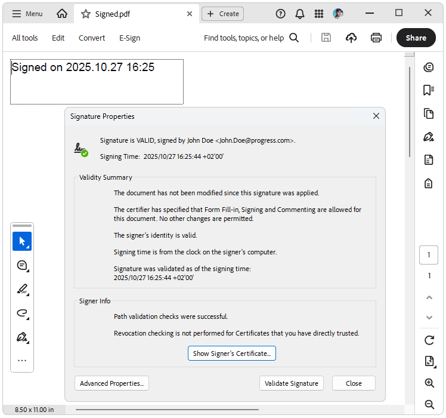

# What is Digital Signature?

The digital signature feature enables you to sign and validate a PDF document. A signature confirms that the document's content originated from the signer and has not been modified in any way. A signed document is considered valid when it has not been changed after the signing, and all of its certificates have a valid trusted root certificate.

>To use the signing functionality in PdfProcessing for **.NET Standard/.NET Core**, you must add a reference to the **System.Security.Cryptography.Pkcs** NuGet package, version 6 or newer (This functionality is available since R1 2022 SP1).

## Signing a Document

To sign a document, follow the steps:

1\. Create a **Signature** object which takes a [X509Certificate2](https://msdn.microsoft.com/en-us/library/system.security.cryptography.x509certificates.x509certificate2(v=vs.110).aspx) object as a parameter. This is the certificate that will be used to sign the PDF document.

2\. When instantiated, add the **Signature** to the document's content using a [SignatureField]().

3\. To create a signature, which has a visual representation, you must create a [SignatureWidget]() and associate the Widget annotation with the signed [SignatureField](). The widget also needs a [FormSource]() object applied to its Content.**NormalContentSource** property. A **FormSource** could be filled with data using the FixedContentEditor.

>caution When exporting a digitally signed document, a stream that allows both, reading and writing, should be passed. Otherwise, an exception is thrown: *NotSupportedException: 'Stream does not support reading.'*.

The following example shows a full code snippet for a simple signing of a newly created document:

#### **[C#] Example: Sign a document**

{{region radpdfprocessing-features-digital-signature_2}}

    int signatureFieldWidth = 200;
    int signatureFieldHeight = 50;
    int signaturePositionLeft = 10;
    int signaturePositionTop = 10; 

    X509Certificate2 certificate = new System.Security.Cryptography.X509Certificates.X509Certificate2("Certificate.pfx", "johndoe");
    SignatureField pdfSignature = new SignatureField("SignatureField");
    pdfSignature.Signature = new Signature(certificate);

    Form pdfForm = new Telerik.Windows.Documents.Fixed.Model.Objects.Form();
    pdfForm.FormSource = new FormSource();
    pdfForm.FormSource.Size = new Size(signatureFieldWidth, signatureFieldHeight);
    FixedContentEditor editor = new FixedContentEditor(pdfForm.FormSource);
    pdfForm.Position.Translate(signaturePositionLeft, signaturePositionTop);
    editor.DrawText($"{certificate.GetNameInfo(X509NameType.SimpleName, false)} {DateTime.Now.ToString("yyyy.MM.dd HH:mm")}");

    SignatureWidget signatureWidget = pdfSignature.Widgets.AddWidget();
    signatureWidget.Content.NormalContentSource = pdfForm.FormSource;
    signatureWidget.Rect = new Rect(
        new Point(signaturePositionLeft, signaturePositionTop),
        new Size(signatureFieldWidth, signatureFieldHeight));
    signatureWidget.RecalculateContent();

    RadFixedDocument document = new RadFixedDocument();
    RadFixedPage pdfPage = document.Pages.AddPage();
    pdfPage.Annotations.Add(signatureWidget);

    FixedContentEditor pageEditor = new FixedContentEditor(pdfPage);
    pageEditor.Position.Translate(signaturePositionLeft, signaturePositionTop);
    pageEditor.DrawForm(pdfForm.FormSource);
    document.AcroForm.FormFields.Add(pdfSignature);
    signatureWidget.RecalculateContent();

    string signedDocumentFilePath = "signed.pdf";
    File.Delete(signedDocumentFilePath);
    using (System.IO.Stream output = new System.IO.FileStream(signedDocumentFilePath, System.IO.FileMode.OpenOrCreate, System.IO.FileAccess.ReadWrite))
    {
        new Telerik.Windows.Documents.Fixed.FormatProviders.Pdf.PdfFormatProvider().Export(document, output);
    }

{{endregion}}

>important When signing an existing document (after the import) we must be sure the AcroForm's ViewersShouldRecalculateWidgetAppearances property is set to false, otherwise, the exported and signed PDF document could not be shown as a signed. 

## See Also

* [Form]()
* [Form Fields]()
* [AcroForm]()
* [SignatureField]()
* [Signing a document with a digital signature]()
* [Widgets Types]()
* [How to Create Invisible Signatures for PDF Documents]()
* [Signing a PDF Document with a SignatureWidget]()
* [Verifying If Digital Signatures Exist in PDF Documents]()
