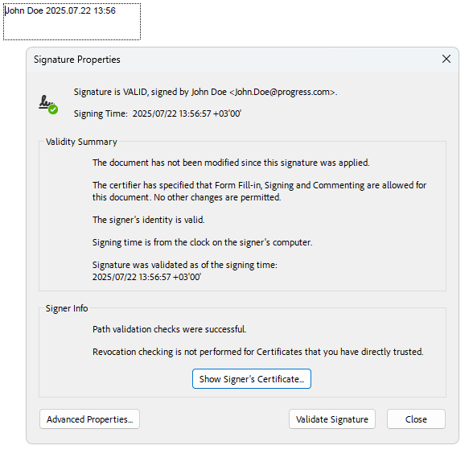

# Overview

The **digital signature** feature in `RadPdfProcessing`, part of Telerik Document Processing, lets you sign and validate PDF documents. A digital signature confirms that the document content came from the signer and has not been modified. A signed document remains valid when the content stays unchanged after signing and the certificate chain resolves to a trusted root certificate.

In a *public key infrastructure* (PKI) workflow, `RadPdfProcessing` uses X.509 certificates, certificate chains, trusted roots, and revocation checks for PDF signing and validation. Certificate issuance and certificate-authority management are outside the library scope.
<a name="signing-a-document"><a/>
With `RadPdfProcessing`, you can:

* [Create a PDF document from scratch and add a signature field](). 
* [Sign PDF documents that contain a predefined signature field](https://demos.telerik.com/document-processing/pdfprocessing/digitally_sign_document).
* [Verify existing signed PDF documents]().
* [Multiple Digital Signing with PdfStreamSigner](). 

 

## Online Demos

The following demos show common signing scenarios:

| Demo | Description |
|----|----|
| [PdfProcessing Digitally Sign Document](https://demos.telerik.com/document-processing/pdfprocessing/digitally_sign_document) | Demonstrates how to digitally sign a PDF. |
| [PdfProcessing Validate Digital Signature](https://demos.telerik.com/document-processing/pdfprocessing/validate_digital_signature) | Demonstrates how to validate a digitally signed PDF. |
| [PdfProcessing Multiple Digital Signatures](https://demos.telerik.com/document-processing/pdfprocessing/multiple_digital_signatures) | Demonstrates how to digitally sign a PDF without invalidating existing signatures. |

## See Also

* [Form]()
* [Form Fields]()
* [AcroForm]()
* [SignatureField]()
* [Signing a document with a digital signature]()
* [Widgets Types]()
* [How to Create Invisible Signatures for PDF Documents]()
* [Signing a PDF Document with a SignatureWidget]()
* [Verifying If Digital Signatures Exist in PDF Documents]()
* [Signing an Unsigned PDF Document that Contains a Digital Signature with RadPdfProcessing]()
