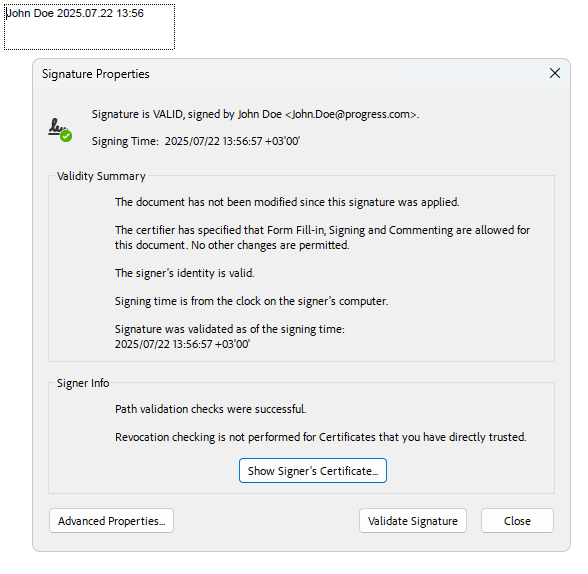

# What is Digital Signature?

The **digital signature** feature enables you to sign and validate a PDF document. A signature confirms that the document's content originated from the signer and has not been modified in any way. A signed document is considered valid when it has not been changed after the signing, and all of its certificates have a valid trusted root certificate.

Telerik **RadPdfProcessing** provides an easy-to-use API that allows you to:

<a name="signing-a-document"><a/>

* [Create a PDF document from scratch and add a signature field](). 
* [Sign PDF documents that contain a predifined signature field](https://demos.telerik.com/document-processing/pdfprocessing/digitally_sign_document).
* [Verify existing signed PDF documents]().
* [Multiple Digital Signing with PdfStreamSigner](). 

 

## See Also

* [Form]()
* [Form Fields]()
* [AcroForm]()
* [SignatureField]()
* [Signing a document with a digital signature]()
* [Widgets Types]()
* [How to Create Invisible Signatures for PDF Documents]()
* [Signing a PDF Document with a SignatureWidget]()
* [Verifying If Digital Signatures Exist in PDF Documents]()
* [Signing an Unsigned PDF Document that Contains a Digital Signature with RadPdfProcessing]()
