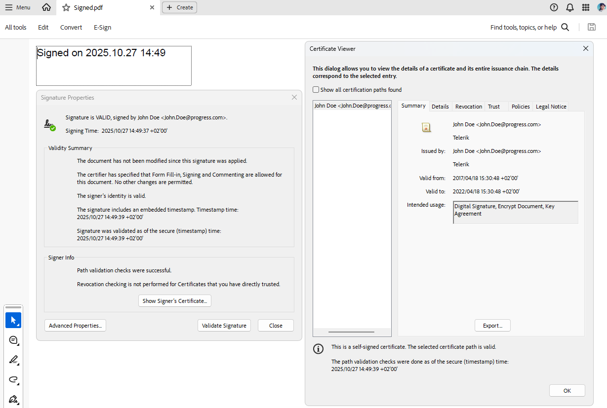

# Signing a PDF using a TimeStamp Server

|Minimum Version|Q4 2025|
|----|----|

The **TimeStampServer** class encapsulates the necessary details to communicate with an external Timestamp Authority (TSA), including the endpoint URL, optional authentication credentials and timeout for requests. The TimeStampServer can be set via the [SignatureSettings](#signature-settings):

<snippet id='libraries-pdf-features-digital-signature-timestampserver'/>

The produced result document indicates a valid embedded timestamp:

 

## Creating TimeStampServer with Credentials

The following example shows how to initialize a new instance of the TimeStampServer class with the specified URL, credentials, and timeout:

<snippet id='libraries-pdf-features-digital-signature-create-timestampserver'/>

## See Also

 * [Digital Signature]()
 * [Signature Field]()
 * [Multiple Digital Signatures Demo](https://demos.telerik.com/document-processing/pdfprocessing/multiple_digital_signatures)
