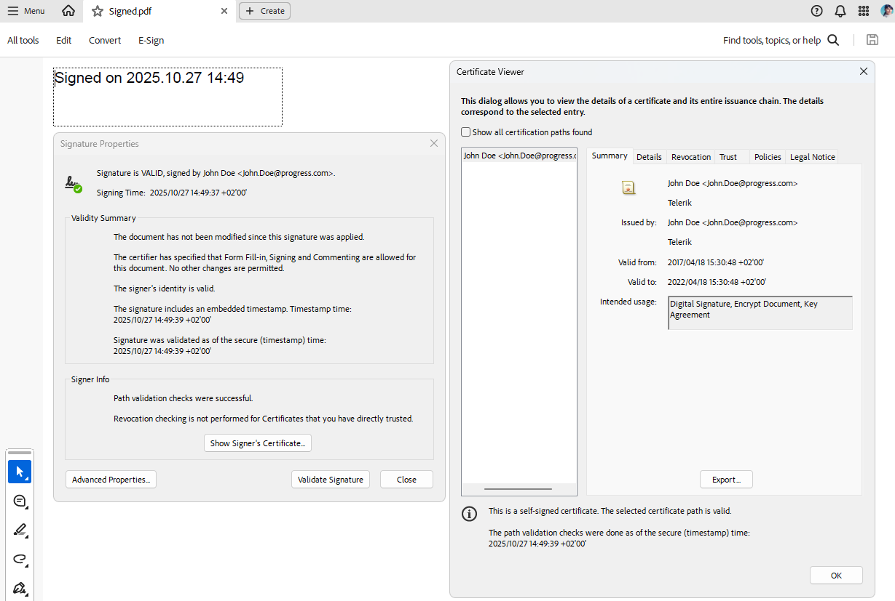

# Signing a PDF using a TimeStamp Server

|Minimum Version|Q4 2025|
|----|----|

The `TimeStampServer` class encapsulates the details needed to communicate with an external Timestamp Authority (TSA), including the endpoint URL, optional authentication credentials, and timeout for requests. Set the `TimeStampServer` through the [SignatureSettings](#signature-settings).

>note [PdfProcessing Add Digital Signature External Demo](https://demos.telerik.com/document-processing/pdfprocessing/external_digitally_sign_document)

<snippet id='libraries-pdf-features-digital-signature-pdf-sign-timestamp-server-timestampserver'/>

The produced result document indicates a valid embedded timestamp:

 

## Creating TimeStampServer with Credentials

The following example shows how to initialize a new instance of the `TimeStampServer` class with the specified URL, credentials, and timeout:

<snippet id='libraries-pdf-features-digital-signature-pdf-sign-timestamp-server-create-timestampserver'/>

## See Also

* [Digital Signature]()
* [Signature Field]()
* [Multiple Digital Signatures Demo](https://demos.telerik.com/document-processing/pdfprocessing/multiple_digital_signatures)
