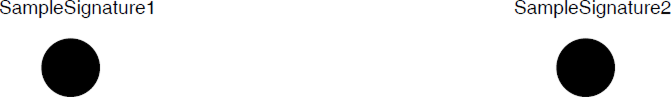

# PdfStreamSigner

As of **Q2 2025** RadPdfProcessing intorduces the **PdfStreamSigner**. The **SignDocument** method it exposes allows the user to insert one or more [Digital Signatures]() into a PDF document.

|Method|Description|
|----|----|
|**PdfStreamSigner(Stream outputStream)**|Creates a new instance of thе PdfStreamSigner and specifies the output stream of the signed document.|
|**SignDocument(Stream originalStream, SignatureField signatureField, int pageIndex, TimeSpan? timeout)**|Adds a [Digital Signature]() to the PDF document|

The following example shows how to insert multiple [Digital Signatures]() into a PDF document using the PdfStreamSigner:

>important In .NET Standard use __Telerik.Documents.Primitives.Rect__ instead of __System.Windows.Rect__.

>important When adding multiple signatures, make sure the document is exported after each signature before importing it back again.

<snippet id='libraries-pdf-features-digital-signature-pdfstreamsigner'/>

## See Also

 * [Digital Signature]()
 * [Signature Field]()