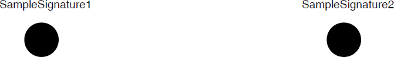

# Multiple Digital Signing with PdfStreamSigner

|Minimum Version|Q2 2025|
|----|----|

RadPdfProcessing introduces the `PdfStreamSigner` class. The `SignDocument` method allows you to insert one or more [digital signatures]() into a PDF document.

>important When adding multiple signatures, export the document after each signature before importing it back again.

|Method|Description|
|----|----|
|`PdfStreamSigner(Stream outputStream)`|Creates a new instance of the `PdfStreamSigner` and specifies the output stream where the signed document is written.|
|`SignDocument(Stream originalStream, SignatureField signatureField, int pageIndex, TimeSpan? timeout)`|Adds a [digital signature]() to the PDF document.|

>note Starting with **Q1 2026**, the `PdfStreamSigner` supports the [TimeStamp server](). The `SignatureField` used for signing the document preserves all of its [SignatureSettings](#signature-settings) including the `TimeStampServer`.

The following example shows how to insert multiple [digital signatures]() into a PDF document using the `PdfStreamSigner`:

>important In .NET Standard, use `Telerik.Documents.Primitives.Rect` instead of `System.Windows.Rect`.

>note [PdfProcessing Multiple Digital Signatures Demo](https://demos.telerik.com/document-processing/pdfprocessing/multiple_digital_signatures)

<snippet id='libraries-pdf-features-digital-signature-pdfstreamsigner'/>

## See Also

* [Digital Signature]()
* [Signature Field]()
* [Multiple Digital Signatures Demo](https://demos.telerik.com/document-processing/pdfprocessing/multiple_digital_signatures)
* [Using a TimeStamp Server]()
