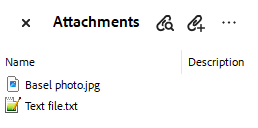
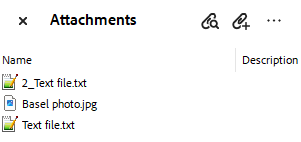

# Embedded File Streams - Overview

As of **2024 Q1** RadPdfProcessing allows embedding file streams into the document. Thus, the content of the referenced files is embedded directly within the body of the PDF file.

## The EmbeddedFile Class

RadFixedDocument stores the integrated files in an **EmbeddedFilesCollection** accessed by the **EmbeddedFiles** property. Each **EmbeddedFile** contains **Name** (string) and **Data** (byte[]) properties. The specified Name should be unique and it represents the textual description of the embedded file, which can be displayed in the user interface of a viewer application. The Data stores the byte[] of the file stream. 

>important The Name for the EmbeddedFile should contain the file extension as well, e.g. *MySampleTextFile.txt*.

>note [PdfProcessing Embedding File Streams Demo](https://demos.telerik.com/document-processing/pdfprocessing/embed_file_streams)

### Creating an Embedded File Stream
 
#### **[C#] Creating an embedded file stream**

{{region cs-radpdfprocessing-embedded-file-streams_creating_1}}

            RadFixedDocument document = new RadFixedDocument();
            RadFixedPage page = document.Pages.AddPage();
            byte[] textFile = File.ReadAllBytes(@"..\..\Embedded_File_Streams.txt");
            document.EmbeddedFiles.Add("Text file.txt", textFile);
            byte[] imageFile = File.ReadAllBytes(@"..\..\Basel.JPG");
            document.EmbeddedFiles.Add("Basel photo.jpg", imageFile);

{{endregion}}

>important **DuplicatedEmbeddedFileNameException** is thrown when adding an embedded file with a name that is already added to the collection.

#### Attachments section in Adobe 

### Creating an Embedded Electronic (ZUGFeRD) Invoice

RadPdfProcessing provides support for embedding of [ZUGFeRD](https://de.wikipedia.org/wiki/ZUGFeRD) (acronym for Zentraler User Guide des Forums elektronische Rechnung Deutschland) invoices.

#### **[C#] Add ZUGFeRD invoice**

{{region cs-radpdfprocessing-embedded-file-add-zugferd-invoice}}

            RadFixedDocument document = new RadFixedDocument();
            using (RadFixedDocumentEditor editor = new RadFixedDocumentEditor(document))
            {
                editor.CharacterProperties.TrySetFont(new System.Windows.Media.FontFamily("Calibri"));
                editor.InsertRun("PDF/A-3B Compliant Invoice");
            };
            byte[] bytes = File.ReadAllBytes(@"zugferd-invoice.xml");
            document.EmbeddedFiles.AddZugferdInvoice(bytes);

            PdfFormatProvider provider = new PdfFormatProvider();
            PdfExportSettings settings = new PdfExportSettings();
            settings.ComplianceLevel = PdfComplianceLevel.PdfA3B;
            provider.ExportSettings = settings; 
            using (Stream output = File.OpenWrite("exportedInvoice.pdf"))
            { 
                provider.Export(document, output);
            }

{{endregion}}

>note Only a single XML invoice attachment is allowed according to ZUGFeRD standard.

>important To comply with the PDF/A-3B standard all the fonts in the documents should be embedded, so please avoid using [Standard Fonts]() because they are not being embedded in the document. In **.NET Standard/.NET (Target OS: None)** environments, fonts beyond the [14 standard ones](#standard-fonts) require a [FontsProvider implementation]() to be resolved correctly.

#### **[C#] Remove ZUGFeRD invoice**

{{region cs-radpdfprocessing-embedded-file-remove-zugferd-invoice}}

            if (document.EmbeddedFiles.ContainsZugferdInvoice)
            {
                document.EmbeddedFiles.RemoveZugferdInvoice();
            }

{{endregion}}

### Using the MergedEmbeddedFileNameResolving event

The **MergedEmbeddedFileNameResolving** event occurs when trying to resolve conflicts between the embedded file names while merging RadFixedDocument instances. The **DuplicatedEmbeddedFileNameResolvingEventArgs** allows you to specify the **NewName** to be used for adding the file to the EmbeddedFiles collection.

|**DuplicatedEmbeddedFileNameResolvingEventArgs**|**Description**|
|----|----|
|**Name**|Gets the current embedded file name.|
|**NewName**|Gets or sets the new embedded file name.|
|**UsedNames**|Gets the names that are already used for embedded files in the same RadFixedDocument.|

#### **[C#] Resolving Duplicated Names**

{{region cs-radpdfprocessing-embedded-file-streams_resolving_2}}

            RadFixedDocument doc1 = new RadFixedDocument();
            RadFixedPage page1 = doc1.Pages.AddPage();          
            byte[] textFile1 = File.ReadAllBytes(@"..\..\Embedded_File_Streams.txt");
            doc1.EmbeddedFiles.Add("Text file.txt", textFile1); 
            byte[] imageFile = File.ReadAllBytes(@"..\..\Basel.JPG");
            doc1.EmbeddedFiles.Add("Basel photo.jpg", imageFile);

            RadFixedDocument doc2 = new RadFixedDocument();
            RadFixedPage page2 = doc2.Pages.AddPage();           
            byte[] textFile2 = File.ReadAllBytes(@"..\..\Release_Notes.txt");
            doc2.EmbeddedFiles.Add("Text file.txt", textFile2);

            doc1.MergedEmbeddedFileNameResolving += (s, a) =>
            {
                string myNewName = "2_" + a.Name;
                if (!a.UsedNames.Contains(myNewName))
                {
                    a.NewName = myNewName;
                }
            };

            doc1.Merge(doc2);

{{endregion}}

#### Resolved Duplicated Names 
 

### Using the PdfImportSettings.DuplicatedEmbeddedFileNameResolving event 

When importing a PDF document containing embedded files, the **DuplicatedEmbeddedFileNameResolving** event that the [PdfImportSettings]() offers, allows you to handle duplicated names and properly resolve them.

