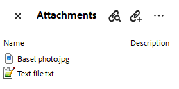
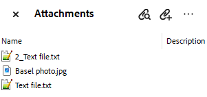

# Embedded File Streams - Overview

|Minimum Version|Q1 2024|
|----|----|

RadPdfProcessing allows you to embed file streams into the document. The content of the referenced files is embedded directly within the body of the PDF file.

## The EmbeddedFile Class

`RadFixedDocument` stores the integrated files in an `EmbeddedFilesCollection` accessed by the `EmbeddedFiles` property. Each `EmbeddedFile` requires `Name` (string) and `Data` (byte[]) properties. The specified Name must be unique and it represents the textual description of the embedded file, which can be displayed in the user interface of a viewer application. The `Data` property stores the byte[] of the file stream. 

>important The `Name` for the `EmbeddedFile` must contain the file extension, for example, *MySampleTextFile.txt*.

|Property|Description|
|----|----|
|`Name`|Gets or sets the attachment display filename (including extension) shown in viewer UIs.|
|`Data`|Represents the file data as a byte array.|
|`MimeType`|Gets or sets the MIME type of the embedded file. The MIME type string (for example, "application/xml", "text/xml"). If not specified, the default value of "application/octet-stream" is used. (*introduced in Q1 2026*)|
|`Description`|Gets or sets the description of the embedded file. This value is displayed in the Description column of a [PDF Portfolio]() when the schema includes an `AddDescriptionField()`. (*introduced in Q1 2026*)|
|`CreationDate`|Gets or sets the creation date of the embedded file. This value is displayed in the Created column of a [PDF Portfolio]() when the schema includes an `AddCreationDateField()`. (*introduced in Q1 2026*)|
|`ModificationDate`|Gets or sets the modification date of the embedded file. This value is displayed in the Modified column of a [PDF Portfolio]() when the schema includes an `AddModificationDateField()`. (*introduced in Q1 2026*)|
|`Size`|Gets the size of the embedded file in bytes. This value is automatically calculated from the `Data` property. (*introduced in Q1 2026*)|
|`CollectionItems`|Gets the collection item values for this embedded file in a [PDF Portfolio](). Use this property to set metadata that appears in the portfolio columns when viewing embedded files. (*introduced in Q1 2026*)|

>note [PdfProcessing Embedding File Streams Demo](https://demos.telerik.com/document-processing/pdfprocessing/embed_file_streams)

### Creating an Embedded File Stream
 
#### Creating an Embedded File Stream

<snippet id='pdf-create-embedded-file-stream'/>

>important `DuplicatedEmbeddedFileNameException` is thrown when you add an embedded file with a name that already exists in the collection.

**Attachments Section in Adobe**



### Specifying the MIME Type

|Minimum Version|Q1 2026|
|----|----|

RadPdfProcessing allows you to set the MIME type when embedding a file into a PDF document via the `MimeType` property of `EmbeddedFile`. The `MimeType` property accepts any standard IANA MIME type string. If not explicitly specified, the default value is `"application/octet-stream"`.

Declaring the correct MIME type along with the proper file extension in the `Name` property ensures that PDF viewers (such as Adobe Acrobat) correctly identify the attachment format, associate it with the right host application, and meet requirements for standards like PDF/A-3 and Factur-X.

**Set the MIME Type**

<snippet id='pdf-set-mime-type'/>

#### Common Supported MIME Types

The following table lists common MIME types used when embedding attachments:

| File Format | File Extension | MIME Type |
|---|---|---|
| PDF Document | `.pdf` | `application/pdf` |
| OpenXML Word Document | `.docx` | `application/vnd.openxmlformats-officedocument.wordprocessingml.document` |
| Microsoft Word 97–2003 | `.doc` | `application/msword` |
| OpenXML Excel Spreadsheet | `.xlsx` | `application/vnd.openxmlformats-officedocument.spreadsheetml.sheet` |
| Microsoft Excel 97–2003 | `.xls` | `application/vnd.ms-excel` |
| Plain Text | `.txt` | `text/plain` |
| XML Document | `.xml` | `application/xml` or `text/xml` |
| CSV Spreadsheet | `.csv` | `text/csv` |
| PNG Image | `.png` | `image/png` |
| JPEG Image | `.jpg`, `.jpeg` | `image/jpeg` |
| Generic Binary Data (Default) | *any* | `application/octet-stream` |

>important Notice the distinction between Office Open XML formats and legacy binary formats:
>* `.docx` uses `application/vnd.openxmlformats-officedocument.wordprocessingml.document`, while legacy `.doc` uses `application/msword`.
>* `.xlsx` uses `application/vnd.openxmlformats-officedocument.spreadsheetml.sheet`, while legacy `.xls` uses `application/vnd.ms-excel`.
>Assigning `application/msword` to a `.docx` file or omitting the extension in the `Name` property may cause PDF viewers to fail when launching the attachment.

**Example: Embedding Files with Different MIME Types**

```csharp
RadFixedDocument document = new RadFixedDocument();

// Embed a PDF file
byte[] pdfBytes = File.ReadAllBytes("sample.pdf");
EmbeddedFile pdfAttachment = document.EmbeddedFiles.Add("sample.pdf", pdfBytes);
pdfAttachment.MimeType = "application/pdf";

// Embed a DOCX file
byte[] docxBytes = File.ReadAllBytes("report.docx");
EmbeddedFile docxAttachment = document.EmbeddedFiles.Add("report.docx", docxBytes);
docxAttachment.MimeType = "application/vnd.openxmlformats-officedocument.wordprocessingml.document";

// Embed a TXT file
byte[] txtBytes = File.ReadAllBytes("notes.txt");
EmbeddedFile txtAttachment = document.EmbeddedFiles.Add("notes.txt", txtBytes);
txtAttachment.MimeType = "text/plain";
```

### Creating an Embedded Electronic (ZUGFeRD) Invoice

RadPdfProcessing supports embedding [ZUGFeRD invoices](). 

### Using the MergedEmbeddedFileNameResolving Event

The `MergedEmbeddedFileNameResolving` event occurs when trying to resolve conflicts between the embedded file names while merging `RadFixedDocument` instances. The `DuplicatedEmbeddedFileNameResolvingEventArgs` allows you to specify the `NewName` to use for adding the file to the `EmbeddedFiles` collection.

|Property|Description|
|----|----|
|`Name`|Gets the current embedded file name.|
|`NewName`|Gets or sets the new embedded file name.|
|`UsedNames`|Gets the names that are already used for embedded files in the same `RadFixedDocument`.|

**Resolving Duplicated Names**

<snippet id='pdf-duplicated-file-names'/>

**Resolved Duplicated Names**
 

### Using the PdfImportSettings.DuplicatedEmbeddedFileNameResolving Event 

When importing a PDF document containing embedded files, the `DuplicatedEmbeddedFileNameResolving` event that the [PdfImportSettings]() offers allows you to handle duplicated names and properly resolve them.

## See Also

* [PDF Portfolio]()
* [PdfProcessing Embedding File Streams Demo](https://demos.telerik.com/document-processing/pdfprocessing/embed_file_streams)

