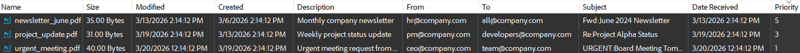

# PDF Portfolio - Overview

|Minimum Version|Q1 2026|
|----|----|

PDF Portfolios (also known as PDF Collections or PDF Packages) allow organizing multiple embedded files within a single PDF with a structured user interface showing file metadata in columns (details view) or icons (tile view). This feature was introduced in PDF 1.7.

**RadPdfProcessing** provides a comprehensive API for creating and configuring PDF Portfolios through the [RadFixedDocument]().**Portfolio** property. A portfolio enhances the presentation of [Embedded File Streams]() by defining a schema of metadata columns, sort order, and a preferred view mode.

## Overview

A PDF Portfolio provides the following capabilities:

* **Schema definition**: Define custom fields (columns) that describe the embedded files—text, date, and number fields, as well as built-in fields like file name, size, and dates.
* **Sorting**: Specify how the embedded files are ordered using one or more sort keys.
* **View modes**: Choose between a details view (multi-column table), tile view (icon-based), or hidden mode.
* **Initial document**: Designate which embedded file is displayed when the portfolio is first opened.
* **Per-file metadata**: Assign custom field values to each embedded file through the `CollectionItems` property.

## Requirements

NuGet packages:

|.NET Framework|.NET Standard-compatible|
|---|---|
|**Telerik.Windows.Documents.Fixed**|**Telerik.Documents.Fixed**|

To use PDF Portfolios, ensure the following:

* The **Portfolio.IsEnabled** property must be set to **true**.
* The document must contain at least one [Embedded File]().
* The portfolio schema should have at least one field defined for meaningful presentation.

For a detailed description of each class, property, and method in the PDF Portfolio API, see the [PortfolioCollection]() article.

## Example Implementation

The following example demonstrates how to create a PDF Portfolio with a fully configured schema, sorting, and per-file metadata modeling an email-like collection of embedded files.



```csharp
    // Create a PDF Portfolio demonstrating all portfolio features
    RadFixedDocument fixedDocument = new RadFixedDocument();
    fixedDocument.Pages.AddPage();

    // =====================================================
    // STEP 1: Enable Portfolio and Configure Schema
    // =====================================================
    fixedDocument.Portfolio.IsEnabled = true;
    fixedDocument.Portfolio.ViewMode = PortfolioViewMode.Details;

    // Add built-in fields (automatically populated from file metadata)
    fixedDocument.Portfolio.Schema.AddFileNameField(order: 1);
    fixedDocument.Portfolio.Schema.AddSizeField(order: 2);
    fixedDocument.Portfolio.Schema.AddModificationDateField(order: 3);
    fixedDocument.Portfolio.Schema.AddCreationDateField(order: 4);
    fixedDocument.Portfolio.Schema.AddDescriptionField(order: 5);

    // Add custom fields for email-like metadata
    fixedDocument.Portfolio.Schema.AddTextField("from", "From", order: 6);
    fixedDocument.Portfolio.Schema.AddTextField("to", "To", order: 7);
    PortfolioField subjectField = fixedDocument.Portfolio.Schema.AddTextField("subject", "Subject", order: 8);
    subjectField.IsEditable = true; // Allow user to edit this field in PDF viewer

    fixedDocument.Portfolio.Schema.AddDateField("received", "Date Received", order: 9);
    fixedDocument.Portfolio.Schema.AddNumberField("priority", "Priority", order: 10);

    // Add a hidden field (not visible in UI but stored in PDF)
    PortfolioField internalId = fixedDocument.Portfolio.Schema.AddTextField("internalId", "Internal ID", order: 99);
    internalId.IsVisible = false;

    // =====================================================
    // STEP 2: Configure Sorting
    // =====================================================
    // Sort by priority (descending), then by received date (newest first)
    fixedDocument.Portfolio.Sort.AddSortField("priority", ascending: false);
    fixedDocument.Portfolio.Sort.AddSortField("received", ascending: false);

    // =====================================================
    // STEP 3: Add Embedded Files with Collection Items
    // =====================================================

    // Email 1: High priority urgent email
    EmbeddedFile email1 = fixedDocument.EmbeddedFiles.Add("urgent_meeting.pdf", Encoding.UTF8.GetBytes("%PDF-1.4 Urgent Meeting Document Content"));

    // Set built-in file metadata (for Size, Modified, Created, Description columns)
    email1.Description = "Urgent meeting request from CEO";
    email1.CreationDate = DateTime.Now.AddDays(-1);
    email1.ModificationDate = DateTime.Now.AddHours(-2);

    // Set custom fields
    email1.CollectionItems.SetText("from", "ceo@company.com");
    email1.CollectionItems.SetText("to", "team@company.com");

    // Use prefix for subject (CollectionSubitem feature) - fluent API
    email1.CollectionItems.SetText("subject", "Board Meeting Tomorrow - Mandatory Attendance").Prefix = "URGENT:";

    email1.CollectionItems.SetDate("received", DateTime.Now.AddHours(-2));
    email1.CollectionItems.SetNumber("priority", 1);
    email1.CollectionItems.SetText("internalId", "MSG-001");

    // Email 2: Normal priority follow-up
    EmbeddedFile email2 = fixedDocument.EmbeddedFiles.Add("project_update.pdf", Encoding.UTF8.GetBytes("%PDF-1.4 Project Update Content"));

    // Set built-in file metadata
    email2.Description = "Weekly project status update";
    email2.CreationDate = DateTime.Now.AddDays(-7);
    email2.ModificationDate = DateTime.Now.AddDays(-1);
    email2.CollectionItems.SetText("from", "pm@company.com");
    email2.CollectionItems.SetText("to", "developers@company.com");

    // Use prefix for subject - fluent API
    email2.CollectionItems.SetText("subject", "Project Alpha Status").Prefix = "Re:";

    email2.CollectionItems.SetDate("received", DateTime.Now.AddDays(-1));
    email2.CollectionItems.SetNumber("priority", 3);
    email2.CollectionItems.SetText("internalId", "MSG-002");

    // Email 3: Low priority newsletter
    EmbeddedFile email3 = fixedDocument.EmbeddedFiles.Add("newsletter_june.pdf", Encoding.UTF8.GetBytes("%PDF-1.4 Company Newsletter Content"));

    // Set built-in file metadata
    email3.Description = "Monthly company newsletter";
    email3.CreationDate = DateTime.Now.AddDays(-14);
    email3.ModificationDate = DateTime.Now.AddDays(-7);

    // Set custom fields
    email3.CollectionItems.SetText("from", "hr@company.com");
    email3.CollectionItems.SetText("to", "all@company.com");

    // Use prefix for subject - fluent API
    email3.CollectionItems.SetText("subject", "June 2024 Newsletter").Prefix = "Fwd:";

    email3.CollectionItems.SetDate("received", DateTime.Now.AddDays(-7));
    email3.CollectionItems.SetNumber("priority", 5);
    email3.CollectionItems.SetText("internalId", "MSG-003");

    // =====================================================
    // STEP 4: Set Initial Document
    // =====================================================
    // When the portfolio opens, show the urgent email first
    fixedDocument.Portfolio.InitialDocument = "urgent_meeting.pdf";
```

## See Also

* [PortfolioCollection]()
* [Embedded File Streams]()
* [EmbeddedFilesCollection]()
* [RadFixedDocument]()
