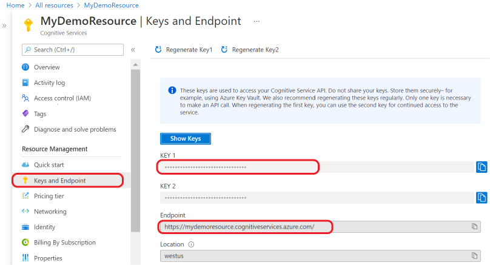
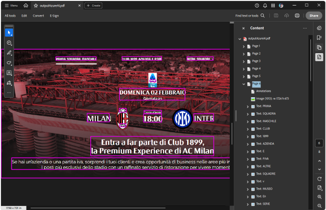

# Implementing a Custom IOcrProvider

RadPdfProcessing offers a [default]() implementation for an **IOcrProvider** engine wrapper that the **OcrFormatProvider** uses. It is the **TesseractOcrProvider** which uses the [Tesseract 5.2.0 engine](https://github.com/tesseract-ocr/tesseract?tab=readme-ov-file#tesseract-ocr) to extract text from an image. 

However, it is possible to implement your own **IOcrProvider** that uses the desired engine that recognizes the text from a screenshot. 

## Using the Azure AI Vision

The [Azure AI Vision](https://learn.microsoft.com/en-us/azure/ai-services/computer-vision/overview) service gives you access to the [Optical Character Recognition](https://learn.microsoft.com/en-us/azure/ai-services/computer-vision/overview-ocr) (OCR) service that extracts text from images. We will use its [OCR engine](https://learn.microsoft.com/en-us/azure/ai-services/computer-vision/overview-ocr#ocr-engine) to implement a custom **IOcrProvider** that our RadPdfProcessing library can use.

1\. Before going further, you can find listed below the **required** assemblies/ NuGet packages that should be added to your project:

* [Azure.AI.Vision.ImageAnalysis](https://www.nuget.org/packages/Azure.AI.Vision.ImageAnalysis)
* Telerik.Documents.Fixed
* Telerik.Documents.Fixed.FormatProviders.Ocr
* Telerik.Documents.ImageUtils
* SkiaSharp

2\.  It is necessary to generate your Azure AI key and endpoint: [Get your credentials from your Azure AI services resource](https://learn.microsoft.com/en-us/azure/ai-services/use-key-vault?tabs=azure-cli&pivots=programming-language-csharp)

  

3\. Create the custom AzureAIOcrProvider class that implements the **IOcrProvider** interface: 

<snippet id='libraries-pdf-formats-and-conversion-ocrformatprovider-azureaiocrprovider'/>
 
4\. Use the custom implementation with the [OcrFormatProvider]() that RadPdfProcessing offers:

<snippet id='libraries-pdf-formats-and-conversion-ocrformatprovider-use-custom-iocrprovider'/>

After iterating all the images in the specified folder, which contain content in different languages, a PDF document is generated with the respective content, recognized as text fragments:

 

## See Also

* [Prerequisites]()
* [Using OcrFormatProvider]()
* [Cross-Platform Support - Images]()
* [What is Azure AI Vision?](https://learn.microsoft.com/en-us/azure/ai-services/computer-vision/overview)
* [Get your credentials from your Azure AI services resource](https://learn.microsoft.com/en-us/azure/ai-services/use-key-vault?tabs=azure-cli&pivots=programming-language-csharp#get-your-credentials-from-your-azure-ai-services-resource)
