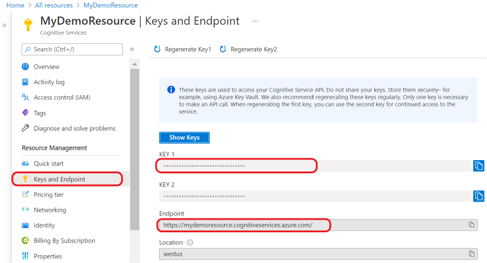
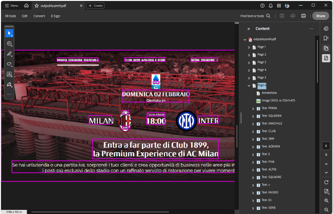

# Implementing a Custom IOcrProvider

RadPdfProcessing offers a [default]() implementation for an `IOcrProvider` engine wrapper that `OcrFormatProvider` uses. The `TesseractOcrProvider` uses the [Tesseract 5.2.0 engine](https://github.com/tesseract-ocr/tesseract?tab=readme-ov-file#tesseract-ocr) to extract text from an image. 

You can also implement your own `IOcrProvider` that uses a different engine to recognize text from a screenshot. 

## Using the Azure AI Vision

The [Azure AI Vision](https://learn.microsoft.com/en-us/azure/ai-services/computer-vision/overview) service provides access to the [Optical Character Recognition](https://learn.microsoft.com/en-us/azure/ai-services/computer-vision/overview-ocr) (OCR) service that extracts text from images. The following example uses the Azure [OCR engine](https://learn.microsoft.com/en-us/azure/ai-services/computer-vision/overview-ocr#ocr-engine) to implement a custom `IOcrProvider` for the RadPdfProcessing library.

1\. Add the following **required** NuGet packages to your project:

* [Azure.AI.Vision.ImageAnalysis](https://www.nuget.org/packages/Azure.AI.Vision.ImageAnalysis)
* Telerik.Documents.Fixed
* Telerik.Documents.Fixed.FormatProviders.Ocr
* Telerik.Documents.ImageUtils
* SkiaSharp

2\. Generate your Azure AI key and endpoint: [Get your credentials from your Azure AI services resource](https://learn.microsoft.com/en-us/azure/ai-services/use-key-vault?tabs=azure-cli&pivots=programming-language-csharp)

  

3\. Create the custom `AzureAIOcrProvider` class that implements the `IOcrProvider` interface: 

<snippet id='libraries-pdf-formats-and-conversion-ocr-custom-ocr-provider-ocrformatprovider-azureaiocrprovider'/>
 
4\. Use the custom implementation with the [OcrFormatProvider]() that RadPdfProcessing offers:

<snippet id='libraries-pdf-formats-and-conversion-ocr-custom-ocr-provider-ocrformatprovider-use-custom-iocrprovider'/>

After iterating all images in the specified folder (which contain content in different languages), the provider generates a PDF document with the respective content recognized as text fragments:

 

## See Also

* [Prerequisites]()
* [Using OcrFormatProvider]()
* [Cross-Platform Support - Images]()
* [What is Azure AI Vision?](https://learn.microsoft.com/en-us/azure/ai-services/computer-vision/overview)
* [Get your credentials from your Azure AI services resource](https://learn.microsoft.com/en-us/azure/ai-services/use-key-vault?tabs=azure-cli&pivots=programming-language-csharp#get-your-credentials-from-your-azure-ai-services-resource)
