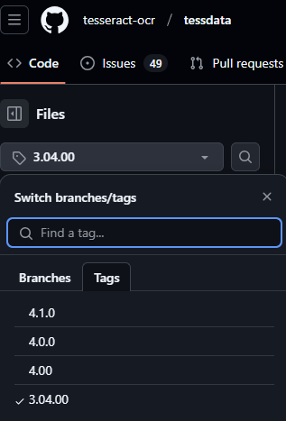
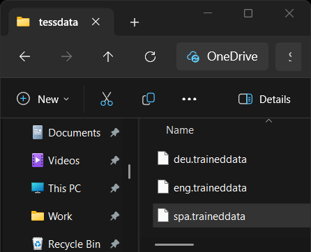
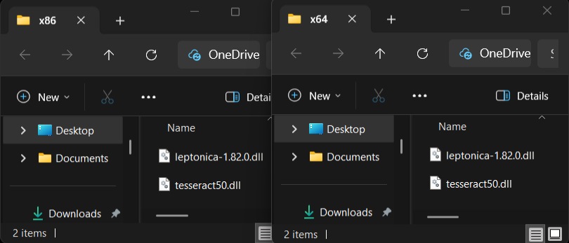

# Prerequisites

**Optical Character Recognition** (a.k.a. OCR) is the electronic or mechanical conversion of images of typed, handwritten, or printed text into a machine-encoded text from a scanned document.

This topic describes the requirements needed by the [PdfProcessing]() library to start using the **OcrFormatProvider**.

## Required Assemblies/ NuGet Packages

In order to use the **OcrFormatProvider** you need to add the following references:

<table>
<thead>
	<tr>
		<th>.NET Framework </th>
		<th>.NET Standard-compatible</th>
	</tr>
</thead>
<tbody>
	<tr>
		<td><b>Telerik.Windows.Documents.Core</b></td>
		<td><b>Telerik.Documents.Core</b></td>
	</tr>
	<tr>
	    <td><b>Telerik.Windows.Documents.Fixed</b></td>
		<td><b>Telerik.Documents.Fixed</b></td>
	</tr>
    <tr>
	    <td><b>Telerik.Windows.Documents.Fixed.FormatProviders.Ocr</b></td>
		<td><b>Telerik.Documents.Fixed.FormatProviders.Ocr</b></td>
	</tr>
    <tr>
	    <td><b>Telerik.Windows.Zip.dll</b></td>
		<td><b>Telerik.Zip.dll</b></td>
	</tr>
     </tr>
		<tr>
	    <td colspan="2">&nbsp;</td>
	</tr>
    <tr>
        <td colspan="2">This reference is recommented to always be in the form of a NuGet package, as it will add the required Tesseract references and files automatically. Otherwise a [manual intervention](#manually-set-up-the-tesseract-native-assemblies) might be required.</td> 
    </tr>
        <tr>
	    <td><b>Telerik.Windows.Documents.Tesseract.Ocr</b></td>
		<td><b>Telerik.Documents.Tesseract.Ocr</b></td>
	</tr>
    </tr>
		<tr>
	    <td colspan="2">&nbsp;</td>
	</tr>
	<tr>
        <td colspan="2">To export images different than <b>Jpeg</b> and <b>Jpeg2000</b> or ImageQuality different than High you will need to add a reference to the following assembly:</td> 
    </tr>
	<tr>
	    <td><b>-</b></td>
		<td><b>Telerik.Documents.ImageUtils.dll</b>
			<br><sub><i>This assembly is not available in UI for Xamarin.</i></sub>
	</tr>
    <tr>
	    <td><b>-</b></td>
		<td><b>[SkiaSharp](https://www.nuget.org/packages/SkiaSharp/)</b>
            <br><sub><i>Telerik.Documents.ImageUtils depends on SkiaSharp.</i></sub>
	</tr>
</tbody>
</table>

>note In ASP AJAX you would have to additionaly [manually place the Tesseract native assemblies](#manually-set-up-the-tesseract-native-assemblies).

## Language Data Setup

Create a "**tessdata**" folder and populate it with the desired languages. You can download the language data files from the official [Tesseract GitHub repository](https://github.com/tesseract-ocr/tessdata/blob/3.04.00/eng.traineddata). Results may vary depending on the language version:



The "**tessdata**" folder's placement is determined by the user. The **DataPath** property of the [TesseractOcrProvider](#tesseractocrprovider-public-api) points to the parent folder containing "**tessdata**", allowing the provider to locate and use it.

### "tessdata" Structure:

```plaintext
tessdata
├── due.traineddata
├── eng.traineddata     
└── spa.traineddata
```
 

## Important Notes

>note The default Tesseract implementation is at this point **Windows-only**. You can still use the OCR feature with a [custom implementation]().

>note Used images should be **300 DPI** for best results.

### Manually set up the Tesseract native assemblies
1. Download the "_tesseract50.dll_" and "_leptonica-1.82.0.dll_" native assemblies from the listed links:
    * https://github.com/charlesw/tesseract/tree/master/src/Tesseract/x64.
    * https://github.com/charlesw/tesseract/tree/master/src/Tesseract/x86.
1. Create the following structure and add the two folders to the root of the applicaiton (structureIMAGE).
    * Folder Structure:
    ```plaintext
    RootFolder
    ├── x64
    │   ├── tesseract50.dll
    │   └── leptonica-1.82.0.dll
    └── x86
        ├── tesseract50.dll
        └── leptonica-1.82.0.dll
    ```
 

## See Also

* [Using OcrFormatProvider]()
* [Implementing a Custom OCR Provider]()
