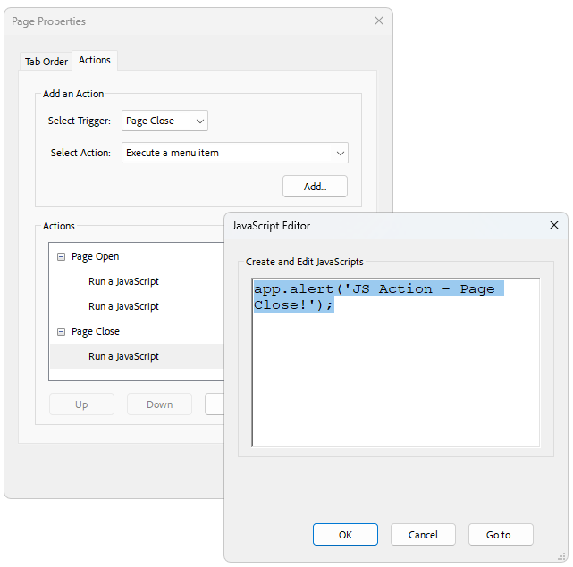
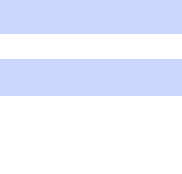

# JavaScript Actions

|Minimum Version|Q4 2024|
|----|----|

RadPdfProcessing supports:

* **JavaScript actions** associated with documents, pages, form fields, and other elements.
* **Event-triggered actions** that execute after a certain event in the respective viewer (for example, RadPdfViewer, Adobe Acrobat, or a web browser) is triggered.

The `JavaScriptAction` class represents JavaScript actions and stores the JS content as plain text in its public `Script` property.

You can add JS actions by using the public `Actions` property of the following classes:

|Class|Collection Type|
|----|----|
|`Link`*|[ActionCollection](#actioncollection)|
|`BookmarkItem`*|[ActionCollection](#actioncollection)|
|`Widget`|[WidgetActionCollection](#widgetactioncollection)|
|`FormField`|[FormFieldActionCollection](#formfieldactioncollection)|
|`RadFixedDocument`|[DocumentActionCollection](#documentactioncollection)|
|`RadFixedPage`|[PageActionCollection](#pageactioncollection)|

\* The existing `Action` property is obsolete.

### Adding a JavaScript Action to a TextBoxField

The following example demonstrates how to create a PDF document with three `TextBoxField` instances where the third field calculates the sum of the values entered in the first two widgets:

<snippet id='pdf-js-action-sum'/>

### Using the MergedJavaScriptNameResolving Event

The `MergedJavaScriptNameResolving` event fires when resolving conflicts between JavaScript names while merging `RadFixedDocument` instances.

<snippet id='pdf-merged-js-script-name-resolving'/>

## See Also

* [FormField]()
* [FormFieldCollection]()
* [Widgets]()
* [Multiplying TextBoxField Values with JavaScript Actions and RadPdfProcessing]()
