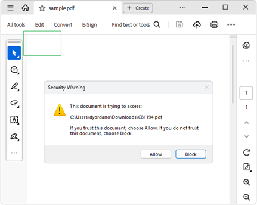

# Launch Actions  

As of **Q2 2025** RadPdfProcessing provides support for **Launch actions** that PDF viewer applications are expected to support. A launch action launches an application or opens or prints a document. The LaunchAction class offers the following public properties: 

|Property|Description|
|----|----|
|**File**| Gets or sets the remote File for the action.|
|**OpenInNewWindow**|Gets or sets a value indicating whether to open the destination document in a new window. True if the document should be open in a new window, otherwise false.|

### Adding a Launch Action to a Document

The following example shows how to create a PDF document and add a **LaunchAction** to a [Link annotation]() that opens another PDF document in a new window:
 
 <snippet id='libraries-pdf-model-actions-launch'/>

    

## See Also

* [Links]() 
* [Actions]() 
* [Annotations]()
* [GoToRAction]()
