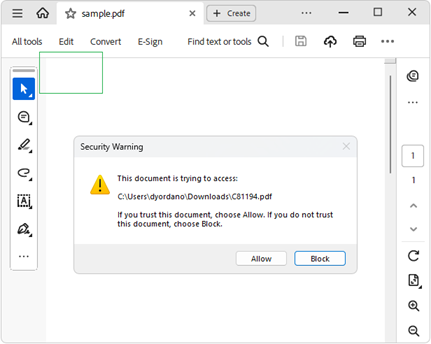

# Launch Actions

|Minimum Version|Q2 2025|
|----|----|

RadPdfProcessing supports **Launch actions** that PDF viewer applications are expected to support. A launch action launches an application or opens or prints a document. The `LaunchAction` class offers the following public properties:

|Property|Description|
|----|----|
|`File`|Gets or sets the remote file for the action.|
|`OpenInNewWindow`|Gets or sets a value indicating whether to open the destination document in a new window. Set to `true` to open in a new window, or `false` otherwise.|

### Adding a Launch Action to a Document

The following example shows how to create a PDF document and add a `LaunchAction` to a [Link annotation]() that opens another PDF document in a new window:

<snippet id='libraries-pdf-model-actions-launch'/>

## See Also

* [Links]()
* [Actions]()
* [Annotations]()
* [GoToRAction]()
