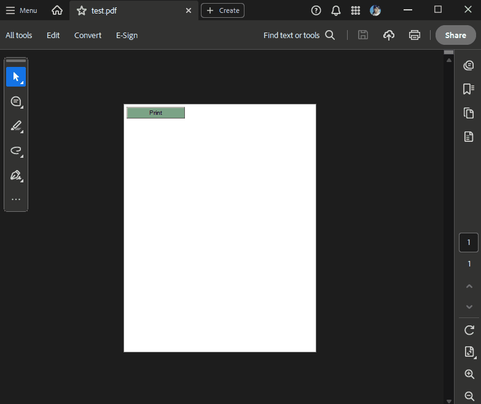

# Named Actions  

As of **Q1 2025** RadPdfProcessing provides support for **Named actions** that PDF viewer applications are expected to support. The NamedAction class offers the public **Type** property which specifies the type of the action representing the menu item to be executed.

The available *Standard* **NamedActionType** options are listed in the table below. 

>note The PDF viewer applications are expected to support the standard name actions. Further names may be added as well but it is not guaranteed that all PDF viewers would support the *NonStandard* actions:

|Standard Names Actions|Description|
|----|----|
|**NextPage**|Go to the next page of the document.|
|**PrevPage**|Go to the previous page of the document.|
|**FirstPage**|Go to the first page of the document.|
|**LastPage**|Go to the last page of the document.|

>note Viewer applications may support additional, nonstandard named actions, but any document using them is not portable. If a viewer (e.g. Adobe Acrobat, RadPdfViewer or a web browser) encounters a named action that is inappropriate for a viewing platform, or if the viewer does not recognize the name, it should take no action.

RadPdfProcessing offers support for the following *NonStandard* **Named actions** as well:

|NonStandard Named Actions|Description|
|----|----|
|**Print**|Print the current document.|
|**SaveAs**|Save the current document as a new file.|
|**Find**|Find text within the document.|
|**FindSearch**|Perform a search operation within the document.|
|**Close**|Close the current document or viewer.|
|**GoToPage**|Go to a specific page within the document.|
|**GoBack**|Navigate back to the previous location.|
|**GoForward**|Navigate forward to the next location.|
|**SinglePage**|Display the document in single-page view mode.|
|**TwoPages**|Display the document in two-page view mode.|
|**OneColumn**|Display the document in one-column layout mode.|
|**ActualSize**|Show the document at its actual size.|
|**FitPage**|Fit the document page within the viewer.|
|**FitWidth**|Fit the document width within the viewer.|
|**FitHeight**|Fit the document height within the viewer.|
|**FitVisible**|Fit the visible content of the page within the viewer.|
|**ZoomTo**|Zoom to a specified level.|
|**FullScreenMode**|Enter full-screen mode.|
|**ShowHideArticles**|Show or hide articles within the document.|
|**ShowHideFileAttachment**|Show or hide file attachments.|
|**ShowHideBookmarks**|Show or hide bookmarks.|
|**ShowHideOptCont**|Show or hide optional content.|
|**ShowHideModelTree**|Show or hide the model tree.|
|**ShowHideThumbnails**|Show or hide page thumbnails.|
|**ShowHideSignatures**|Show or hide digital signatures.|
|**GeneralPrefs**|Open general preferences for the viewer.|
|**GeneralInfo**|Display general information about the document.|
|**Quit**|Exit the viewer application.|
|**FindCurrentBookmark**|Find the currently selected bookmark.|
|**BookmarkShowLocation**|Show the location associated with a bookmark.|
|**ZoomViewIn**|Zoom in the view.|
|**ZoomViewOut**|Zoom out the view.|
|**HelpReader**|Open the help documentation for the reader.|
|**TwoColumns**|Display the document in two-column layout mode.|
|**HandMenuItem**|Activate the hand tool menu item.|
|**ZoomDragMenuItem**|Activate the zoom drag tool menu item.|
|**Scan**|Initiate a scan operation.|

### Adding a Named Action to a PushButtonField

The following example demonstrates how to create a PDF document with a [PushButtonField]() which triggers a printing action when the document is displayed in a viewer and the button is pressed by the end-user: 
 
 <snippet id='libraries-pdf-model-actions-named-actions-create'/>

 

>important In **.NET Standard/.NET (Target OS: None)** environments, fonts beyond the [14 standard ones](#standard-fonts) require a [FontsProvider implementation]() to be resolved correctly.

## See Also

* [FormField]()
* [FormFieldCollection class]()
* [Widgets]() 

