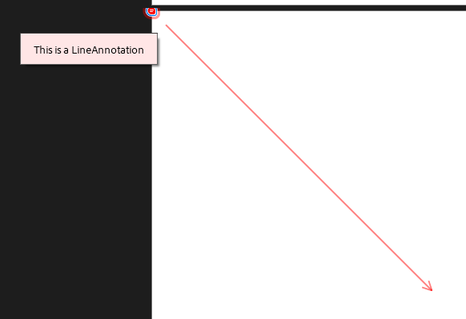
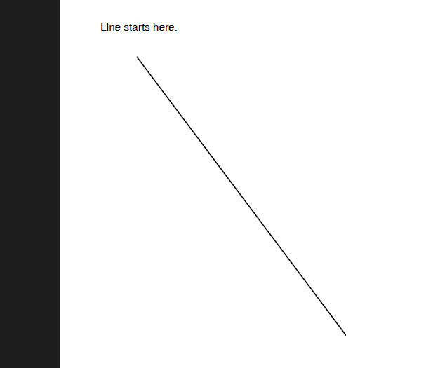

# Line Annotation  

A **Line annotation** displays a single straight line on the page. When opened, it displays a pop-up window containing the text of the associated note.

The **LineAnnotation** class is a derivative of the **MarkupAnnotation** (descendent of **ContentAnnotation**) and it exposes the following properties:

|Property|Description|
|---|---|
|**Start**|Gets or sets the starting point of the annotation.|
|**End**|Gets or sets the ending point of the annotation.|
|**StartLineEndingType**|Gets or sets the line ending type for the start of the line.|
|**EndLineEndingType**|Gets or sets the line ending type for the end of the line.|
|**Opacity**|Gets or sets the opacity of the annotation.|
|**Contents**|Gets or sets the text that shall be displayed for the annotation.|
|**Color**|Gets or sets the color of the annotation.|
|**Content**|Gets the source defining the visual content of the annotation. This content is with bigger priority compared to the annotation appearance characteristics and text properties and it is visualized by default when opening the exported document in some PDF viewer.|

### Creating a LineAnnotation

```csharp
            RadFixedDocument document = new RadFixedDocument();
            RadFixedPage page = document.Pages.AddPage();

            LineAnnotation annotation = page.Annotations.AddLine(new Point(10, 10), new Point(300, 300));
            annotation.StartLineEndingType = LineEndingType.None;
            annotation.EndLineEndingType = LineEndingType.OpenArrow;
            annotation.Color = new RgbColor(255, 0, 0); //Default RgbColor(255, 255, 255)
            annotation.Contents = "This is a LineAnnotation";
            annotation.Opacity = 0.5;
            annotation.RecalculateContent();
```

  

### Creating a LineAnnotation with FixedContentEditor

The [FixedContentEditor]() offers the public **DrawLineAnnotation** method which creates a new __LineAnnotation__ with starting point the current point of the editor and end point the current point of the editor plus the given distances.

```csharp
            RadFixedDocument fixedDocument = new RadFixedDocument();
            FixedContentEditor editor = new FixedContentEditor(fixedDocument.Pages.AddPage());

            editor.Position.Translate(50, 50);
            editor.DrawText("Line starts here.");
            editor.DrawLineAnnotation(300, 400);
```

   

## See Also

* [AcroForm]()
* [FormField]()
* [Annotations Overview]()