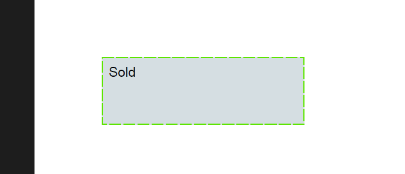

# Stamp Annotation  

A **Stamp annotation** displays text or graphics intended to look as if they were stamped on the page with a rubber stamp. When opened, it displays a pop-up window containing the text of the associated note.

The **StampAnnotation** class is a derivative of the **MarkupAnnotation** (descendent of **ContentAnnotation**) and it exposes the following properties:

|Property|Description|
|---|---|
|**Name**|Gets or sets the name of the stamp. The name can be chosen from the predefined names in the __StampAnnotationPredefinedNames__ class or it can be a custom string. In the case of a custom string an appearance should be provided via the __ContentAnnotation.Content__ property.|
|**Opacity**|Gets or sets the opacity of the annotation.|
|**Contents**|Gets or sets the text that shall be displayed for the annotation.|
|**Color**|Gets or sets the color of the annotation.|
|**Content**|Gets the source defining the visual content of the annotation. This content is with bigger priority compared to the annotation appearance characteristics and text properties and it is visualized by default when opening the exported document in some PDF viewer.|

### Creating a StampAnnotation

<snippet id='pdf-create-stamp-annotation'/>

  

### Creating a StampAnnotation with FixedContentEditor

The [FixedContentEditor]() offers the public **DrawStampAnnotation** method which creates a new __StampAnnotation__ and draws it with a specified annotation size and name.

<snippet id='pdf-fixed-editor-create-stamp'/>

   

### Creating a StampAnnotation with Appearance

The **AnnotationContentSource** class, accessed by the **Content** property of the annotation object, represents the [FormSource]() instances used for displaying the widget content. The following example shows how to create a custom Stamp annotation and change its visual appearance:

>important When creating a custom stamp name (not from the predefined names), it is important to start the name with "#". Otherwise, if the stamp is moved in Adobe, its appearance will be rewritten.

>important When creating appearance for an annotation, it is important to create it with the same size as the rectangle of the annotation otherwise unexpected behavior may occur when the annotation is moved in Adobe.

<snippet id='pdf-stamp-annotation-with-appearance'/>

  

>important In **.NET Standard/.NET (Target OS: None)** environments, fonts beyond the [14 standard ones](#standard-fonts) require a [FontsProvider implementation]() to be resolved correctly.

## See Also

* [AcroForm]()
* [FormField]()
* [Annotations Overview]()
* [FormSource]()