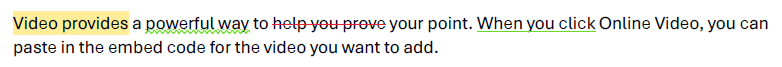
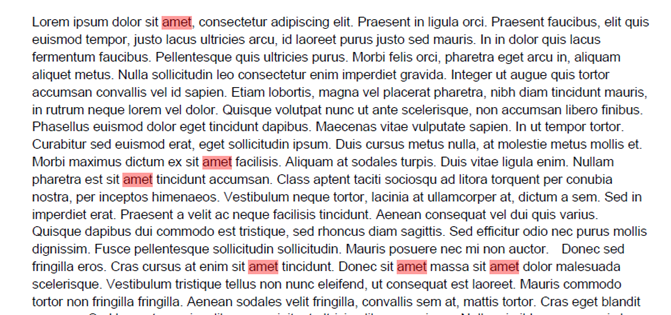
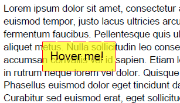

# TextMarkup 

**Text Markup annotations** appear as highlights, underlines, strikeouts, or jagged ("squiggly") underlines in the text of a document. When opened, they display a pop-up window containing the text of the associated note. 

    

The **TextMarkupAnnotation** class is a derivative of the **MarkupAnnotation** (descendent of **ContentAnnotation**) and it exposes the following properties:

|Property|Description|
|---|---|
|**TextMarkupType**|Gets the type of the annotation. The **TextMarkupAnnotationType** enum offers *Highlight*, *StrikeOut*, *Underline*, *Squiggly* options.|
|**Opacity**|Gets or sets the opacity of the annotation.|
|**Contents**|Gets or sets the text that shall be displayed for the annotation.|
|**Color**|Gets or sets the color of the annotation.|
|**Content**|Gets the source defining the visual content of the annotation. This content is with bigger priority compared to the annotation appearance characteristics and text properties and it is visualized by default when opening the exported document in some PDF viewer.|

Depending on the TextMarkupAnnotationType the respective type of the TextMarkup annotation can be added to the PDF document using the below examples:

## Highlight

### Creating a Highlight Annotation

```csharp 
            string sampleText =  File.ReadAllText("dummyText.txt");

            RadFixedDocument fixedDocument = new RadFixedDocument();
            using (RadFixedDocumentEditor documentEditor = new RadFixedDocumentEditor(fixedDocument))
            {
                documentEditor.InsertRun(sampleText);
            }           
            TextSearch search = new TextSearch(fixedDocument);
            IEnumerable<SearchResult> result = search.FindAll("amet", TextSearchOptions.Default);
            foreach (SearchResult r in result)
            {
                Rect highlightRectangle = r.GetWordBoundingRect(); 
                TextMarkupAnnotation annotation = r.GetResultPage().Annotations.AddHighlight(highlightRectangle);
                annotation.Color = new RgbColor(125, 255, 0, 0);

                annotation.RecalculateContent();
            }
        
```

   

### Creating a Highlight Annotation with Appearance


```csharp          
        private RadFixedDocument CreateTextMarkupAnnotation()
        {
            string sampleText = File.ReadAllText("dummyText.txt");
            RadFixedDocument fixedDocument = new RadFixedDocument();
            using (RadFixedDocumentEditor documentEditor = new RadFixedDocumentEditor(fixedDocument))
            {
                documentEditor.InsertRun(sampleText);
            }
            TextMarkupAnnotation annotation = fixedDocument.Pages[0].Annotations.AddHighlight(new Rect(150, 150, 100, 40));

            FormSource simpleForm = new FormSource();
            CreateContentFormWithText(simpleForm, "Hover me!");
            annotation.Content.NormalContentSource = simpleForm;

            FormSource secondForm = new FormSource();
            CreateContentFormWithText(secondForm, "Hovered!");
            annotation.Content.MouseOverContentSource = secondForm;
            return fixedDocument;
        }

        private static void CreateContentFormWithText(FormSource normalForm, string text)
        {
            Size s = new Size(100, 40);
            normalForm.Size = s;

            FixedContentEditor formEditor = new FixedContentEditor(normalForm);

            using (formEditor.SaveProperties())
            {
                formEditor.GraphicProperties.IsFilled = true;
                formEditor.GraphicProperties.IsStroked = true;
                formEditor.GraphicProperties.StrokeThickness = 1;
                formEditor.GraphicProperties.StrokeColor = new RgbColor(255, 0, 0);
                formEditor.GraphicProperties.FillColor = new RgbColor(175,255, 255, 0);
                formEditor.GraphicProperties.StrokeDashArray = new double[] { 17, 4 };
                formEditor.DrawRectangle(new Rect(s));
            }

            formEditor.TextProperties.FontSize = 16;
            formEditor.Position.Translate(10, 10);
            formEditor.DrawText(text);
        }
```

    

## Underline

```csharp 
            RadFixedDocument fixedDocument = new RadFixedDocument();
            RadFixedPage page = fixedDocument.Pages.AddPage();
            FixedContentEditor editor = new FixedContentEditor(page);
            editor.Position.Translate(100, 100);
            editor.DrawText("This is an underline.");

            TextSearch search = new TextSearch(fixedDocument);
            IEnumerable<SearchResult> underlineSearch = search.FindAll("underline", TextSearchOptions.Default);
            Rect underlineRectangle = underlineSearch.First().GetWordBoundingRect();
            TextMarkupAnnotation underlineAnnotation = page.Annotations.AddUnderline(underlineRectangle);
            underlineAnnotation.Color = new RgbColor(255, 0, 255);
            underlineAnnotation.Opacity = 0.90;
            underlineAnnotation.RecalculateContent();     
```

     

## Squiggly

```csharp 
            RadFixedDocument fixedDocument = new RadFixedDocument();
            RadFixedPage page = fixedDocument.Pages.AddPage();
            FixedContentEditor editor = new FixedContentEditor(page);
            editor.Position.Translate(100, 100);
            editor.DrawText("This is a squiggly line.");

            TextSearch search = new TextSearch(fixedDocument);
            IEnumerable<SearchResult> squigglySearch = search.FindAll("squiggly", TextSearchOptions.Default);
            Rect squigglyRectangle = squigglySearch.First().GetWordBoundingRect();
            TextMarkupAnnotation squigglyAnnotation = page.Annotations.AddSquiggly(squigglyRectangle);
            squigglyAnnotation.Color = new RgbColor (255,0, 0);
            squigglyAnnotation.Opacity = 0.70;
            squigglyAnnotation.RecalculateContent();       
```

    

## StrikeOut

```csharp 
            RadFixedDocument fixedDocument = new RadFixedDocument();
            RadFixedPage page = fixedDocument.Pages.AddPage();
            FixedContentEditor editor = new FixedContentEditor(page);
            editor.Position.Translate(100, 100);
            editor.DrawText("This is a strikeout.");

            TextSearch search = new Search.TextSearch(fixedDocument);
            IEnumerable<SearchResult> strikeoutSearch = search.FindAll("strikeout", TextSearchOptions.Default);
            Rect strikeoutRectangle = strikeoutSearch.First().GetWordBoundingRect();
            TextMarkupAnnotation strikeoutAnnotation = page.Annotations.AddStrikeout(strikeoutRectangle);
            strikeoutAnnotation.Color = new RgbColor(0, 0, 255);
            strikeoutAnnotation.Opacity = 0.90;
            strikeoutAnnotation.RecalculateContent();    
```

      


## See Also

* [AcroForm]()
* [FormField]()
* [Annotations Overview]()
* [FormSource]()
