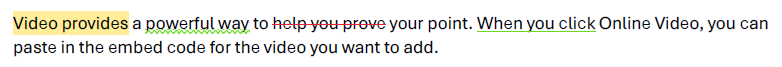
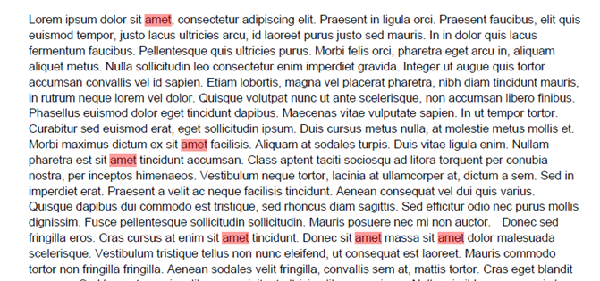
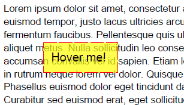
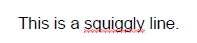
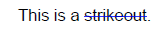

# TextMarkup

**Text Markup annotations** appear as highlights, underlines, strikeouts, or jagged ("squiggly") underlines in the text of a document. When opened, they display a pop-up window containing the text of the associated note.

The `TextMarkupAnnotation` class is a derivative of `MarkupAnnotation` (descendent of `ContentAnnotation`) and it exposes the following properties:

| Property | Description |
|---|---|
| `TextMarkupType` | Gets the type of the annotation. The `TextMarkupAnnotationType` enum offers `Highlight`, `StrikeOut`, `Underline`, and `Squiggly` options. |
| `Opacity` | Gets or sets the opacity of the annotation. |
| `Contents` | Gets or sets the text displayed for the annotation. |
| `Color` | Gets or sets the color of the annotation. |
| `Content` | Gets the source defining the visual content of the annotation. This content has higher priority compared to the annotation appearance characteristics and text properties and is visualized by default when opening the exported document in a PDF viewer. |

Depending on the `TextMarkupAnnotationType`, you can add the respective type of TextMarkup annotation to the PDF document using the following examples.

## Highlight

### Creating a Highlight Annotation

<snippet id='pdf-highlight-annotation'/>

### Creating a Highlight Annotation with Appearance

<snippet id='pdf-appearance-highlight-annotation'/>

>important In **.NET Standard/.NET (Target OS: None)** environments, fonts beyond the [14 standard ones](#standard-fonts) require a [FontsProvider implementation]() to be resolved correctly.

## Underline

<snippet id='pdf-text-markup-underline'/>

## Squiggly

<snippet id='pdf-text-markup-squiggly'/>

## StrikeOut

<snippet id='pdf-text-markup-strikeout'/>

## See Also

* [AcroForm]()
* [FormField]()
* [Annotations Overview]()
* [FormSource]()
