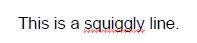
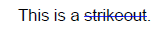

# TextMarkup 

**Text Markup annotations** appear as highlights, underlines, strikeouts, or jagged ("squiggly") underlines in the text of a document. When opened, they display a pop-up window containing the text of the associated note. 

    

The **TextMarkupAnnotation** class is a derivative of the **MarkupAnnotation** (descendent of **ContentAnnotation**) and it exposes the following properties:

|Property|Description|
|---|---|
|**TextMarkupType**|Gets the type of the annotation. The **TextMarkupAnnotationType** enum offers *Highlight*, *StrikeOut*, *Underline*, *Squiggly* options.|
|**Opacity**|Gets or sets the opacity of the annotation.|
|**Contents**|Gets or sets the text that shall be displayed for the annotation.|
|**Color**|Gets or sets the color of the annotation.|
|**Content**|Gets the source defining the visual content of the annotation. This content is with bigger priority compared to the annotation appearance characteristics and text properties and it is visualized by default when opening the exported document in some PDF viewer.|

Depending on the TextMarkupAnnotationType the respective type of the TextMarkup annotation can be added to the PDF document using the below examples:

## Highlight

### Creating a Highlight Annotation

<snippet id='pdf-highlight-annotation'/>

   

### Creating a Highlight Annotation with Appearance

<snippet id='pdf-appearance-highlight-annotation'/>

    

>important In **.NET Standard/.NET (Target OS: None)** environments, fonts beyond the [14 standard ones](#standard-fonts) require a [FontsProvider implementation]() to be resolved correctly.

## Underline

<snippet id='pdf-text-markup-underline'/>

     

## Squiggly

<snippet id='pdf-text-markup-squiggly'/>

    

## StrikeOut

<snippet id='pdf-text-markup-strikeout'/>

      

## See Also

* [AcroForm]()
* [FormField]()
* [Annotations Overview]()
* [FormSource]()
